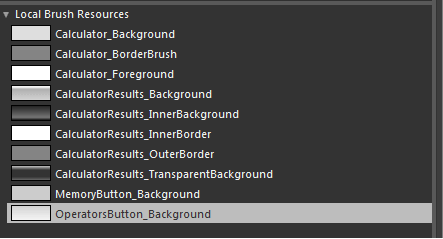
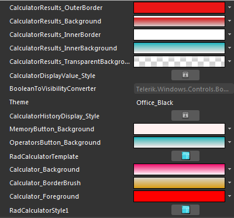
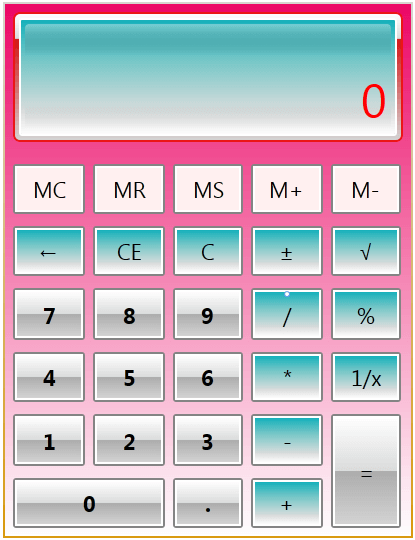

# Styling RadCalculator

Before reading this topic, you might find useful to get familiar with the Template Structure of the RadCalculator control.

## 

RadCalculator exposes a Style property which allows you to apply a particular style to it and modify its appearance.You have two options:

* To create an empty style and set it up on your own.

* To copy the default style of the control and modify it.

This topic will show you how to perform the second one.

## Modifying the Default Style

To copy the default styles, load your project in Expression Blend and open the User Control that holds the RadCalculator. In the 'Objects and Timeline' pane select the RadCalculator you want to style. From the menu choose Object -> Edit Style -> Edit a Copy. You will be prompted for the name of the style and where to be placed.

If you choose to define the style in Application, it would be available for the entire application. This allows you to define a style only once and then reuse it where needed. After clicking 'OK', Expression Blend will generate the default style of the RadCalculator control in the Resources section of your User Control. The properties available for the style will be loaded in the 'Properties' pane and you will be able to modify their default values. You can also edit the generated XAML in the XAML View or in Visual Studio. If you go to the 'Resources' pane, you will see an editable list of resources generated together with the style and used by it. In this list you will find the brushes, styles and templates needed to change the visual appearance of the RadCalculator. Their names indicate to which part of the RadCalculator appearance they are assigned.

## RadCalculator Resources:

* __Calculator_Background__ - a brush that paints the background of RadCalculator.
			  

* __Calculator_BorderBrush__ - a brush that that represents the border color of RadCalculator.
			  

* __Calculator_Foreground__ - a brush that that represents the foreground color of RadCalculator.
			  

* __MemoryButton_Background__ - a brush that paints the background of RadCalculator’s MemoryButtons.
			  

* __OperatorsButton_Background__ - a brush that paints the background of RadCalculator’s OperatorsButtons.
			  

* __CalculatorResults_OuterBorder__ - a brush that represents the outer border color of RadCalculator’s header.
			  

* __CalculatorResults_InnerBorder__ - a brush that represents the inner border color of RadCalculator’s header.
			  

* __CalculatorResults_InnerBackground__ - a brush that represents the inner background of RadCalculator’s header.
			  

* __CalculatorResults_TransparentBackground__ - a brush that represents the transparent background of RadCalculator’s header.
			  

* __CalculatorResults_Background__ - a brush that represents the outer background of RadCalculator’s header.
			  

Below you can see an example of how all those resources can be modified:

Once they are modified, RadCalculator will look like:

