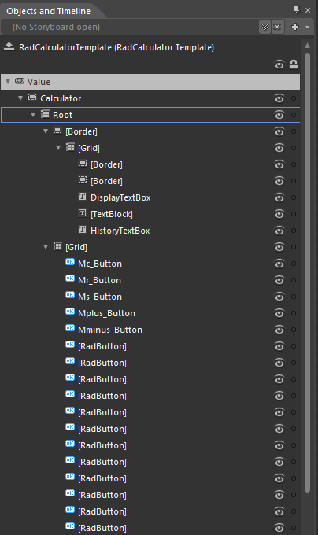

# RadCalculator Template Structure

Like most SilverlightWPF controls, RadCalculator allows you to template it in order to change the control from inside. Except for templating the whole control, you can template parts of it or even independent controls related to it.
		  

>tip
			  To learn how to style SilverlightWPF RadControls read the common topics about Styling and Appearance. If you are new to the controls, they will give you the basic knowledge about it.
		  

## RadCalculator Template Structure:

* __Calculator__ - hosts the elements of the template. It represents the border and the background the RadCalculator and is of type Border.
				  

* __Root__ - provides rows for the template elements of RadCalculator.
				  

* __Border__ - represents the outer border of the header and is of type Border.
				  

* __Grid__ - provides rows for the elements in the header.
				  

* __Border__ - represents the inner border of the header and is of type Border.
				  

* __Border__ - represents the transparent background of the header and is of type Border.
				  

* __DisplayTextBox__ - represents a single TextBox control which is responsible for displaying the RadCalculator's value.
				  

* __TextBlock__ - single TextBlock which represents the Memory indicator of RadCalculator.
				  

* __HistoryTextBox__ - represents a single TextBox control which is responsible for displaying the RadCalculator's history.
				  

* __Grid__ - provides rows and columns for RadCalculator's Buttons.
				  

* __RadButton__ - represents the Delete button and it is of type RadButton.
				  

* __RadButton__ - represents the Clear Input button and it is of type RadButton.
				  

* __RadButton__ - represents the Clear Everything button and it is of type RadButton.
				  

* __RadButton__ - represents the a button which exectues an unary operation and it is of type RadButton.
				  

* __RadButton__ - represents the a numeric button (0).
				  

* __RadButton__ - represents the a numeric button (1).
				  

* __RadButton__ - represents the a numeric button (2).
				  

* __RadButton__ - represents the a numeric button (3).
				  

* __RadButton__ - represents the a numeric button (4).
				  

* __RadButton__ - represents the a numeric button (5).
				  

* __RadButton__ - represents the a numeric button (6).
				  

* __RadButton__ - represents the a numeric button (7).
				  

* __RadButton__ - represents the a numeric button (8).
				  

* __RadButton__ - represents the a numeric button (9).
				  

* __RadButton__ - reresents the  Plus button and it is of type RadButton.
				  

* __RadButton__ - reresents the Minus button and it is of type RadButton.
				  

* __RadButton__ - represents the a button which exectues binary operation and it is of type RadButto (=).
				  

* __RadButton__ - represents the Multiply button and it is of type RadButton.
				  

* __RadButton__ - represents the Divide button and it is of type RadButton.
				  

* __RadButton__ - represents the Percent button and it is of type RadButton.
				  

* __RadButton__ - represents a button which executes an unary operation and it is of type RadButton.(1/x).
				  

