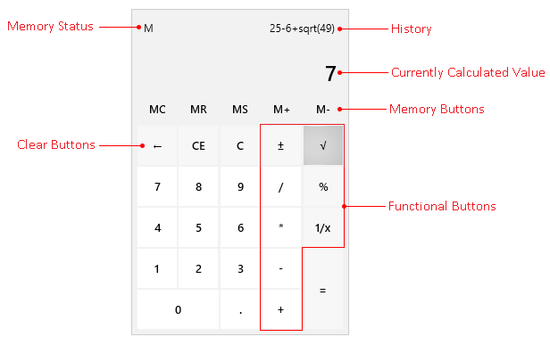

# Visual Structure

The __Calculator__ component allows you to execute all basic calculations, save the calculated value in memory, clear it and update it.

This article defines the terms and concepts used in the scope of the `RadCalculator` that you have to get familiar with prior to continue reading this help. They can also be helpful when contacting with the support service in order to better describe your issue. Below you can see snapshot and explanations of the main states and visual elements of the standard __Calculator__ control.
			  

* __Memory Status__&mdash;Defines whether you have a value stored in the Memory or not.				  

* __History__&mdash;Displays chronically the operations you have done.  

* __Currently Calculated Value__&mdash;Displays the calculated value at the moment.				  

* __Memory Buttons__&mdash;A set of buttons saving/calling the displayed value in/from the memory.				  

* __Clear Buttons__&mdash;A set of buttons enabling you to clear a part of the displayed value, the currently calculated one or all of the operations executed so far.				  

* __Functional Buttons__&mdash;A set of buttons performing different calculations.