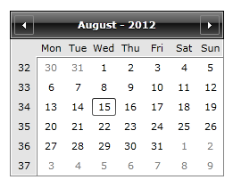
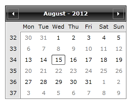

# BlackoutDates

With the Q2 SP1 2012 release we introduced an easier way to disable dates in __RadCalendar__ control. Now all that is needed to disable certain dates in the Calendar is to bind the __BlackoutDates__ property of the control to a collection of dates.

## Disable certain dates

The purpose of the following tutorial is to show how to disable certain dates in RadCalendar.

* Add a property for the blackout dates in your view model:

#### __C#__

```C#
	public ObservableCollection<DateTime> BlackoutDates { get; set; }
```

* Populate the property with some sample data:

#### __C#__

```C#
	public MyViewModel()
	{
		this.BlackoutDates = new ObservableCollection<DateTime>()
	    {
			new DateTime(2012, 8, 6),
			new DateTime(2012, 8, 7),
			new DateTime(2012, 8, 8),
			new DateTime(2012, 8, 9),
			new DateTime(2012, 8, 10),
			new DateTime(2012, 8, 11),
			new DateTime(2012, 8, 12),
			new DateTime(2012, 8, 20),
			new DateTime(2012, 8, 21),
			new DateTime(2012, 8, 22),
			new DateTime(2012, 8, 23),
			new DateTime(2012, 8, 24),
			new DateTime(2012, 8, 25),
			new DateTime(2012, 8, 26),
	    };
	}
```

* Bind the collection to the BlackoutDates property of the Calendar control:

#### __XAML__

```XAML
	<telerik:RadCalendar BlackoutDates="{Binding BlackoutDates}"/>
```

The end result is:

* Without BlackoutDates set:



* With BlackoutDates set:


