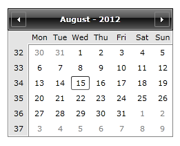
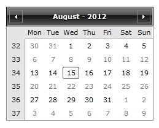

# BlackoutDates

With the Q2 SP1 2012 release we introduced an easier way to disable dates in __RadCalendar__ control. Now all that is needed to disable certain dates in the Calendar is to bind the __BlackoutDates__ property of the control to a collection of dates.

## Disable certain dates

The purpose of the following tutorial is to show how to disable certain dates in RadCalendar.

* Add a property for the blackout dates in your view model:

<snippet id='radcalendar-features-blackoutdates-block_1-cs' />

* Populate the property with some sample data:

<snippet id='radcalendar-features-blackoutdates-block_2-cs' />

* Bind the collection to the BlackoutDates property of the Calendar control:

<snippet id='radcalendar-features-blackoutdates-block_3-xaml' />

The end result is:

* Without BlackoutDates set:

* With BlackoutDates set:

