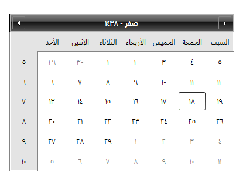

# Globalization

As of **R1 2017** RadCalendar supports the following .NET Framework calendar implementations:

* **ChineseLunisolarCalendar**, which represents the **Chinese lunisolar** calendar.

* **GregorianCalendar**, which represents the **Gregorian** calendar. This calendar is further divided into subtypes (such as Arabic and Middle East French) that are defined by the *System.Globalization.GregorianCalendarTypes* enumeration. The **GregorianCalendar.CalendarType** property specifies the subtype of the Gregorian calendar.

* **HebrewCalendar**, which represents the **Hebrew** calendar.

* **HijriCalendar**, which represents the **Hijri** calendar.

* **JapaneseCalendar**, which represents the **Japanese** calendar.

* **JapaneseLunisolarCalendar**, which represents the **Japanese lunisolar** calendar.

* **JulianCalendar**, which represents the **Julian** calendar.

* **KoreanCalendar**, which represents the **Korean** calendar.

* **KoreanLunisolarCalendar**, which represents the **Korean lunisolar** calendar.

* **PersianCalendar**, which represents the **Persian** calendar.

* **TaiwanCalendar**, which represents the **Taiwan** calendar.

* **TaiwanLunisolarCalendar**, which represents the **Taiwan lunisolar** calendar.

* **ThaiBuddhistCalendar**, which represents the **Thai Buddhist** calendar.

* **UmAlQuraCalendar**, which represents the **Um Al Qura** calendar.

You can set the default calendar for the whole application or for a specific RadCalendar instance as demonstrated in **Example 1** and **Example 2**.

__Example 1: Setting the default calendar application-wide__

	```C#
		CultureInfo arSA = CultureInfo.CreateSpecificCulture("ar-SA");
        Thread.CurrentThread.CurrentCulture = arSA;
        Thread.CurrentThread.CurrentUICulture = arSA;
        arSA.DateTimeFormat.Calendar = new HijriCalendar();
	```
```VB.NET
		Dim arSA As CultureInfo = CultureInfo.CreateSpecificCulture("ar-SA")
		Thread.CurrentThread.CurrentCulture = arSA
		Thread.CurrentThread.CurrentUICulture = arSA
		arSA.DateTimeFormat.Calendar = New HijriCalendar()
	```

__Example 2: Setting the calendar for a specific RadCalendar instance__

	```C#
		CultureInfo arSA = CultureInfo.CreateSpecificCulture("ar-SA");
        arSA.DateTimeFormat.Calendar = new HijriCalendar();
        calendar.Culture = arSA;
	```
```VB.NET
		Dim arSA As CultureInfo = CultureInfo.CreateSpecificCulture("ar-SA")
		arSA.DateTimeFormat.Calendar = New HijriCalendar()
		calendar.Culture = arSA
	```

**Figure 1** demonstrates the final result:

#### __Figure 1: Hijri calendar__



>For more information on how to use the calendar classes when working with date values, please read the following [MSDN article](https://msdn.microsoft.com/en-us/library/82aak18x).

## See Also

* [Calendar Basics]()