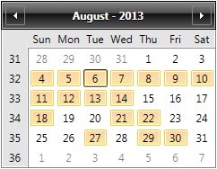

# Selection Modes

The Calendar supports three selection modes: __Single, Multiple and Extended__, the default selection mode is __Single__.

The following snippet creates a Calendar with Extended selection mode:


```XAML
	<telerik:RadCalendar SelectionMode="Extended" />
```

In __Single Selection mode__ only one date can be selected. Note that the SelectedDate can be null as well, which means that no date is selected. Keyboard movement selects an item.

__Multiple Selection mode__ allows unlimited number of dates to be selected. Dragging with the mouse will toggle the selection of the dates. Keyboard movement will move the focus of the item. Selection can be toggled with the space bar key.

__Extended Selection mode__ is best suited for selection date ranges. It supports Ctrl and Shift selection.

A Calendar in Extended selection mode:


