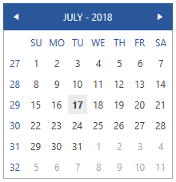
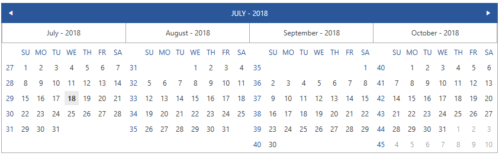
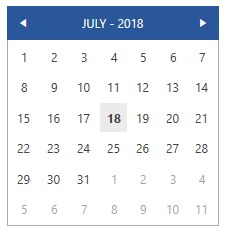
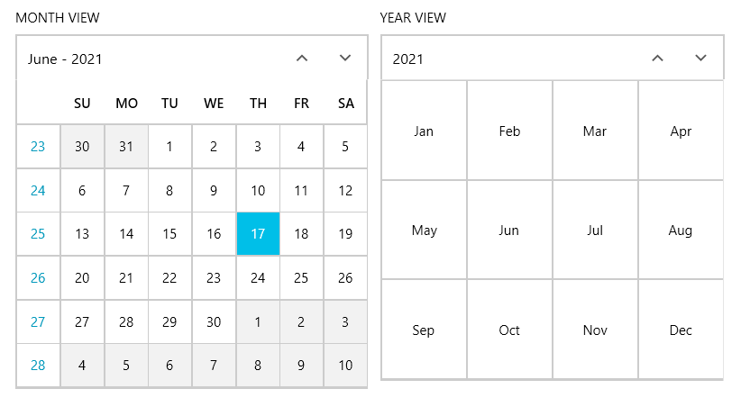

# Getting Started with {{ site.framework_name }} Calendar

This tutorial will walk you through the creation of a sample application that contains a __RadCalendar__. 

## Adding Telerik Assemblies Using NuGet

To use __RadCalendar__ when working with NuGet packages, install the `Telerik.Windows.Controls.Input.for.Wpf.Xaml` package. The [package name may vary]() slightly based on the Telerik dlls set - [Xaml or NoXaml]()

Read more about NuGet installation in the [Installing UI for WPF from NuGet Package]() article.

>tip With the 2025 Q1 release, the Telerik UI for WPF has a new licensing mechanism. You can learn more about it [here]().

## Adding Assembly References Manually

If you are not using NuGet packages, you can add a reference to the following assemblies:

* __Telerik.Licensing.Runtime__
* __Telerik.Windows.Controls__
* __Telerik.Windows.Controls.Input__

## Adding RadCalendar to the Project

**Example 1** demonstrates how you can add a RadCalendar in xaml.

#### __[XAML] Example 1: RadCalendar definition__
{{region xaml-radcalendar-getting-started_0}}
	<telerik:RadCalendar VerticalAlignment="Center" HorizontalAlignment="Center"  />
{{endregion}}

#### __Figure 1: Result from Example 1 in the Office2016 Theme__

## Changing the number of shown months

You can control how many months are shown by setting the **Columns** property of the RadCalendar. Its default value is **one** and the maximum is **four**. **Example 2** demonstrates how you can achieve that.

#### __[XAML] Example 2: RadCalendar showing four months__
{{region xaml-radcalendar-getting-started_1}}
	<telerik:RadCalendar VerticalAlignment="Center" HorizontalAlignment="Center" Columns="4" ViewsHeaderVisibility="Visible"/>
{{endregion}}

#### __Figure 2: Result from Example 2 in the Office2016 Theme__

## Hide Week Numbers and Weekdays

You have the option to hide the week numbers, as well as the weekdays. This can be done by setting the **AreWeekNumbersVisible** and **AreWeekNamesVisible** properties to **False**. **Example 3** demonstrates this:

#### __[XAML] Example 3: RadCalendar without week numbers and weekdays__
{{region xaml-radcalendar-getting-started_2}}
	<telerik:RadCalendar VerticalAlignment="Center" HorizontalAlignment="Center" AreWeekNumbersVisible="False" AreWeekNamesVisible="False" />
{{endregion}}

#### __Figure 3: Result from Example 3 in the Office2016 Theme__

## Setting a Theme

The controls from our suite support different themes. You can see how to apply a theme different than the default one in the [Setting a Theme]() help article.

>important Changing the theme using implicit styles will affect all controls that have styles defined in the merged resource dictionaries. This is applicable only for the controls in the scope in which the resources are merged. 

To change the theme, you can follow the steps below:

* Choose between the themes and add reference to the corresponding theme assembly (ex: **Telerik.Windows.Themes.Fluent.dll**). You can see the different themes applied in the **Theming** examples from our [WPF Controls Examples](https://demos.telerik.com/wpf/)[Silverlight Controls Examples](https://demos.telerik.com/silverlight/#Calendar/Theming) application.

* Merge the ResourceDictionaries with the namespace required for the controls that you are using from the theme assembly. For the __RadCalendar__, you will need to merge the following resources:

	* __Telerik.Windows.Controls__
    * __Telerik.Windows.Controls.Input__
	
__Example 3__ demonstrates how to merge the ResourceDictionaries so that they are applied globally for the entire application.

#### __[XAML] Example 3: Merge the ResourceDictionaries__  
{{region xaml-radcalendar-getting-started_5}}
	<Application.Resources>
		<ResourceDictionary>
			<ResourceDictionary.MergedDictionaries>
				<ResourceDictionary Source="/Telerik.Windows.Themes.Fluent;component/Themes/System.Windows.xaml"/>
				<ResourceDictionary Source="/Telerik.Windows.Themes.Fluent;component/Themes/Telerik.Windows.Controls.xaml"/>
				<ResourceDictionary Source="/Telerik.Windows.Themes.Fluent;component/Themes/Telerik.Windows.Controls.Input.xaml"/>
			</ResourceDictionary.MergedDictionaries>
		</ResourceDictionary>
	</Application.Resources>
{{endregion}}

>Alternatively, you can use the theme of the control via the [StyleManager](https://docs.telerik.com/devtools/wpf/styling-and-appearance/stylemanager/common-styling-apperance-setting-theme-wpf)[StyleManager](https://docs.telerik.com/devtools/silverlight/styling-and-appearance/stylemanager/common-styling-apperance-setting-theme).

__Figure 4__ shows a __RadCalendar__ with the **Fluent** theme applied.
	
#### __Figure 4: RadCalendar with the Fluent theme__


## Telerik UI for WPF Learning Resources

* [Telerik UI for WPF Calendar Component](https://www.telerik.com/products/wpf/calendar.aspx)
* [Getting Started with Telerik UI for WPF Components]()
* [Telerik UI for WPF Installation]()
* [Telerik UI for WPF and WinForms Integration]()
* [Telerik UI for WPF Visual Studio Templates]()
* [Setting a Theme with Telerik UI for WPF]()
* [Telerik UI for WPF Virtual Classroom (Training Courses for Registered Users)](https://learn.telerik.com/learn/course/external/view/elearning/16/telerik-ui-for-wpf) 
* [Telerik UI for WPF License Agreement](https://www.telerik.com/purchase/license-agreement/wpf-dlw-s)


## See Also

* [Calendar Basics]()
* [Key Properties]()
* [Globalization]()
* [How to Customize the Calendar Buttons]()
