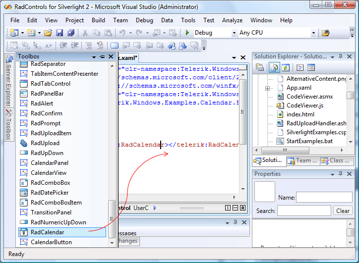

# Getting Started

This article will show you how to create a simple calendar.

>In order to use __RadCalendar__ control in your projects you have to add references to the following assemblies:
>	1. __Telerik.Windows.Controls__
>	2. __Telerik.Windows.Controls.Input__

>You can find more info [here]()[here]().

1. Drag and Drop the Calendar control from the toolbox.

	
	
	

	
	
	

2. After you have dropped the control onto the XAML you can manage the control by setting various properties to operate the control's behavior:

	#### __XAML__

	{{region radcalendar-getting-started_0}}
		<telerik:RadCalendar HorizontalAlignment="Left" VerticalAlignment="Center" 
			 x:Name="calendar" Columns="2" ViewsHeaderVisibility="Visible"/>
	{{endregion}}