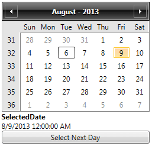

# Binding to Objects

All of the Calendar properties are dependency properties which means that they can be bound to almost any object.

To enable __TwoWay__ binding, the object that the Calendar is bound to should implement the __INotifyPropertyChanged__ interface. The following example shows how to bind the __SelectedDate__ property of the calendar to a business object, the __OrderInfo__.



Here is the Xaml for the example:


```XAML
	<UserControl xmlns="http://schemas.microsoft.com/winfx/2006/xaml/presentation" 
	    xmlns:x="http://schemas.microsoft.com/winfx/2006/xaml" 
	    xmlns:telerik="http://schemas.telerik.com/2008/xaml/presentation"
	    MinWidth="400" MinHeight="300">
	    <Grid x:Name="LayoutRoot" Background="White">
	        <StackPanel x:Name="parentPanel" Width="250">
	            <telerik:RadCalendar SelectedDate="{Binding ArrivalDate, Mode=TwoWay}"/>
	            <TextBlock FontWeight="Bold"
	                       Text="SelectedDate" />
	            <TextBlock Text="{Binding ArrivalDate}" />
	            <Button Content="Select Next Day" Click="Button_Click"/>
	        </StackPanel>
	    </Grid>
	</UserControl>
```

And the code-behind:


```C#
	public partial class Default_Cs : UserControl
	{
	    OrderInfo myOrderInfo;
	    public Default_Cs()
	    {
	        InitializeComponent();
	        myOrderInfo = new OrderInfo()
	        {
	            ArrivalDate = DateTime.Today.AddDays(3),
	            ProductName = "Good CDs"
	        };
	        // The object is set as data context of a parent of the controls, this way 
	        // it appears both in the TextBlock and the Calendar.
	        parentPanel.DataContext = myOrderInfo;
	    }
	    private void Button_Click(object sender, RoutedEventArgs e)
	    {
	        if (myOrderInfo.ArrivalDate.HasValue)
	        {
	            myOrderInfo.ArrivalDate = myOrderInfo.ArrivalDate.Value.AddDays(1);
	        }
	    }
	}
	/// <summary>
	/// The business object that will be bound to the control.
	/// </summary>
	public class OrderInfo : INotifyPropertyChanged
	{
	    private DateTime? arrivalDate;
	    /// <summary>
	    /// Gets or sets the date on which the delivery is expected to arrive.
	    /// </summary>
	    public DateTime? ArrivalDate
	    {
	        get
	        {
	            return this.arrivalDate;
	        }
	        set
	        {
	            if (this.arrivalDate != value)
	            {
	                this.arrivalDate = value;
	                OnPropertyChanged("ArrivalDate");
	            }
	        }
	    }
	
	    private String productName;
	    /// <summary>
	    /// Gets or sets the name of the product.
	    /// </summary>
	    public String ProductName
	    {
	        get
	        {
	            return this.productName;
	        }
	        set
	        {
	            if (this.productName != value)
	            {
	                this.productName = value;
	                OnPropertyChanged("ProductName");
	            }
	        }
	    }
	    /// <summary>
	    ///     Called when the value of a property changes.
	    /// </summary>
	    /// <param name="propertyName">The name of the property that has changed.</param>
	    protected virtual void OnPropertyChanged(String propertyName)
	    {
	        if (PropertyChanged != null)
	        {
	            PropertyChanged(this, new PropertyChangedEventArgs(propertyName));
	        }
	    }
	    /// <summary>
	    ///     Raised when the value of one of the properties changes.
	    /// </summary>
	    public event PropertyChangedEventHandler PropertyChanged;
	}
```

In this example our business object, the Order info has a property ArrivalDate which we bind the calendar and the __TextBlock__ to. When the property changes, everything is updated accordingly regardless of whether we update the value in code (the click handler) or via the TwoWay binding.

Please note that the __SelectedDate__ property is of type __Nullable\<DateTime\>__.  By default if the value is __null__ the TwoWay binding will not update the __DateTime__ property, so its value will be the last selected date.
