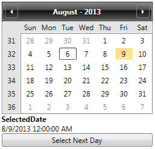

# Binding to Objects

All of the Calendar properties are dependency properties which means that they can be bound to almost any object.

To enable __TwoWay__ binding, the object that the Calendar is bound to should implement the __INotifyPropertyChanged__ interface. The following example shows how to bind the __SelectedDate__ property of the calendar to a business object, the __OrderInfo__.

Here is the Xaml for the example:

<snippet id='radcalendar-howto-binding-to-objects-block_1-xaml' />

And the code-behind:

<snippet id='radcalendar-howto-binding-to-objects-block_2-cs' />

In this example our business object, the Order info has a property ArrivalDate which we bind the calendar and the __TextBlock__ to. When the property changes, everything is updated accordingly regardless of whether we update the value in code (the click handler) or via the TwoWay binding.

Please note that the __SelectedDate__ property is of type __Nullable\<DateTime\>__.  By default if the value is __null__ the TwoWay binding will not update the __DateTime__ property, so its value will be the last selected date.
