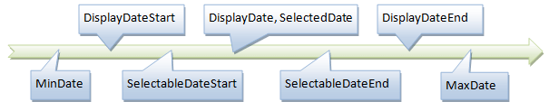
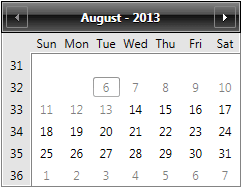

# Constraining Selection and Visible Dates

When certain dates are to be hidden or should not be selected by the user, the Calendar can hide or disable specific date ranges.

The following timeline shows how the selection and display ranges should relate to each other. All dates should fall between the __MinDate__ and __MaxDate__, If __DisplayDateStart__/__End__ are set, the __SelectableDates__ range and all the selected dates must fall within it.



In the following example the Calendar has DisplayDateStart set to 6 Aug, while the SelectableDateStart is 14 Aug:



The __RadCalendar__ has several static methods (__IsDisplayDateValid__, __IsDisplayDateStartValid__, __IsDisplayDateEndValid__, __IsSelectableDateStartValid__, __IsSelectableDateEndValid__) that can check whether the desired values are valid for the given calendar, for example:


```C#
	if (RadCalendar.IsDisplayDateValid(calendar, DateTime.Today))
	{
	    calendar.DisplayDate = DateTime.Today;
	}
	if (RadCalendar.IsDisplayDateStartValid(calendar, DateTime.Today.AddDays(-13)))
	{
	    calendar.DisplayDateStart = DateTime.Today.AddDays(-13);
	}
	if (RadCalendar.IsSelectableDateStartValid(calendar, DateTime.Today.AddDays(-5)))
	{
	    calendar.SelectableDateStart = DateTime.Today.AddDays(-5);
	}
```

To add constraints for specific dates, use the __TemplateSelector__ properties.
