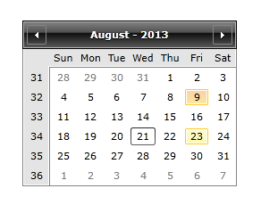

# Overview









RadCalendar is a fully featured data-input control providing the ability to display different views such as months, years, decades, centuries, multiple months view, etc. Additionally, you can select several dates at a time and define selection ranges.


RadCalendar for WPF is an advanced date input control that allows single or multiple date selection as well as displaying dates in different views. All calendar properties are culture-aware and customizable.


__Key Features:__


* __Display Modes__: You can display the calendar in four different views - Months, Years, Decades and Centuries. Thus, you can adjust the calendar component to meet your very own business needs.          

* __Multiple Months View__: RadCalendar can be easily configured to show more than one month in the calendar area. Thus, you can make the navigation easier and faster.

* __Powerful DataBinding__: Telerik RadCalendar for Silverlight can be bound to various datasoure types, such as such as Object, XML and WCF services.

* __Selection Mode__: RadCalendar supports both single and multi-date selection. This behavior can be changed by using a single property.         

* __Selection Range__: Set the range of the dates the user will be able to navigate to, and a constraint on the dates that can be selected.          

* __Keyboard Navigation__: RadCalendar supports the standard browser navigation paradigm. Users can tab across the page elements till they reach the calendar element. Then they can go forward/backward over the individual days by pressing the [Tab]/[Shift+Tab] keys. A day can be selected by clicking the [Enter] button.

* __Styling and Appearance__: RadCalendar can be fully customized using Expression Blend. There are also several pre-defined themes that can be used to stylize the calendar control.



* __Culture awareness__: RadCalendar is easily globalized. All properties are culture-aware and if not explicitly set, they would use the default thread culture for their values. You can easily change the text in the calendar's header, FirstDayOfWeek or DayMonthNamesFormat.          

* __Month and year views__: RadCalendar provides month and year views.          

* __Flexible date navigation__: RadCalendar provides two types of navigation:  arrow buttons in the calendar header that would cycle through the list of days, months or years and clicking inbetween the two arrows would change the calendar view.

* __Fully Skinnable__: RadCalendar is easily customizable through different skins available.

* __Keyboard support__: Users can navigate through the items (dates) using keys.          

* __Advanced Event-handling model__: RadCalender supports routed events.
