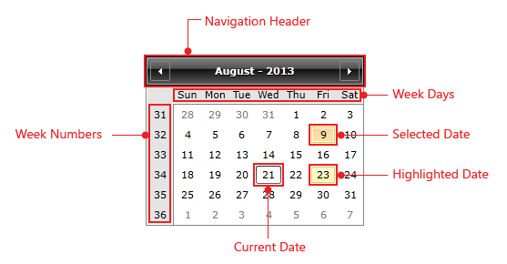

# Visual Structure

This section defines terms and concepts used in the scope of __RadCalendar__ you have to get familiar with prior to continue reading this help. They can also be helpful when contacting our support service in order to describe your issue better. 

* __Navigation Header__ - the Header of RadCalendar. Includes the left and right navigation buttons and represents the current month.

* __Week Days__ - the distribution of specific days in a month.

* __Week Numbers__ - week numbers throughout the year.

* __Current Date__ - indicates today's date.

* __Selected Date__ - currently selected date or range of dates.

* __Highlighted Date__ - currently highlighted date.

# See Also

* [Overview]()
 
* [Getting Started]()

* [Calendar Basics]()
