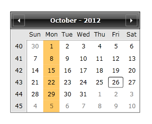

# How to Customize the Calendar Buttons


Customizing the buttons in __RadCalendar__ could easily be achieved by creating a custom StyleSelector and setting it to the __DayButtonStyleSelector__ property of the control.

This tutorial will go through on how to:

* Create a custom DayButtonStyleSelector

* Customize the CalendarButton Style

* Set the DayButtonStyleSelector of RadCalendar

The next example shows how to create a custom __DayButtonStyleSelector__ in order to change the Background color of every Monday in the calendar.

1. First you will need to create a DayButtonStyleSelector that inherits StyleSelector class:

	#### __C#__

	```C#
		public class DayButtonStyleSelector : StyleSelector
		{
		}
	```

2. Create a property of type __Style__:

	#### __C#__

	```C#
		public class DayButtonStyleSelector : StyleSelector
		{
		    public Style SpecialStyleMonday { get; set; }
		}
	```

3. Override the __SelectStyle()__ method:

	#### __C#__

	```C#
		public class DayButtonStyleSelector : StyleSelector
		{
		    public Style SpecialStyleMonday { get; set; }
		
		    public override Style SelectStyle(object item, DependencyObject container)
		    {
		        CalendarButtonContent content = item as CalendarButtonContent;
		        if (content != null)
		        {
		            if (content.Date.DayOfWeek == DayOfWeek.Monday && content.ButtonType == CalendarButtonType.Date)
		            {
		                return SpecialStyleMonday;
		            }
		        }
		        return base.SelectStyle(item, container);
		    }
		}
	```

4. Add the following namespaces in the xaml:

	#### __XAML__

	```XAML
		<UserControl xmlns:local="clr-namespace:WpfApplication1"
		             xmlns:calendar="clr-namespace:Telerik.Windows.Controls.Calendar;assembly=Telerik.Windows.Controls.Input">
		</UserControl>
	```

5. Create a StaticResource for the DayButtonStyleSelector and the SpecialStyleMonday Style:

	#### __XAML__

	```XAML
		<local:DayButtonStyleSelector x:Key="CustomStyleSelector">
		    <local:DayButtonStyleSelector.SpecialStyleMonday>
		        <Style TargetType="calendar:CalendarButton">
		            <Setter Property="Background">
		                <Setter.Value>
		                    <SolidColorBrush Color="Orange" Opacity="0.6"/>
		                </Setter.Value>
		            </Setter>
		        </Style>
		    </local:DayButtonStyleSelector.SpecialStyleMonday>
		</local:DayButtonStyleSelector>
	```

6. Set the __DayButtonStyleSelector__ property of the control:

	#### __XAML__

	```XAML
		<telerik:RadCalendar DayButtonStyleSelector="{StaticResource CustomStyleSelector}"/>
	```

7. The last step is to set the __DayButtonStyle__ to null in order for the custom DayButtonStyleSelector to be used:

	#### __XAML__

	```XAML
		<telerik:RadCalendar DayButtonStyleSelector="{StaticResource CustomStyleSelector}"
		             DayButtonStyle="{x:Null}"/>
	```

The next screenshot shows the final result:


