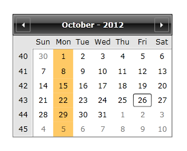

# How to Customize the Calendar Buttons

Customizing the buttons in __RadCalendar__ could easily be achieved by creating a custom StyleSelector and setting it to the __DayButtonStyleSelector__ property of the control.

This tutorial will go through on how to:

* Create a custom DayButtonStyleSelector

* Customize the CalendarButton Style

* Set the DayButtonStyleSelector of RadCalendar

The next example shows how to create a custom __DayButtonStyleSelector__ in order to change the Background color of every Monday in the calendar.

1. First you will need to create a DayButtonStyleSelector that inherits StyleSelector class:

<snippet id='radcalendar-styles-and-templates-daybuttonstyleselector-block_1-cs' />

2. Create a property of type __Style__:

<snippet id='radcalendar-styles-and-templates-daybuttonstyleselector-block_2-cs' />

3. Override the __SelectStyle()__ method:

<snippet id='radcalendar-styles-and-templates-daybuttonstyleselector-block_3-cs' />

4. Add the following namespaces in the xaml:

<snippet id='radcalendar-styles-and-templates-daybuttonstyleselector-block_4-xaml' />

5. Create a StaticResource for the DayButtonStyleSelector and the SpecialStyleMonday Style:

<snippet id='radcalendar-styles-and-templates-daybuttonstyleselector-block_5-xaml' />

6. Set the __DayButtonStyleSelector__ property of the control:

<snippet id='radcalendar-styles-and-templates-daybuttonstyleselector-block_6-xaml' />

7. The last step is to set the __DayButtonStyle__ to null in order for the custom DayButtonStyleSelector to be used:

<snippet id='radcalendar-styles-and-templates-daybuttonstyleselector-block_7-xaml' />

The next screenshot shows the final result:

