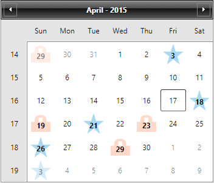

# Using DayTemplateSelector

This help topic explains in details how you can customize and apply a different __DataTemplate__ to __RadCalendar’s__ buttons by creating a custom __DataTemplateSelector__.

The article will go through on how to:

* Create a custom DayButtonTemplateSelector
* Customize the CalendarButton Template
* Set the DayTemplateSelector of RadCalendar

Firstly, you need to create a DayButtonTemplateSelector class that inherits the __DataTemplateSelector__ class:

<snippet id='radcalendar-styles-and-templates-daytemplateselector-block_1-cs' />

Next we need to define the needed DataTemplates and override the __SelectTemplate__ method. For this concrete scenario the days on which a new Template should be set are stored in collections named "SpecialHolidays" and “BookedDays” - based on your condition, in the particular case comparison between the Days of the Calendar with the one from the collections, you return the proper DataTemplate that should be applied:

<snippet id='radcalendar-styles-and-templates-daytemplateselector-block_2-cs' />

As a next step you need to create a StaticResource in XAML for the DayButtonTemplateSelector and the Templates that contains:

<snippet id='radcalendar-styles-and-templates-daytemplateselector-block_3-xaml' />

The last step is to set the __DayTemplateSelector__ property of the control:

<snippet id='radcalendar-styles-and-templates-daytemplateselector-block_4-xaml' />

The following figure demonstrates the final result:

>tip Find a runnable project of the previous example in the [WPF Samples GitHub repository](https://github.com/telerik/xaml-sdk/tree/master/Calendar/UsingDayTemplateSelector).