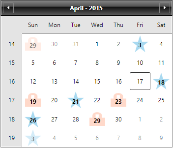

# Using DayTemplateSelector

This help topic explains in details how you can customize and apply a different __DataTemplate__ to __RadCalendar’s__ buttons by creating a custom __DataTemplateSelector__.

The article will go through on how to:

* Create a custom DayButtonTemplateSelector
* Customize the CalendarButton Template
* Set the DayTemplateSelector of RadCalendar

Firstly, you need to create a DayButtonTemplateSelector class that inherits the __DataTemplateSelector__ class:

#### __C#__

```C#
	public class DayButtonTemplateSelector : DataTemplateSelector
	{
	
	}
```

Next we need to define the needed DataTemplates and override the __SelectTemplate__ method. For this concrete scenario the days on which a new Template should be set are stored in collections named "SpecialHolidays" and “BookedDays” - based on your condition, in the particular case comparison between the Days of the Calendar with the one from the collections, you return the proper DataTemplate that should be applied:

#### __C#__

```C#
					
			public DataTemplate DefaultTemplate { get; set; }
			public DataTemplate BookedDayTemplate { get; set; }
			public DataTemplate SpecialHolidayTemplate { get; set; }
			
			      public List<DateTime> BookedDays { get; set; }
			      public List<DateTime> SpecialHolidays { get; set; }
			
			      public override DataTemplate SelectTemplate(object item, DependencyObject container)
			      {
			          var calendarButton = item as CalendarButtonContent;
			          var currDate = calendarButton.Date;
			          if (calendarButton.ButtonType == CalendarButtonType.Date)
			          {
			              if (this.BookedDays.Any(a => a.Date.Day == currDate.Day))
			              {
			                  return this.BookedDayTemplate;
			              }
			
			              if (this.SpecialHolidays.Any(a => a.Date.Day == currDate.Day))
			              {
			                  return this.SpecialHolidayTemplate;
			              }
			          }
			
			          return this.DefaultTemplate;
			      }
	```

As a next step you need to create a StaticResource in XAML for the DayButtonTemplateSelector and the Templates that contains:

#### __XAML__

```XAML
	<local:DayButtonTemplateSelector x:Key="DayButtonTemplateSelector">
	    <local:DayButtonTemplateSelector.DefaultTemplate>
	        <DataTemplate>
	            <TextBlock Text="{Binding Text}" />
	        </DataTemplate>
	    </local:DayButtonTemplateSelector.DefaultTemplate>
	    <local:DayButtonTemplateSelector.BookedDayTemplate>
	        <DataTemplate>
	            <Grid>
	                <Path Data="M3.9,1.9 L3.9,4.9 L5.9,4.9 L5.9,1.9 z M4.9,0 C6.5,0 7.9,1.3 7.9,2.9 L7.9,4.9 L10,4.9 L10,12 L0,12 L0,4.9 L1.9,4.9 L1.9,2.9 C1.9,1.3 3.2,0 4.9,0 z" 
	              Fill="LightSalmon"
	              Height="28" 
	              Stretch="Fill" 
	              UseLayoutRounding="False"
	              Width="32"
	              Opacity="0.4"/>
	                <TextBlock Text="{Binding Text}" 
	                   Margin="0 6 0 0"
	                   Foreground="Black" 
	                   FontWeight="Bold" 
	                   HorizontalAlignment="Center" 
	                   VerticalAlignment="Center"/>
	            </Grid>
	        </DataTemplate>
	    </local:DayButtonTemplateSelector.BookedDayTemplate>
	    <local:DayButtonTemplateSelector.SpecialHolidayTemplate>
	        <DataTemplate>
	            <Grid>
	                <Path Data="M11.5,0 L14.2,8.3 L23.0,8.3 L16,13.5 L18.6,22 L11.5,16.7 L4.4,22 L7.1,13.5 L0,8.3 L8.7,8.3 z" 
	              Fill="#FF25A0DA" 
	              Height="34"
	              Stretch="Fill"
	              UseLayoutRounding="False"
	              Width="34"
	              Opacity="0.4"/>
	                <TextBlock Text="{Binding Text}" 
	                   Margin="0 5 0 0"
	                   Foreground="Black"
	                   FontWeight="Bold" 
	                   HorizontalAlignment="Center"
	                   VerticalAlignment="Center"/>
	            </Grid>
	        </DataTemplate>
	    </local:DayButtonTemplateSelector.SpecialHolidayTemplate>
	</local:DayButtonTemplateSelector>
```

The last step is to set the __DayTemplateSelector__ property of the control:

#### __XAML__
```XAML
	<telerik:RadCalendar DayTemplateSelector="{StaticResource DayButtonTemplateSelector}" />
```

The following figure demonstrates the final result:



>tip Find a runnable project of the previous example in the [WPF Samples GitHub repository](https://github.com/telerik/xaml-sdk/tree/master/Calendar/UsingDayTemplateSelector).