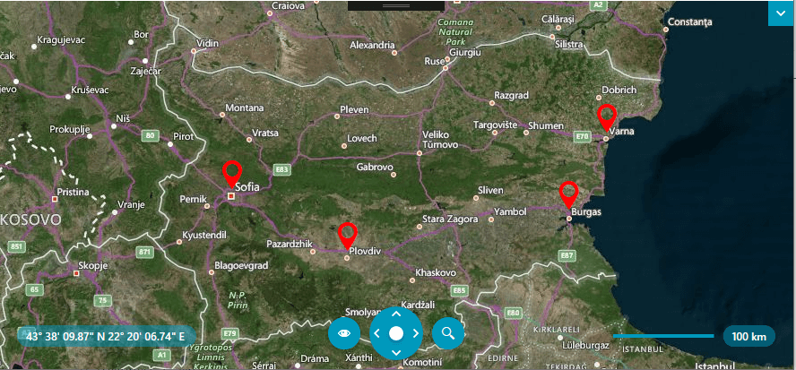
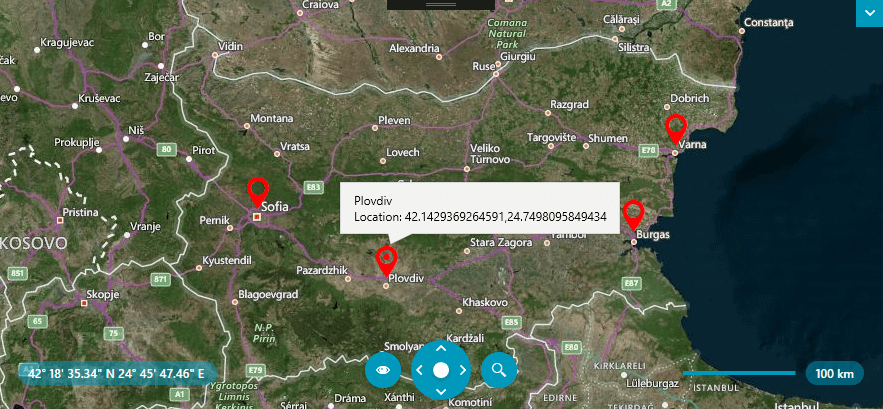

# IUse Callout with RadMap

This tutorial will walk you through the steps to integrate the RadCallout control inside the RadMap. In this example, we will show how to open a RadCallout with additional information regarding the clicked PushPin element on the map.

First, we will set-up our RadMap control. We will create a collection of business objects, which represent the desired data and populate the visualization layer.

So let's define the business class that represents our objects: 

#### __[C#] Example 1: Set-up our map object__
{{region csharp_radcallout-howto-map-integration_0}}
	public class MapItem : ViewModelBase
	{
		private string caption = string.Empty;
		private Telerik.Windows.Controls.Map.Location location = Location.Empty;

		public MapItem( string caption,Location location)
		{
			Caption = this.caption;
			Location = this.location;
		}        

		public string Caption
		{
			get => this.caption;

			set
			{
				this.caption = value;
				this.OnPropertyChanged("Caption");
			}
		}

		public Location Location
		{
			get => this.location;

			set
			{
				this.location = value;
				this.OnPropertyChanged("Location");
			}
		}        
	}
{{endregion}}

The next step is to define how we want to visualize our data items through the ItemTemplate property of the VisualizationLayer and set the desired bindings in it. In the current example, the marker will be represented by a __PushPin__:   

#### __[XAML] Example 2: Declare RadMap in XAML__
{{region xaml_radcallout-howto-map-integration_0}}
	<telerik:RadMap x:Name="radMap" MouseClickMode="SelectItem" 
		MouseSelectionMode="RaiseEvent" 
		ZoomLevel="7" 
		Center="42.7957539183824, 25.3427663758679">
		<telerik:RadMap.Provider>
			<telerik:BingRestMapProvider ApplicationId="Your Application Key" Mode="Aerial" />
		</telerik:RadMap.Provider>
		<telerik:VisualizationLayer x:Name="visualizationLayer"                                        
								ItemSelectionMode="MouseClick"
								ClusteringEnabled="True"
								ItemsSource="{Binding Data}">
			<telerik:VisualizationLayer.ItemTemplate>
				<DataTemplate>
					<telerik:Pushpin telerik:MapLayer.Location="{Binding Location}" Background="Red" Cursor="Hand" />
				</DataTemplate>
			</telerik:VisualizationLayer.ItemTemplate>
		</telerik:VisualizationLayer>
	</telerik:RadMap>
{{endregion}}

The last thing to do is to create your ViewModel, which holds the data and set it as the DataContext of the MainWindow.

#### __[C#] Example 3: Create map items__
{{region csharp_radcallout-howto-map-integration_0}}
	public class ViewModel
    {
        public ObservableCollection<MapItem> Data { get; set; }
        public ViewModel()
        {
            Data = GetMapData();
        }

        private ObservableCollection<MapItem> GetMapData()
        {
            ObservableCollection<MapItem> data = new ObservableCollection<MapItem>
            {
                new MapItem("Sofia", new Location(42.6957539183824, 23.3327663758679)),
                new MapItem("Plovdiv", new Location(42.1429369264591, 24.7498095849434)),
                new MapItem("Burgas", new Location(42.5131732087098, 27.4611884843576)),
                new MapItem("Varna", new Location(43.2073941930888, 27.9275176988258))
            };

            return data;
        }
    }
{{endregion}}

#### __[XAML] Example 4: Set DataContext of the MainWindow__
{{region xaml_radcallout-howto-map-integration_0}}
	public MainWindow()
	{
		InitializeComponent();
		this.DataContext = new ViewModel();
	}   
{{endregion}}

If you run the application now, the RadMap should display the following structure:

#### Figure 1: RadMap sample

Now to show the RadCallout when the PushPin map element is clicked, we can subscribe to the SelectionChanged event of the VisualizationLayer. In the event handler, we can get the FrameworkElement container that holds the map element and use it as a placement target element for the RadCallout.

#### __[XAML] Example 5:__
{{region xaml_radcallout-howto-map-integration_0}}
	public partial class MainWindow : Window
	{      
		public MainWindow()
		{
			InitializeComponent();
			DataContext = new ViewModel();
			visualizationLayer.SelectionChanged += VisualizationLayer_SelectionChanged;
		}

		private void VisualizationLayer_SelectionChanged(object sender, SelectionChangedEventArgs e)
		{
			VisualizationLayer layer = sender as VisualizationLayer;
			layer.ClearSelection(true);

			if (e.AddedItems != null && e.AddedItems.Count > 0)
			{
				MapItem item = (MapItem)e.AddedItems[0];
				UIElement container = layer.GetContainerFromItem(item);
				if (container != null)
				{
					FrameworkElement placementTarget = (FrameworkElement)container;
					ShowCalloutPopup(placementTarget, item);
				}
			}
		}

		private void ShowCalloutPopup(FrameworkElement placementTarget, MapItem item)
		{
			CalloutPopupService.CloseAll();

			DataTemplate calloutContentTemplate = TryFindResource("CalloutContentTemplate") as DataTemplate;
			if (calloutContentTemplate != null)
			{
				var radCallout = new RadCallout()
				{
					DataContext = item,
					ContentTemplate = calloutContentTemplate,
					ArrowAnchorPoint = new Point(0.18, 1.2),
					ArrowBasePoint1 = new Point(0.15, 0.5),
					ArrowBasePoint2 = new Point(0.45, 0.5),
					TextAlignment = TextAlignment.Left,
					UseLayoutRounding = true,
					Width = 280
				};

				radCallout.SetBinding(ContentProperty, new Binding());
				CalloutPopupSettings popupSettings = new CalloutPopupSettings() { AutoClose = false, HorizontalOffset = radCallout.Width / 3, VerticalOffset = -2 };              

				CalloutPopupService.Show(radCallout, placementTarget, popupSettings);
			}
		}
	}
{{endregion}}

We also need to specify the content of the RadCallout. This way, we can visualize relevant information for the clicked element.

#### __[XAML] Example 6:__
{{region xaml_radcallout-howto-map-integration_0}}
	<Window.Resources>        
		<DataTemplate x:Key="CalloutContentTemplate">
			<StackPanel>
				<TextBlock Text="{Binding Caption}" />
				<StackPanel Orientation="Horizontal">
					<TextBlock Text="Location: "/>
					<TextBlock Text="{Binding Location}"/>
				</StackPanel>
			</StackPanel>
		</DataTemplate>        
	</Window.Resources>  
{{endregion}}

And we are ready. When you run the example, click on one of the visible PushPin elements on the map to see the name of the city and its location.

#### Figure 2: RadCallout integrated in RadMap

