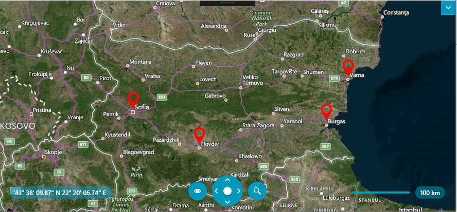
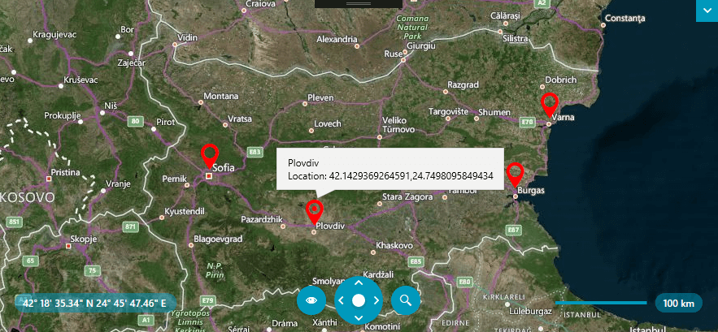

# Use Callout with RadMap

This tutorial will walk you through the steps to integrate the RadCallout control inside the RadMap. In this example, we will show how to open a RadCallout with additional information regarding the clicked PushPin element on the map.

First, we will set-up our RadMap control. We will create a collection of business objects, which represent the desired data and populate the visualization layer.

So let's define the business class that represents our objects: 

__Example 1: Set-up our map object__
<snippet id='radcallout-how-to-map-integration-example_1_set_up_our_map_object-cs' />

The next step is to define how we want to visualize our data items through the ItemTemplate property of the VisualizationLayer and set the desired bindings in it. In the current example, the marker will be represented by a __PushPin__:   

__Example 2: Declare RadMap in XAML__
<snippet id='radcallout-how-to-map-integration-example_2_declare_radmap_in_xaml-xaml' />

The last thing to do is to create your ViewModel, which holds the data and set it as the DataContext of the MainWindow.

__Example 3: Create map items__
<snippet id='radcallout-how-to-map-integration-example_3_create_map_items-cs' />

__Example 4: Set DataContext of the MainWindow__
<snippet id='radcallout-how-to-map-integration-example_4_set_datacontext_of_the_mainwindow-xaml' />

If you run the application now, the RadMap should display the following structure:

#### Figure 1: RadMap sample

Now to show the RadCallout when the PushPin map element is clicked, we can subscribe to the SelectionChanged event of the VisualizationLayer. In the event handler, we can get the FrameworkElement container that holds the map element and use it as a placement target element for the RadCallout.

__Example 5:__
<snippet id='radcallout-how-to-map-integration-example_5-xaml' />

We also need to specify the content of the RadCallout. This way, we can visualize relevant information for the clicked element.

__Example 6:__
<snippet id='radcallout-how-to-map-integration-example_6-xaml' />

And we are ready. When you run the example, click on one of the visible PushPin elements on the map to see the name of the city and its location.

#### Figure 2: RadCallout integrated in RadMap

