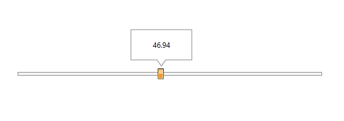

# Use Callout as Thumb ToolTip in RadSlider

The RadCallout can be easily used as a tooltip for the RadSlider control. To do that, we can use the __AutoToolTipContentTemplate__ property of the RadSlider to place the RadCallout inside the Thumb ToolTip. Then we need to remove the Border of the ToolTip and make it transparent so that only the content (RadCallout) is visible. The code snippet in __Example 1__ demonstrates this approach.  

__Example 1: Callout as a ToolTip for RadSlider Thumb__
<snippet id='radcallout-how-to-slider-tooltip-integration-example_1_callout_as_a_tooltip_for_radslider_thumb-cs' />
	
#### __Figure 1:  Callout as a ToolTip for RadSlider Thumb__

