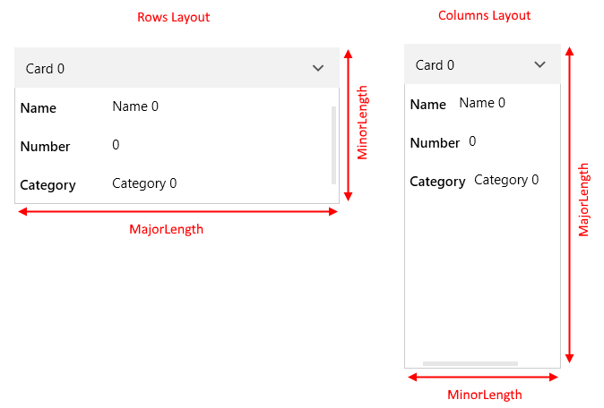
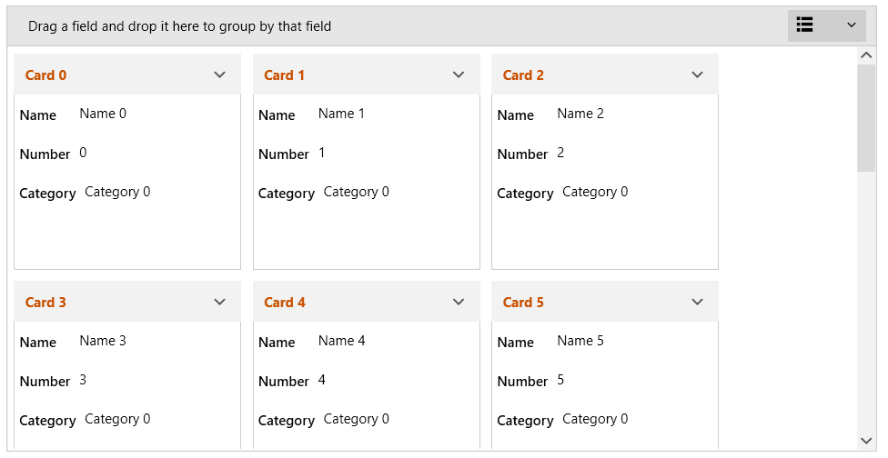
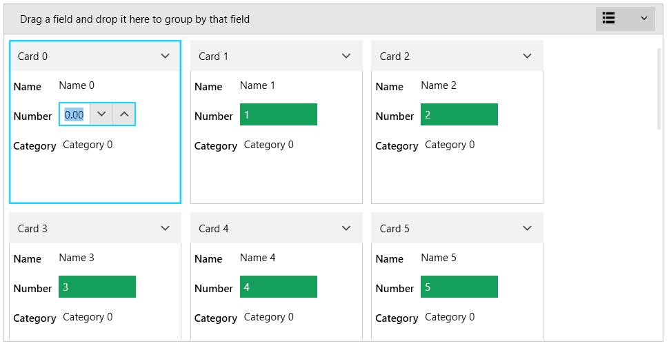
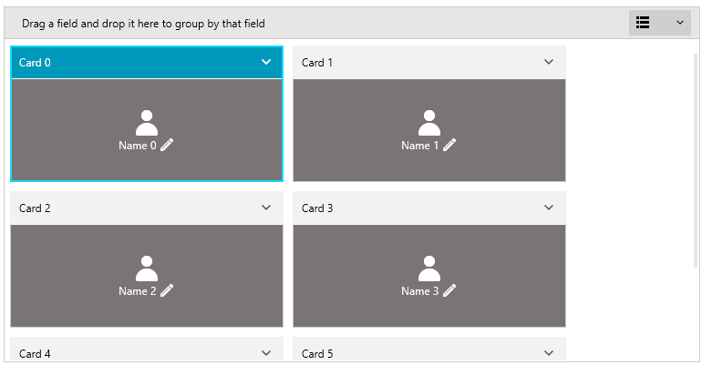
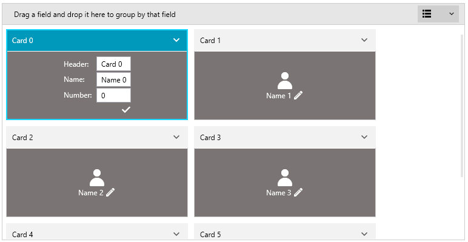

# Customizing Cards

RadCardView cards can be customized in order to match the expected design or functionality.

## Card Size

The card's size is determined by the __MajorLength__ and __MinorLength__ properties of RadCardView. Each property relates to a different dimension (width or height) based on the applied [layout]() (rows or columns).

When the __CardLayout__ property is set to __Rows__ the __MajorLength__ is applied to the card's __width__ and the __MinorLength__ to the card's __height__. 
When the __CardLayout__ is __Columns__ the __MajorLength__ is applied to the card's __height__ and the __MinorLength__ to the card's __width__. 

#### Figure 1: MajorLength and MinorLength examples


Additionally, you can set the __CollapsedLength__ property in order to change the size of the cards while in collapsed state.

__Example 1: Setting cards sizes__
```XAML
    <telerik:RadCardView MinorLength="200"
                         MajorLength="210"
					     CollapsedLength="150"/>
```

You can also set the **CardMargin** property to control the margin around each card. The property is of type **Thickness**.

__Example 2: Setting CardMargin__
```XAML
    <telerik:RadCardView CardMargin="5 10 0 5"/>
```

## Card Header

The header content of a card is determined by the __CardHeaderBinding__ property. Read the [Data Binding]() article to see how to use this. Additionally, the header UI can be customized using the __CardHeaderTemplate__ property of RadCardView.

__Example 3: Setting card header template__
```XAML
    <telerik:RadCardView CardHeaderBinding="{Binding MyHeaderProperty}">
		<telerik:RadCardView.CardHeaderTemplate>
			<DataTemplate>
				<TextBlock Text="{Binding}" Foreground="#CA5100" FontWeight="Bold"/>
			</DataTemplate>
		</telerik:RadCardView.CardHeaderTemplate>           
	</telerik:RadCardView>
```

#### Figure 2: Custom card header


>tip The data context in the __CardHeaderTemplate__ comes from the property bound to the __CardHeaderBinding__.

## Card Data Field

To toggle the visibility of a data field, set the __IsVisible__ property of the associated [CardDataFieldDescriptor]().

__Example 4: Setting CardDataFieldDescriptor IsVisible property__
```XAML
   	<telerik:RadCardView.DataFieldDescriptors>
		<telerik:CardDataFieldDescriptor DataMemberBinding="{Binding Name}" IsVisible="False"/>
	</telerik:RadCardView.DataFieldDescriptors>
```

To customize the field that shows the value, set the __EditorTemplate__ and __ReadOnlyTemplate__ of the CardDataFieldDescriptor. The __EditorTemplate__ property changes the editor element that is displayed when the data field enters edit mode. The __ReadOnlyTemplate__ changes the element that is displayed in the normal state of the data field.

__Example 5: Setting EditorTemplate and ReadOnlyTemplate__
```XAML
	<telerik:RadCardView.DataFieldDescriptors>
		<telerik:CardDataFieldDescriptor DataMemberBinding="{Binding Number}">
			<telerik:CardDataFieldDescriptor.ReadOnlyTemplate>
				<DataTemplate>
					<Border Padding="5" Background="#149F5B">
						<TextBlock Text="{Binding Number}" Foreground="White"/>
					</Border>                            
				</DataTemplate>
			</telerik:CardDataFieldDescriptor.ReadOnlyTemplate>
			<telerik:CardDataFieldDescriptor.EditorTemplate>
				<DataTemplate>
					<telerik:RadNumericUpDown Value="{Binding Number, Mode=TwoWay}" />
				</DataTemplate>
			</telerik:CardDataFieldDescriptor.EditorTemplate>
		</telerik:CardDataFieldDescriptor>
	</telerik:RadCardView.DataFieldDescriptors>
```

#### Figure 3: Custom read only and editor templates for one of the data fields


## Card Contents

The default visual content of the cards can be replaced using the __CardReadOnlyTemplate__ and __CardEditTemplate__ of RadCardView. 

__CardReadOnlyTemplate__ allows you to define the content while the card is in normal state.

__CardEditTemplate__ allows you to define the content while the card is in edit state.

To __enter edit state__, execute the __RadCardViewCommands.BeginEdit__ command. This affects the currently selected card.

To __commit or cancel__ the edit, call execute  __RadCardViewCommands.CommitEdit__ or  __RadCardViewCommands.CancelEdit__ commands.

Read more about RadCardView's commanding support in the [Commands]() article.

__Example 5: Defining CardReadOnlyTemplate and CardEditTemplate__
```XAML
	<telerik:RadCardView x:Name="cardView"  CardHeaderBinding="{Binding Header}" MinorLength="150">
		<telerik:RadCardView.CardReadOnlyTemplate>
			<DataTemplate>
				<Border Background="#7A7574">
					<Grid VerticalAlignment="Center">
						<Grid.RowDefinitions>
							<RowDefinition Height="Auto" />
							<RowDefinition Height="Auto"/>
						</Grid.RowDefinitions>
						<telerik:RadGlyph Glyph="&#xe801;" Foreground="White" FontSize="32"/>
						<StackPanel Orientation="Horizontal" Grid.Row="1" HorizontalAlignment="Center" >
							<TextBlock Text="{Binding Name}" Foreground="White" VerticalAlignment="Center"/>                               
							<telerik:RadGlyph Glyph="&#xe10b;" Foreground="White" Cursor="Hand"
											  Margin="4 0 0 0" MouseLeftButtonDown="OnCardBeginEdit"
											  IsEnabled="{Binding RelativeSource={RelativeSource AncestorType=telerik:RadCardViewItem}, Path=IsSelected}"/>
						</StackPanel>
					</Grid>
				</Border>
			</DataTemplate>
		</telerik:RadCardView.CardReadOnlyTemplate>
		<telerik:RadCardView.CardEditTemplate>
			<DataTemplate>
				<Border Background="#7A7574">
					<Grid VerticalAlignment="Center" HorizontalAlignment="Center"  TextElement.Foreground="White">
						<Grid.RowDefinitions>
							<RowDefinition Height="Auto" />
							<RowDefinition Height="Auto"/>
							<RowDefinition Height="Auto"/>
							<RowDefinition Height="Auto"/>
						</Grid.RowDefinitions>
						<Grid.ColumnDefinitions>
							<ColumnDefinition Width="Auto" />
							<ColumnDefinition Width="Auto" />
						</Grid.ColumnDefinitions>
						<TextBlock Text="Header: " VerticalAlignment="Center"/>
						<TextBox Text="{Binding Header, Mode=TwoWay, UpdateSourceTrigger=PropertyChanged}" Margin="5 0 0 0" Padding="5 3 5 3" Grid.Column="1"/>
						<TextBlock Text="Name: " VerticalAlignment="Center"  Grid.Row="1" />
						<TextBox Text="{Binding Name, Mode=TwoWay, UpdateSourceTrigger=PropertyChanged}" Margin="5 2 0 0" Padding="5 3 5 3" Grid.Row="1" Grid.Column="1"/>
						<TextBlock Text="Number: " VerticalAlignment="Center"  Grid.Row="2" />
						<TextBox Text="{Binding Number, Mode=TwoWay, UpdateSourceTrigger=PropertyChanged}" Margin="5 2 0 0" Padding="5 3 5 3" Grid.Row="2" Grid.Column="1"/>
						<telerik:RadGlyph Glyph="&#xe118;" Foreground="White" Cursor="Hand" Grid.Row="3"
										  Grid.ColumnSpan="2" HorizontalAlignment="Right"
										  Margin="4 4 0 0" MouseLeftButtonDown="OnCardCommitEdit"/>
					</Grid>
				</Border>
			</DataTemplate>
		</telerik:RadCardView.CardEditTemplate>
		</telerik:RadCardView>
```

__Example 6: Execute RadCardView commands__
```XAML
	private void OnCardBeginEdit(object sender, MouseButtonEventArgs e)
	{
		// start editing
		this.cardView.PendingCommands.Add(Telerik.Windows.Controls.RadCardViewCommands.BeginEdit);
		this.cardView.ExecutePendingCommand();
	}

	private void OnCardCommitEdit(object sender, MouseButtonEventArgs e)
	{
		// commit edit
		this.cardView.PendingCommands.Add(Telerik.Windows.Controls.RadCardViewCommands.CommitEdit);
		this.cardView.ExecutePendingCommand();
	}
```

#### Figure 4: Custom card contents in read-only state



#### Figure 5: Custom card contents in edit state


> Always use both CardReadOnlyTemplate and CardEditTemplate properties together. 

## See Also  
* [Data Binding]()
* [Customizing Groups]() 
* [Customizing Filtering Control]() 