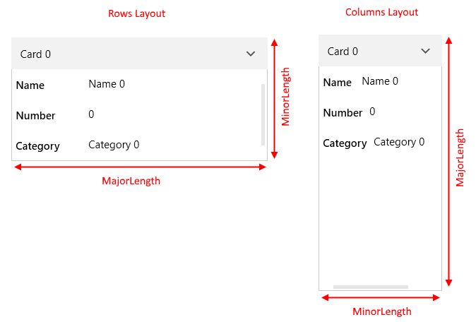
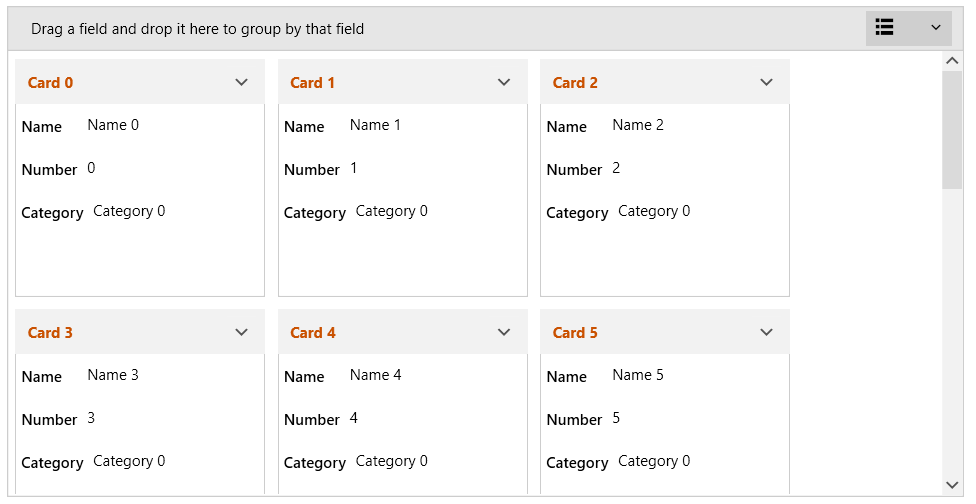
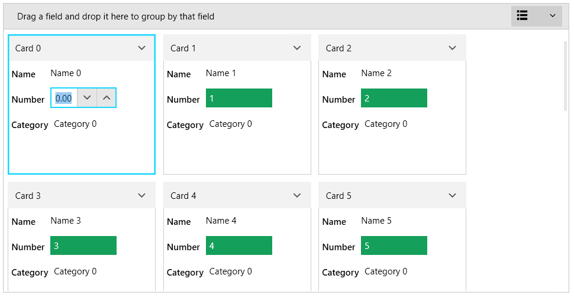
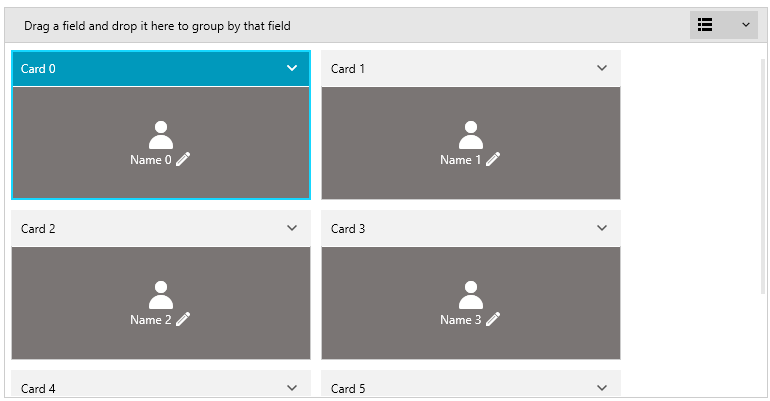
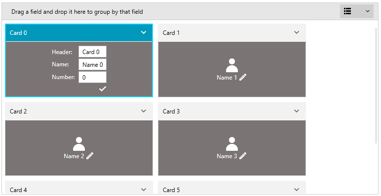

# Customizing Cards

RadCardView cards can be customized in order to match the expected design or functionality.

## Card Size

The card's size is determined by the __MajorLength__ and __MinorLength__ properties of RadCardView. Each property relates to a different dimension (width or height) based on the applied [layout]() (rows or columns).

When the __CardLayout__ property is set to __Rows__ the __MajorLength__ is applied to the card's __width__ and the __MinorLength__ to the card's __height__. 
When the __CardLayout__ is __Columns__ the __MajorLength__ is applied to the card's __height__ and the __MinorLength__ to the card's __width__. 

#### Figure 1: MajorLength and MinorLength examples

Additionally, you can set the __CollapsedLength__ property in order to change the size of the cards while in collapsed state.

__Example 1: Setting cards sizes__
<snippet id='radcardview-appearance-customizing-cards-example_1_setting_cards_sizes-xaml' />

You can also set the **CardMargin** property to control the margin around each card. The property is of type **Thickness**.

__Example 2: Setting CardMargin__
<snippet id='radcardview-appearance-customizing-cards-example_2_setting_cardmargin-xaml' />

## Card Header

The header content of a card is determined by the __CardHeaderBinding__ property. Read the [Data Binding]() article to see how to use this. Additionally, the header UI can be customized using the __CardHeaderTemplate__ property of RadCardView.

__Example 3: Setting card header template__
<snippet id='radcardview-appearance-customizing-cards-example_3_setting_card_header_template-xaml' />

#### Figure 2: Custom card header

>tip The data context in the __CardHeaderTemplate__ comes from the property bound to the __CardHeaderBinding__.

## Card Data Field

To toggle the visibility of a data field, set the __IsVisible__ property of the associated [CardDataFieldDescriptor]().

__Example 4: Setting CardDataFieldDescriptor IsVisible property__
<snippet id='radcardview-appearance-customizing-cards-example_4_setting_carddatafielddescriptor_isvisible_property-xaml' />

To customize the field that shows the value, set the __EditorTemplate__ and __ReadOnlyTemplate__ of the CardDataFieldDescriptor. The __EditorTemplate__ property changes the editor element that is displayed when the data field enters edit mode. The __ReadOnlyTemplate__ changes the element that is displayed in the normal state of the data field.

__Example 5: Setting EditorTemplate and ReadOnlyTemplate__
<snippet id='radcardview-appearance-customizing-cards-example_5_setting_editortemplate_and_readonlytemplate-xaml' />

#### Figure 3: Custom read only and editor templates for one of the data fields

## Card Contents

The default visual content of the cards can be replaced using the __CardReadOnlyTemplate__ and __CardEditTemplate__ of RadCardView. 

__CardReadOnlyTemplate__ allows you to define the content while the card is in normal state.

__CardEditTemplate__ allows you to define the content while the card is in edit state.

To __enter edit state__, execute the __RadCardViewCommands.BeginEdit__ command. This affects the currently selected card.

To __commit or cancel__ the edit, call execute  __RadCardViewCommands.CommitEdit__ or  __RadCardViewCommands.CancelEdit__ commands.

Read more about RadCardView's commanding support in the [Commands]() article.

__Example 5: Defining CardReadOnlyTemplate and CardEditTemplate__
<snippet id='radcardview-appearance-customizing-cards-example_5_defining_cardreadonlytemplate_and_cardedittemplate-xaml' />

__Example 6: Execute RadCardView commands__
<snippet id='radcardview-appearance-customizing-cards-example_6_execute_radcardview_commands-xaml' />

#### Figure 4: Custom card contents in read-only state

#### Figure 5: Custom card contents in edit state

> Always use both CardReadOnlyTemplate and CardEditTemplate properties together. 

## See Also  
* [Data Binding]()
* [Customizing Groups]() 
* [Customizing Filtering Control]() 