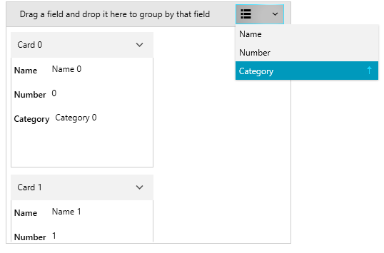
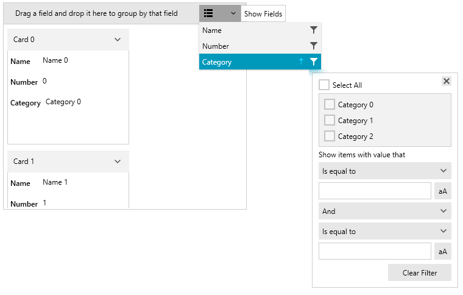
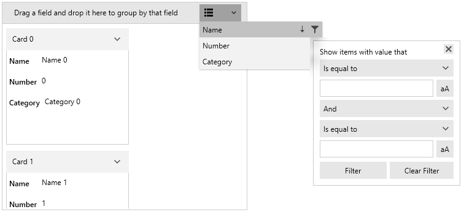
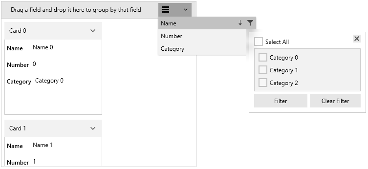
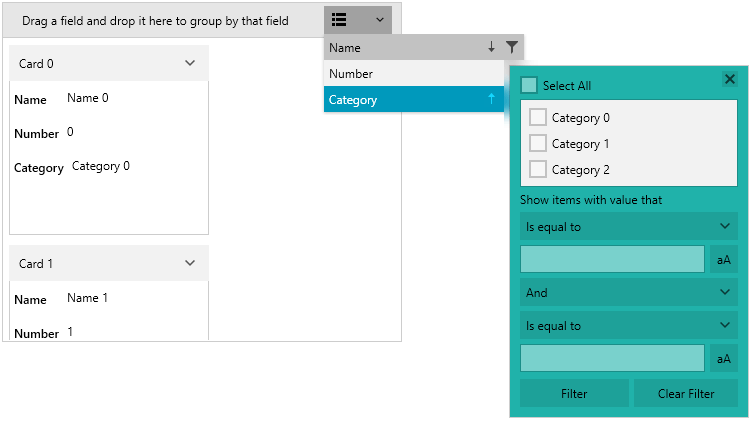

# Customizing Filtering Control

RadCardView filtering control can be customized in order to match the expected design or functionality.

>tip Read the [Filtering]() article to see how to use the filtering feature.

To hide the button that opens the [filtering control popup](), set the __IsFilteringAllowed__ property to __False__. 

__Example 1: Setting the IsFilteringAllowed property__
```XAML
	<telerik:RadCardView IsFilteringAllowed="False" />
```

#### Figure 1: Hidden filtering control icon


To keep the filtering control popup open when you click outside of it, set the __FilteringDropDownStaysOpen__ property to __True__.

__Example 2: Setting the FilteringDropDownStaysOpen property__
```XAML
	<telerik:RadCardView FilteringDropDownStaysOpen="True" />
```

To change the visibility of the __Filter__ button in the popup, set the __ShowFilterButton__ property of the associated [CardDataFieldDescriptor]().

__Example 3: Setting the ShowFilterButton property__
```XAML
	<telerik:RadCardView.DataFieldDescriptors>
		<telerik:CardDataFieldDescriptor DataMemberBinding="{Binding Name}" ShowFilterButton="False"/>
	</telerik:RadCardView.DataFieldDescriptors>
```

#### Figure 2: Hidden filtering button


To change the visibility of the distinct values list from the popup, set the __ShowDistinctFilters__ property of the associated CardDataFieldDescriptor.

__Example 4: Setting the ShowDistinctFilters property__
```XAML
	<telerik:RadCardView.DataFieldDescriptors>
		<telerik:CardDataFieldDescriptor DataMemberBinding="{Binding Name}" ShowDistinctFilters="False"/>
	</telerik:RadCardView.DataFieldDescriptors>
```

#### Figure 3: Hidden the distinct values list


To change the visibility of the field filters in the popup, set the __ShowFieldFilters__ property of the associated CardDataFieldDescriptor.

__Example 5: Setting the ShowFieldFilters property__
```XAML
	<telerik:RadCardView.DataFieldDescriptors>
		<telerik:CardDataFieldDescriptor DataMemberBinding="{Binding Name}" ShowFieldFilters="False"/>
	</telerik:RadCardView.DataFieldDescriptors>
```

#### Figure 4: Hidden the field filters


## Custom Filtering Control

The UI filters are hosted in a __FilteringControl__ element. To get or replace the control, use the __FilteringControl__ property of the associated [CardDataFieldDescriptor](). The value assigned to the property should implement the `IFilteringControl` interface or alternatively the `FilteringControl` class can be used as a base for the implementation.

__Example 6: Creating custom FilteringControl and changing few of the default settings__
```C#
	public class CustomFilteringControl : FilteringControl
    {
        public CustomFilteringControl(CardDataFieldDescriptor cardDataFieldDescriptor)
            : base(cardDataFieldDescriptor)
        {
        }

        public override void Prepare(CardDataFieldDescriptor cardDataFieldDescriptorToPrepare)
        {
            base.Prepare(cardDataFieldDescriptorToPrepare);
            var viewModel = (FilteringViewModel)this.DataContext;
            viewModel.FieldFilterLogicalOperator = FilterCompositionLogicalOperator.Or;
            viewModel.Filter1.Operator = FilterOperator.Contains;
            viewModel.Filter1.Value = "1";
            viewModel.SelectAll = true;
        }
    }
```

__Example 7: Setting the custom FilteringControl__
```C#
	public MainWindow()
	{
		InitializeComponent();
		
		var descriptor = this.cardView.DataFieldDescriptors[0];
		descriptor.FilteringControl = new CustomFilteringControl(descriptor);
	}
```

#### Figure 5: Customized FiltertingControl


The UI of the __FilteringControl__ can be customized using the __FilteringControlStyle__ property of the CardDataFieldDescriptor.

__Example 8: Setting the custom FilteringControlStyle__
```C#
	<telerik:CardDataFieldDescriptor.FilteringControlStyle>		
		<Style TargetType="cardView:FilteringControl">
			<Setter Property="Background" Value="LightSeaGreen" />
		</Style>
	</telerik:CardDataFieldDescriptor.FilteringControlStyle>
```

The "cardView:" namespace points to `xmlns:cardView="clr-namespace:Telerik.Windows.Controls.Data.CardView;assembly=Telerik.Windows.Controls.Data"`

#### Figure 6: Customized FiltertingControlStyle


## See Also  
* [Data Binding]()
* [Customizing Groups]() 
* [Customizing Cards]() 