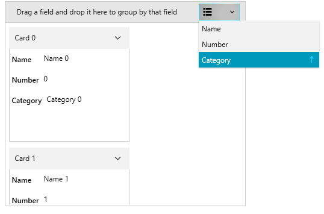
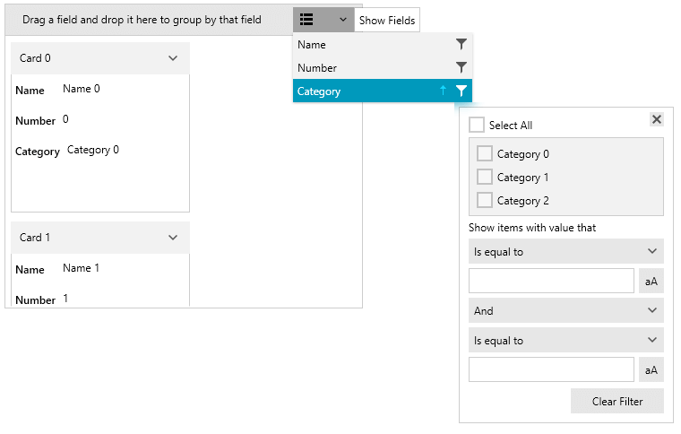
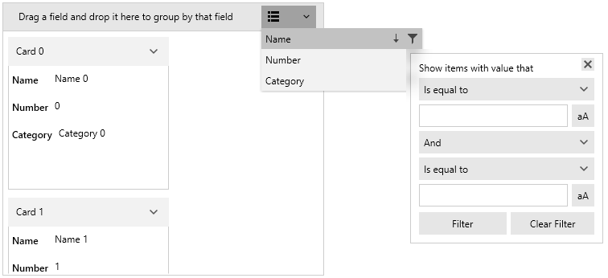
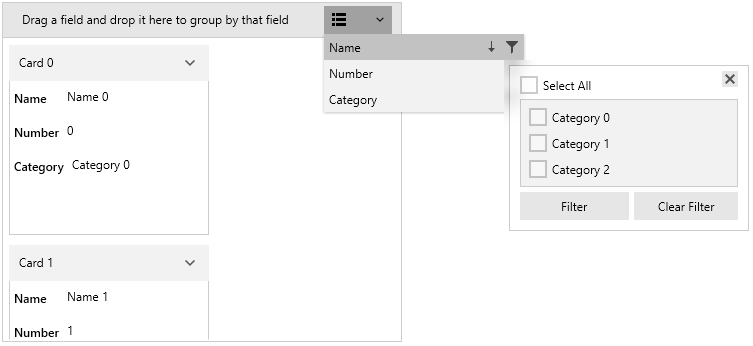
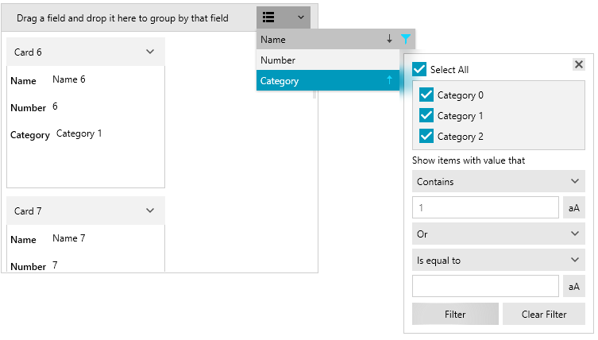
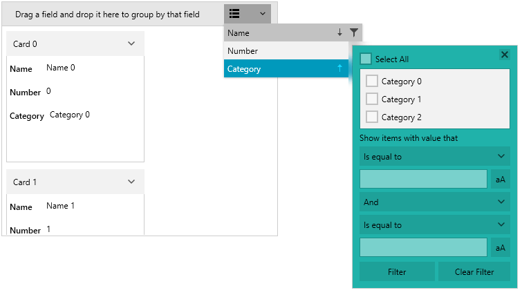

# Customizing Filtering Control

RadCardView filtering control can be customized in order to match the expected design or functionality.

>tip Read the [Filtering]() article to see how to use the filtering feature.

To hide the button that opens the [filtering control popup](), set the __IsFilteringAllowed__ property to __False__. 

__Example 1: Setting the IsFilteringAllowed property__
<snippet id='radcardview-appearance-customizing-filtering-control-example_1_setting_the_isfilteringallowed_property-xaml' />

#### Figure 1: Hidden filtering control icon

To keep the filtering control popup open when you click outside of it, set the __FilteringDropDownStaysOpen__ property to __True__.

__Example 2: Setting the FilteringDropDownStaysOpen property__
<snippet id='radcardview-appearance-customizing-filtering-control-example_2_setting_the_filteringdropdownstaysopen_property-xaml' />

To change the visibility of the __Filter__ button in the popup, set the __ShowFilterButton__ property of the associated [CardDataFieldDescriptor]().

__Example 3: Setting the ShowFilterButton property__
<snippet id='radcardview-appearance-customizing-filtering-control-example_3_setting_the_showfilterbutton_property-xaml' />

#### Figure 2: Hidden filtering button

To change the visibility of the distinct values list from the popup, set the __ShowDistinctFilters__ property of the associated CardDataFieldDescriptor.

__Example 4: Setting the ShowDistinctFilters property__
<snippet id='radcardview-appearance-customizing-filtering-control-example_4_setting_the_showdistinctfilters_property-xaml' />

#### Figure 3: Hidden the distinct values list

To change the visibility of the field filters in the popup, set the __ShowFieldFilters__ property of the associated CardDataFieldDescriptor.

__Example 5: Setting the ShowFieldFilters property__
<snippet id='radcardview-appearance-customizing-filtering-control-example_5_setting_the_showfieldfilters_property-xaml' />

#### Figure 4: Hidden the field filters

## Custom Filtering Control

The UI filters are hosted in a __FilteringControl__ element. To get or replace the control, use the __FilteringControl__ property of the associated [CardDataFieldDescriptor](). The value assigned to the property should implement the `IFilteringControl` interface or alternatively the `FilteringControl` class can be used as a base for the implementation.

__Example 6: Creating custom FilteringControl and changing few of the default settings__
<snippet id='radcardview-appearance-customizing-filtering-control-example_6_creating_custom_filteringcontrol_and_changing_few_of_the_default_settings-cs' />

__Example 7: Setting the custom FilteringControl__
<snippet id='radcardview-appearance-customizing-filtering-control-example_7_setting_the_custom_filteringcontrol-cs' />

#### Figure 5: Customized FiltertingControl

The UI of the __FilteringControl__ can be customized using the __FilteringControlStyle__ property of the CardDataFieldDescriptor.

__Example 8: Setting the custom FilteringControlStyle__
<snippet id='radcardview-appearance-customizing-filtering-control-example_8_setting_the_custom_filteringcontrolstyle-cs' />

The "cardView:" namespace points to `xmlns:cardView="clr-namespace:Telerik.Windows.Controls.Data.CardView;assembly=Telerik.Windows.Controls.Data"`

#### Figure 6: Customized FiltertingControlStyle

## See Also  
* [Data Binding]()
* [Customizing Groups]() 
* [Customizing Cards]() 