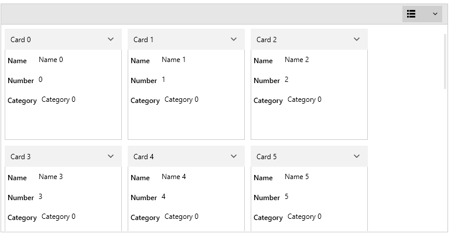
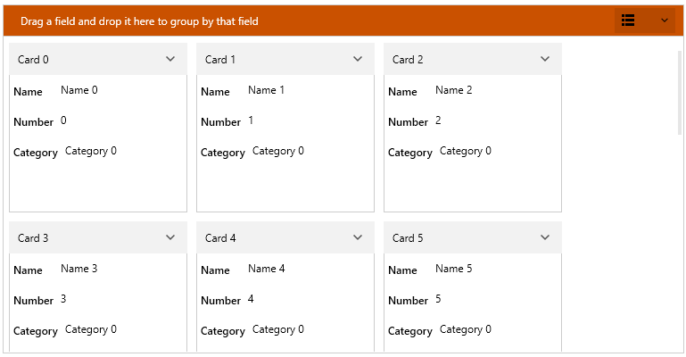
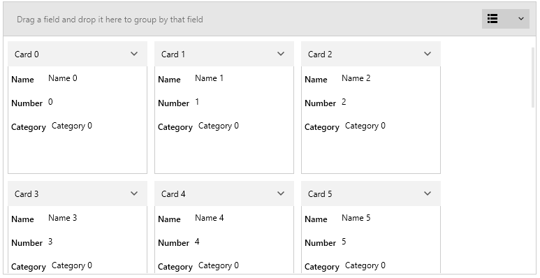
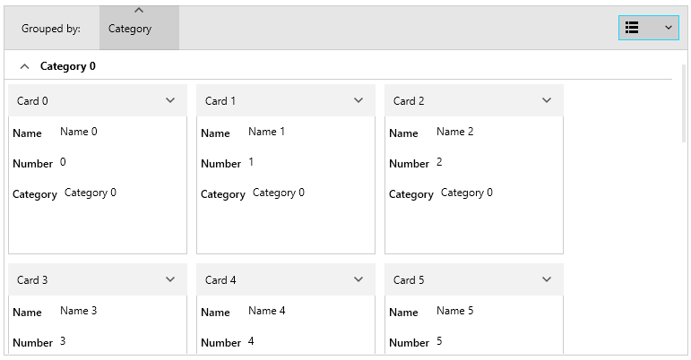
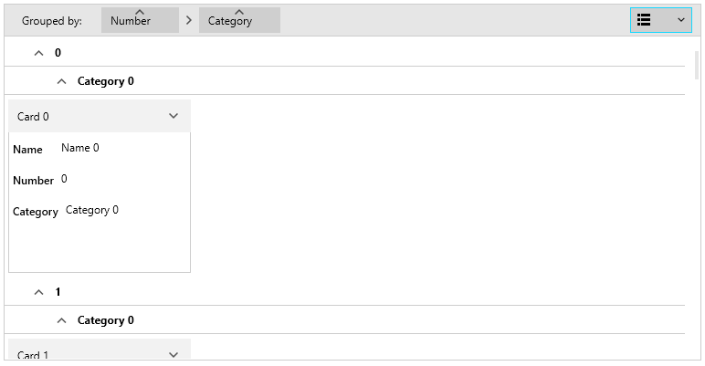

# Customizing Groups

A RadCardView group can be customized in order to match the expected design or functionality.

>tip Read the [Grouping]() article to see how to setup the grouping.

## Group Panel

To change the __visibility__ of the [group panel]()'s text and items, set the __ShowGroupPanel__ property of RadCardView.

#### __[XAML] Example 1: Hiding group panel__
{{region radcardview-appearance-customizing-groups-0}}
    <telerik:RadCardView ShowGroupPanel="False"/>
{{endregion}}

#### Figure 1: Hidden group panel

To change the __background color__ of the group panel, set the __GroupPanelBackground__ property of RadCardView.

To change the __text color__ of the group panel, set the __GroupPanelForeground__ property of RadCardView.

To __disable the sorting__ of groups with the [group member button](), set the __CanUserSortGroups__ property of RadCardView.

#### __[XAML] Example 2: Customizing group panel colors__
{{region radcardview-appearance-customizing-groups-1}}
    <telerik:RadCardView GroupPanelBackground="#CA5100"
						 GroupPanelForeground="White"
                         CanUserSortGroups="False"/>
{{endregion}}

#### Figure 2: Changed group panel background

Additionally, the element that represents the group panel can be customized using the __GroupPanelStyle__ property.

#### __[XAML] Example 3: Customizing group panel style__
{{region radcardview-appearance-customizing-groups-2}}
	<telerik:RadCardView.GroupPanelStyle>
		
	</telerik:RadCardView.GroupPanelStyle>
{{endregion}}

The "cardView:" namespace points to `xmlns:cardView="clr-namespace:Telerik.Windows.Controls.Data.CardView;assembly=Telerik.Windows.Controls.Data"`

#### Figure 3: Customized group panel style

To customize the [group member button]() elements in the group panel, set the __GroupPanelItemStyle__ property.

#### __[XAML] Example 4: Customizing group panel items__
{{region radcardview-appearance-customizing-groups-3}}
	<telerik:RadCardView.GroupPanelItemStyle>
		
	</telerik:RadCardView.GroupPanelItemStyle>
{{endregion}}

#### Figure 4: Customized group panel items

## Group Item Indentation

To set the group items horizontal offset (indentation), set the __GroupItemIndentation__ property. 

#### __[XAML] Example 5: Changing group items indentation__
{{region radcardview-appearance-customizing-groups-4}}
	<telerik:RadCardView GroupItemIndentation="25" />
{{endregion}}

#### Figure 5: Customized group panel items

## See Also  
* [Data Binding]()
* [Customizing Cards]() 
* [Customizing Filtering Control]() 