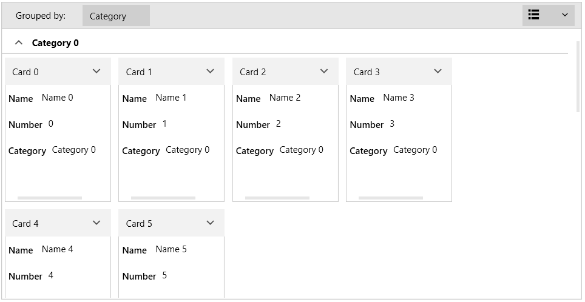
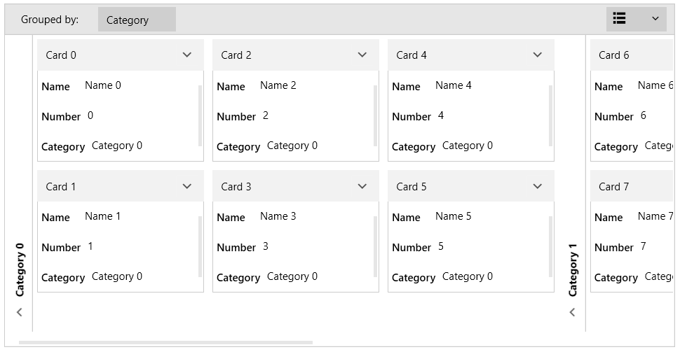

# Card Layout

RadCardView supports two orientation based layouts arranged in rows or columns.

The layout is controlled with the __CardLayout__ property of RadCardView. The default property value is set to __Rows__. In this case, the cards are arranged horizontally. When the there is no more space, the cards are arranged in the next available row. The property can be set also to __Columns__. In this case, the cards are arranged vertically. When there is no more space, the cards are arranged in the next available column.

__Example 1: Setting cards layout__
```XAML	
	<telerik:RadCardView CardLayout="Columns" />   
```

#### Figure 1: Rows layout (default)


#### Figure 2: Columns layout


The size of the cards is controlled with the __MajorLength__ and __MinorLength__ properties of RadCardView. When the CardLayout is Rows the MajorLength is applied to the card's width and the MinorLength to the card's height. When the CardLayout is Columns the MajorLength is applied to the card's height and the MinorLength to the card's width. 

>tip Read more about the MajorLength and MinorLength properties in the [Customizing Cards]() article.

## See Also  
* [Getting Started]()
* [Data Binding]()
* [Customizing Groups]() 