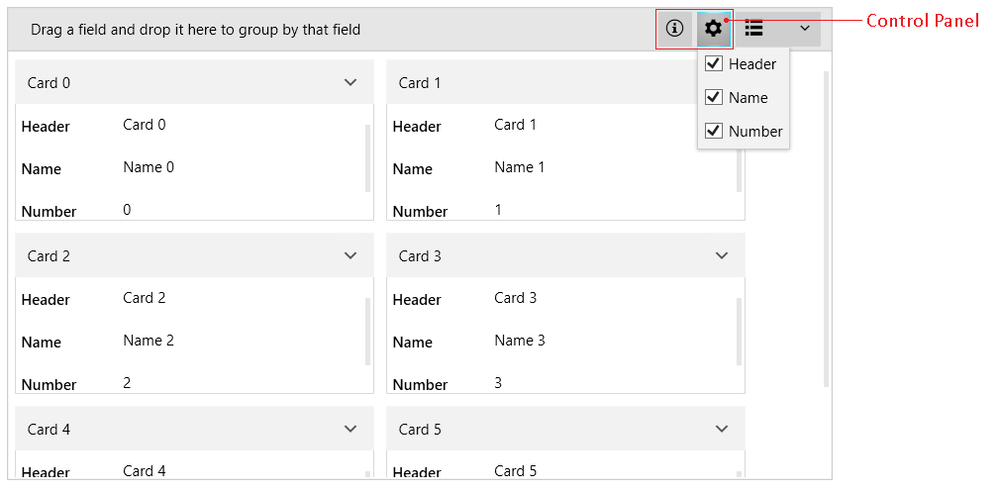
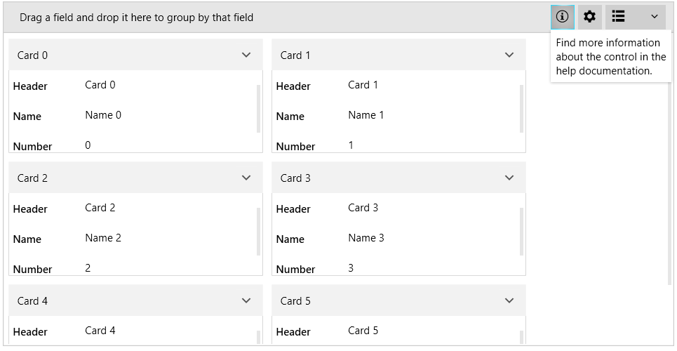

# Control Panel

The control panel of RadCardView allows you to include additional settings UI next to the [Data Field Descriptors Button]().

The feature is useful in case you want to include a custom settings panel and implement the corresponding actions.

To enable the control panel, use the __ControlPanelItems__ property of RadCardView. This allows you to define __CardViewControlPanelItem__ elements, which are proxies that hold information about the corresponding visual element that will be created.

The following example is an extended version of the sample from the [Getting Started]() article.

__Example 1: Defining GridViewControlPanelItems__
```XAML
	<telerik:RadCardView x:Name="cardView" CardHeaderBinding="{Binding Header}" MinorLength="140">
		<telerik:RadCardView.ControlPanelItems>
			<cardView:ControlPanelItemCollection>
			    <cardView:CardViewControlPanelItem>
				<cardView:CardViewControlPanelItem.ButtonContent>
				    <telerik:RadGlyph Glyph="&#xe401;" />
				</cardView:CardViewControlPanelItem.ButtonContent>
				<cardView:CardViewControlPanelItem.Content>
				    <TextBlock Text="Find more information about the control in the help documentation."
						MaxWidth="150" TextWrapping="Wrap" Padding="6" />
				</cardView:CardViewControlPanelItem.Content>
			    </cardView:CardViewControlPanelItem>
			    <cardView:CardViewControlPanelItem ButtonTooltip="Descriptor Settings">
				<cardView:CardViewControlPanelItem.ButtonContent>
				    <telerik:RadGlyph Glyph="&#xe13a;" />
				</cardView:CardViewControlPanelItem.ButtonContent>
				<cardView:CardViewControlPanelItem.Content>
				    <telerik:RadListBox ItemsSource="{Binding ElementName=cardView, Path=DataFieldDescriptors}">
					<telerik:RadListBox.ItemTemplate>
					    <DataTemplate>
						<CheckBox Content="{Binding Header}" IsChecked="{Binding IsVisible, Mode=TwoWay}" />
					    </DataTemplate>
					</telerik:RadListBox.ItemTemplate>
				    </telerik:RadListBox>
				</cardView:CardViewControlPanelItem.Content>
			    </cardView:CardViewControlPanelItem>
			</cardView:ControlPanelItemCollection>               
		</telerik:RadCardView.ControlPanelItems>
	</telerik:RadCardView>
```

>tip `cardView:` points to `xmlns:cardView="clr-namespace:Telerik.Windows.Controls.Data.CardView;assembly=Telerik.Windows.Controls.Data"`. 

#### Figure 1: CardView Control Panel


The control panel item visual element is a [RadDropDownButton]().

To set a tooltip for the button, use the __ButtonTooltip__ property of CardViewControlPanelItem.

To set the content of the button, use the __ButtonContent__ property of CardViewControlPanelItem. 

To set the drop down content of the button, use the __Content__ property of CardViewControlPanelItem.

Both Content and ButtonContent are of type __object__ where you can use a business model or directly an UI element as in Example 1. In addition to those properties, you can set the corresponding __ContentTemplate__ and __ButtonContentTemplate__ properties of CardViewControlPanelItem.

## Using Data Templates

CardViewControlPanelItem allows you to provide objects to the __Content__ and __ButtonContent__ properties. Then, you can use the __ContentTemplate__ and __ButtonContentTemplate__ properties to define the corresponding UI.

The following example is an extended version of the sample from the [Getting Started]() article.

__Example 2: Defining ButtonContentTemplate and ContentTemplate__
```XAML
	<Grid>
        <Grid.Resources>
            <telerik:StringToGlyphConverter x:Key="StringToGlyphConverter" />
            <DataTemplate x:Key="ControlPanelItemButtonContentTemplate">
                <telerik:RadGlyph Glyph="{Binding Converter={StaticResource StringToGlyphConverter}}" />
            </DataTemplate>
            <DataTemplate x:Key="ControlPanelItemContentTemplate">
                <TextBlock Text="{Binding}" MaxWidth="150"
                           TextWrapping="Wrap" Padding="6" />
            </DataTemplate>
        </Grid.Resources>
        <telerik:RadCardView x:Name="cardView"   
                     CardHeaderBinding="{Binding Header}" 
                     MinorLength="140">
            <telerik:RadCardView.ControlPanelItems>
                <cardView:CardViewControlPanelItem ButtonContent="&#xe401;" 
                                                   Content="Find more information about the control in the help documentation."
                                                   ButtonContentTemplate="{StaticResource ControlPanelItemButtonContentTemplate}"
                                                   ContentTemplate="{StaticResource ControlPanelItemContentTemplate}"/>
                <cardView:CardViewControlPanelItem ButtonContent="&#xe13a;" 
                                                   Content="Define some custom UI in the template."
                                                   ButtonContentTemplate="{StaticResource ControlPanelItemButtonContentTemplate}"
                                                   ContentTemplate="{StaticResource ControlPanelItemContentTemplate}"/>
            </telerik:RadCardView.ControlPanelItems>
        </telerik:RadCardView>
    </Grid>
```

#### Figure 2: CardView Control Panel with Data Templates


## See Also
* [Getting Started]()
* [Events]()
* [Visual Structure]()

