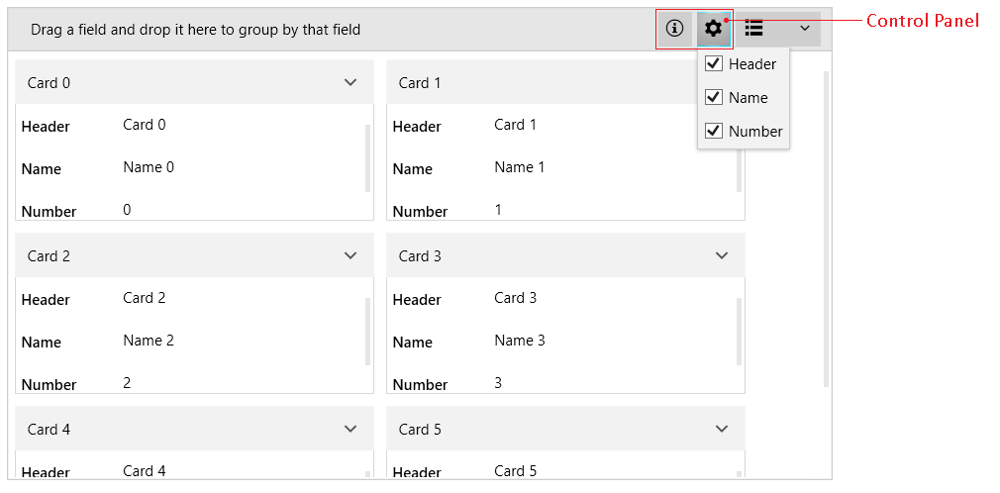
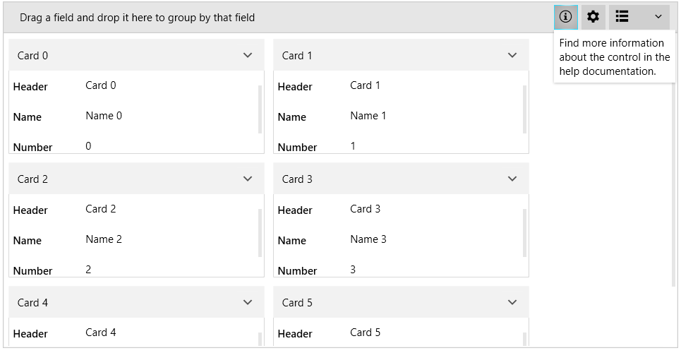

# Control Panel

The control panel of RadCardView allows you to include additional settings UI next to the [Data Field Descriptors Button]().

The feature is useful in case you want to include a custom settings panel and implement the corresponding actions.

To enable the control panel, use the __ControlPanelItems__ property of RadCardView. This allows you to define __CardViewControlPanelItem__ elements, which are proxies that hold information about the corresponding visual element that will be created.

The following example is an extended version of the sample from the [Getting Started]() article.

__Example 1: Defining GridViewControlPanelItems__
<snippet id='radcardview-features-controlpanel-example_1_defining_gridviewcontrolpanelitems-xaml' />

>tip `cardView:` points to `xmlns:cardView="clr-namespace:Telerik.Windows.Controls.Data.CardView;assembly=Telerik.Windows.Controls.Data"`. 

#### Figure 1: CardView Control Panel

The control panel item visual element is a [RadDropDownButton]().

To set a tooltip for the button, use the __ButtonTooltip__ property of CardViewControlPanelItem.

To set the content of the button, use the __ButtonContent__ property of CardViewControlPanelItem. 

To set the drop down content of the button, use the __Content__ property of CardViewControlPanelItem.

Both Content and ButtonContent are of type __object__ where you can use a business model or directly an UI element as in Example 1. In addition to those properties, you can set the corresponding __ContentTemplate__ and __ButtonContentTemplate__ properties of CardViewControlPanelItem.

## Using Data Templates

CardViewControlPanelItem allows you to provide objects to the __Content__ and __ButtonContent__ properties. Then, you can use the __ContentTemplate__ and __ButtonContentTemplate__ properties to define the corresponding UI.

The following example is an extended version of the sample from the [Getting Started]() article.

__Example 2: Defining ButtonContentTemplate and ContentTemplate__
<snippet id='radcardview-features-controlpanel-example_2_defining_buttoncontenttemplate_and_contenttemplate-xaml' />

#### Figure 2: CardView Control Panel with Data Templates

## See Also
* [Getting Started]()
* [Events]()
* [Visual Structure]()

