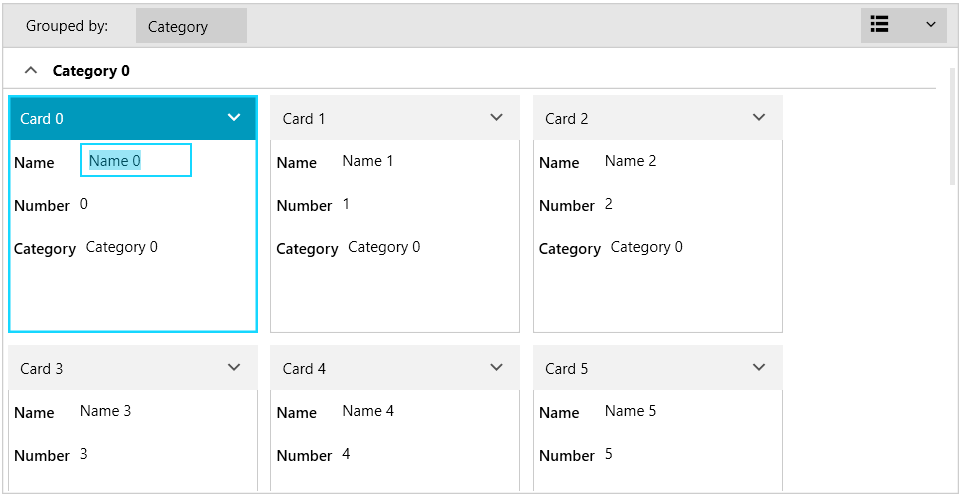

# Editing

The data fields in RadCardView's cards can be edited via the UI.

Clicking onto a card will select it and start the edit mode of the first data field. This displays an editor for the data bound value. The editing is started also by clicking on the corresponding data field in the card.

#### Figure 1: Data field in edit mode

The editing action fires several events that can be used to interfere with the process. Read more in the [Events](#editing) article.

The data fields editor visual element can be customized using the __EditorTemplate__ property of the [CardDataFieldDescriptor](). To customize the entire card while a data field is in edit mode, use the __CardEditTemplate__ property of RadCardView. Read more in the [Customizing Cards]() article.

## See Also
* [Getting Started]()
* [Events]()
* [Visual Structure]()