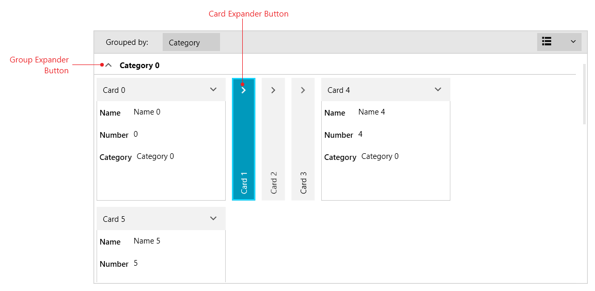

# {{ site.framework_name }} RadCardView Expand and Collapse Support

RadCardView provides you with the ability to collapse and expand cards and groups.

A card or a group can be expanded/collapsed via the expander button in the UI of the control.

#### Figure 1: RadCardView group and card expander

To expand/collapse an item in code use the __Collapse__ and __Expand__ methods of RadCardView. The methods will toggle the expand state of a card if you provide a data item as an argument, or a group if you provide an `IGroup` object.

#### __[C#] Example 1: Expanding and collapsing a card__
{{region radcardview-features-expand-collapse-0}}
	var itemsSource = (ObservableCollection<MyDataItem>)this.cardView.ItemsSource;
	var fistItem = itemsSource[0];
	
	this.cardView.Expand(fistItem);

	this.cardView.Collapse(fistItem);
{{endregion}}

#### __[C#] Example 2: Expanding and collapsing a group__
{{region radcardview-features-expand-collapse-1}}
	var collectionView = (QueryableCollectionView)this.cardView.ItemsSource;
	var firstGroup = collectionView.Groups[0];
	
	this.cardView.Expand(firstGroup);

	this.cardView.Collapse(firstGroup);
{{endregion}}

>tip Read the [Data Binding]() article to see how to populate the RadCardView with items and how enable grouping.

## See Also
* [Getting Started]()
* [Events]()