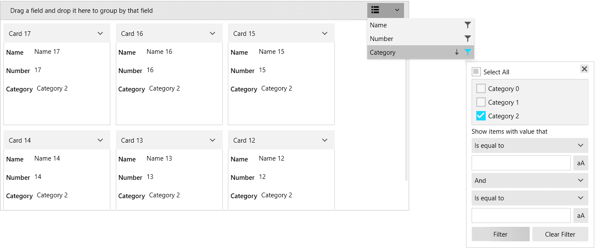

# Filtering

RadCardView supports filtering via the UI or in code, in case you are using ICollectionView as the ItemsSource.

The control internally works with a [QueryableCollectionView]() instance. If you set the ItemsSource of the RadCardView that is not a QueryableCollectionView, then the original collection is wrapped in a QueryableCollectionView instance. This way filtering is supported even if you use a more basic IEnumerable implementation, like `List<T>` or `ObservableCollection<T>`.
 
## Filtering in the UI

The data items can be filtered using the [filtering control]() which opens when a data field descriptor's filters button is pressed.

#### Figure 1: RadCardView filtering control


To disable user filtering, set the __IsFilteringAllowed__ property to __False__. 

__Example 1: Setting the IsFilteringAllowed property__
```XAML
	<telerik:RadCardView IsFilteringAllowed="False" />
```

Additionally, the filtering can be disabled per [CardDataFieldDescriptor]() by setting its __AllowFiltering__ property.

## Programmatic Filtering

The following example shows how to setup RadCardView, populate it a [QueryableCollectionView]() and add FilterDescriptors in code.

__Example 2: Defining the model__
```C#
	public class CardInfo
    {
        public string Header { get; set; }
        public string Name { get; set; }
        public int Number { get; set; }
        public string Category { get; set; }
    }
	
	public class MainViewModel
    {
        public ObservableCollection<CardInfo> Items { get; private set; }
        public QueryableCollectionView CollectionView { get; private set; }

        public MainViewModel()
        {
            int counter = 0;
            Items = new ObservableCollection<CardInfo>();
            for (int g = 0; g < 3; g++)
            {
                for (int i = 0; i < 6; i++)
                {
                    Items.Add(new CardInfo()
                    {
                        Header = "Card " + counter,
                        Name = "Name " + counter,
                        Number = counter,
                        Category = "Category " + g
                    });
                    counter++;
                }
            }

            CollectionView = new QueryableCollectionView(Items);
            CollectionView.FilterDescriptors.Add(new FilterDescriptor()
            {
                Member = "Name", 
                Operator = FilterOperator.Contains,
                Value = "1"
            });
        }
    }
``` 

>tip Read the [QueryableCollectionView](#filtering) to see how to use the FilterDescriptors collection of the QueryableCollectionView.

__Example 3: Setting the DataContext__
```C#
	public MainWindow()
	{
		InitializeComponent();
		this.DataContext = new MainViewModel();
	}
```

__Example 4: Setting up the view__
```XAML
	<telerik:RadCardView ItemsSource="{Binding CollectionView}" CardHeaderBinding="{Binding Header}" />
```

## Events

The filtering operations invoke several events that can be used to customize the filtering. Read more in the [Events](#filtering) article.

## Filter Member Path

The filtering uses the property bound to the __DataMemberBinding__ property of the corresponding [CardDataFieldDescriptor](). To change this, set the __FilterMemberPath__ property of the descriptor. The path should point to a property in the underlying data item.

__Example 5: Setting the FilterMemberPath property__
```XAML
	<telerik:RadCardView.DataFieldDescriptors>
		<telerik:CardDataFieldDescriptor DataMemberBinding="{Binding Name}" FilterMemberPath="Category" />
	</telerik:RadCardView.DataFieldDescriptors>
```

## Deferred Filtering

Selecting a filter in the filtering control will apply it immediately to the items. To change this, set the __IsFilteringDeferred__ property of the corresponding [CardDataFieldDescriptor]() to true. This will require a press of the __Filter button__ in order to commit the filters.

__Example 6: Setting the IsFilteringDeferred property__
```XAML
	<telerik:RadCardView.DataFieldDescriptors>
		<telerik:CardDataFieldDescriptor DataMemberBinding="{Binding Name}" IsFilteringDeferred="True" />
	</telerik:RadCardView.DataFieldDescriptors>
```

## Customizing Filtering UI

The UI of the [filtering control]() can be customized using several properties of RadCardView and CardDataFieldDescriptor. Read more in the [Customizing Filtering Control]() article.

## See Also
* [Getting Started]()
* [Data Binding]()
* [Grouping]()
* [Sorting]()