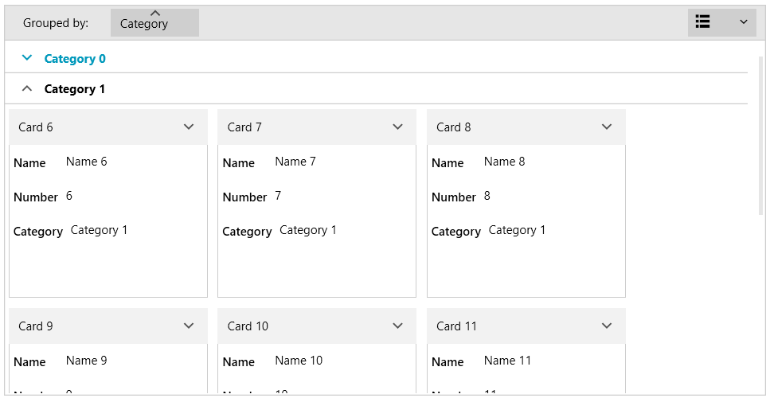
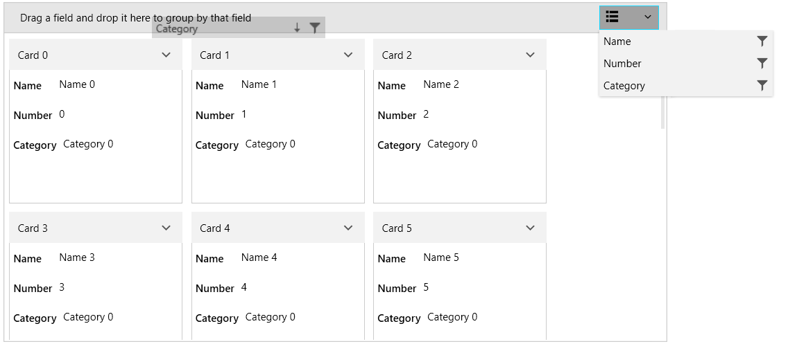

# Grouping

RadCardView supports grouping via the UI or in code, in case you are using ICollectionView as the ItemsSource.

#### Figure 1: RadCardView groups

The control internally works with a [QueryableCollectionView]() instance. If you set the ItemsSource of the RadCardView that is not a QueryableCollectionView, then the original collection is wrapped in a QueryableCollectionView instance. This way grouping is supported even if you use a more basic IEnumerable implementation, like `List<T>` or `ObservableCollection<T>`.
 
## Grouping in the UI

The data items can be grouped by dragging a data field descriptor from the [data field descriptors list]() to the group panel area.

#### Figure 2: Dragging data field descriptor

#### Figure 3: Grouped RadCardView

The RadCardView groups support sorting by clicking onto the associated [group member button](). To disable this, set the __CanUserSortGroups__ property to __False__.

__Example 1: Setting the CanUserSortGroups property__
<snippet id='radcardview-features-grouping-example_1_setting_the_canusersortgroups_property-xaml' />

Additionally, the grouping can be disabled per [CardDataFieldDescriptor]() by setting its __AllowGrouping__ property.

## Programmatic Grouping

The following example shows how to setup RadCardView, populate it a [QueryableCollectionView]() and add GroupDescriptors in code.

__Example 2: Defining the model__
<snippet id='radcardview-features-grouping-example_2_defining_the_model-cs' />

>tip Read the [QueryableCollectionView](#grouping) to see how to use the GroupDescriptors collection of the QueryableCollectionView.

__Example 3: Setting the DataContext__
<snippet id='radcardview-features-grouping-example_3_setting_the_datacontext-cs' />

__Example 4: Setting up the view__
<snippet id='radcardview-features-grouping-example_4_setting_up_the_view-xaml' />

## Events

The grouping operations invoke several events that can be used to customize the grouping. Read more in the [Events](#grouping) article.

## Customizing Grouping UI

The [group panel area]() can be customized using several public properties. To hide the area, set the __ShowGroupPanel__ property to __False__. Read more in the [Customizing Groups]() article.

__Example 5: Setting the ShowGroupPanel property__
<snippet id='radcardview-features-grouping-example_5_setting_the_showgrouppanel_property-xaml' />

## See Also
* [Getting Started]()
* [Data Binding]()
* [Filtering]()
* [Sorting]()
