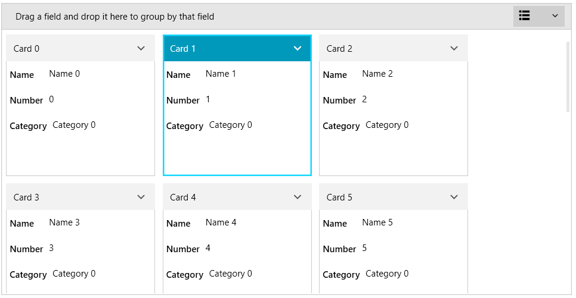

# Selection

The selection feature of RadCardView allows you to select cards by clicking onto the card or using code.

#### Figure 1: Selected card 

Selecting an item updates the __SelectedItem__ property of RadCardView. The property can be used to control the selection in code. The __SelectedItem__ holds a reference to an item from the __ItemsSource__ of the control.

__Example 1: Setting SelectedItem in code__
<snippet id='radcardview-features-selection-example_1_setting_selecteditem_in_code-cs' />

__Example 2: Data binding the SelectedItem property__
<snippet id='radcardview-features-selection-example_2_data_binding_the_selecteditem_property-xaml' />

To disable the user selection from the UI, set the __CanUserSelect__ property of RadCardView to __False__. 

__Example 3: Disabling user selection__
<snippet id='radcardview-features-selection-example_3_disabling_user_selection-xaml' />

Changing the selected item fires the __SelectionChanged__ event. Read more in the [Events]() article.

>tip Read the [Data Binding]() article to see how to populate the RadCardView with items.

## IsSynchronizedWithCurrentItem

If the underlying ItemsSource for your RadCardView control inherits from the **ICollectionView** interface, its **CurrentItem** property will be synchronized with the **SelectedItem** property of the RadCardView. Thus, when the current item of the collection view updates, this change will be reflected in the RadCardView and vice versa.

If you want to disable this functionality, you can set the **IsSynchronizedWithCurrentItem** property of the control to **False**.

__Example 4: Disable synchronization between CurrentItem and SelectedItem__
<snippet id='radcardview-features-selection-example_4_disable_synchronization_between_currentitem_and_selecteditem-xaml' />

## See Also  
* [Getting Started]()
* [Filtering]()
* [Grouping]()