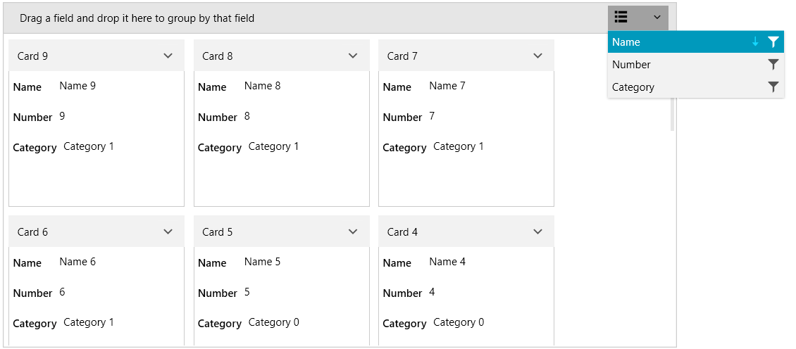

# Sorting

RadCardView supports sorting via the UI or in code, in case you are using ICollectionView as the ItemsSource.

The control internally works with a [QueryableCollectionView]() instance. If you set the ItemsSource of the RadCardView that is not a QueryableCollectionView, then the original collection is wrapped in a QueryableCollectionView instance. This way sorting is supported even if you use a more basic IEnumerable implementation, like `List<T>` or `ObservableCollection<T>`.
 
## Sorting in the UI

The data items can be sorted by clicking on a data field descriptor from the [data field descriptors list]().

#### Figure 1: RadCardView sorting


To disable user sorting, set the __CanUserSortDescriptors__ property to __False__.

__Example 1: Setting the CanUserSortDescriptors property__
```XAML
	<telerik:RadCardView CanUserSortDescriptors="False" />
```

Additionally, the sorting can be disabled per [CardDataFieldDescriptor]() by setting its __AllowSorting__ property.

## Programmatic Sorting

The following example shows how to setup RadCardView, populate it with a [QueryableCollectionView]() and add SortDescriptors in code.

__Example 2: Defining the model__
```C#
	public class CardInfo
    {
        public string Header { get; set; }
        public string Name { get; set; }
        public int Number { get; set; }
        public string Category { get; set; }
    }
	
	public class MainViewModel
    {
        public ObservableCollection<CardInfo> Items { get; private set; }
        public QueryableCollectionView CollectionView { get; private set; }

        public MainViewModel()
        {
            int counter = 0;
            Items = new ObservableCollection<CardInfo>();
            for (int g = 0; g < 3; g++)
            {
                for (int i = 0; i < 6; i++)
                {
                    Items.Add(new CardInfo()
                    {
                        Header = "Card " + counter,
                        Name = "Name " + counter,
                        Number = counter,
                        Category = "Category " + g
                    });
                    counter++;
                }
            }

            CollectionView = new QueryableCollectionView(Items);
            CollectionView.SortDescriptors.Add(new SortDescriptor() { Member = "Name", SortDirection = ListSortDirection.Descending });        
        }
    }
``` 

>tip Read the [QueryableCollectionView](#sorting) to see how to use the SortDescriptors collection of the QueryableCollectionView.

__Example 3: Setting the DataContext__
```C#
	public MainWindow()
	{
		InitializeComponent();
		this.DataContext = new MainViewModel();
	}
```

__Example 4: Setting up the view__
```XAML
	<telerik:RadCardView ItemsSource="{Binding CollectionView}" CardHeaderBinding="{Binding Header}" />
```

## Events

The sorting operations invoke several events that can be used to customize the sort. Read more in the [Events](#sorting) article.

## See Also  
* [Getting Started]()
* [Data Binding]()
* [Filtering]()
* [Grouping]()