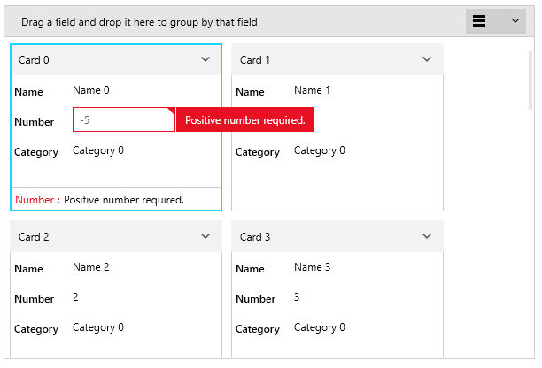

# Data Validation

The data fields of the RadCardView control support data validation of the user input. 

The feature provides visual feedback when an invalid value is entered. This article shows how to implement custom validation logic.

## Using Validation Events

The RadCardView control provides few events that are raised whenever the data is changed using the UI - __CardValidating__, __CardDataFieldValidating__ and __CardDataFieldValidated__.

The __CardDataFieldValidating__ and __CardDataFieldValidated__ events are raised when a data field exits its edit mode. If the card loses the focus when a data field exits edit mode, then the __CardValidating__ event is raised.

__CardDataFieldValidating__ can be used to validate the associated value and determine the validation state of the data field.

__Example 1: Validating a data field__
```C#
	private void RadCardView_CardDataFieldValidating(object sender, CardDataFieldValidatingEventArgs e)
	{
		if (e.DataField.DataMemberBinding.Path.Path == "Number")
		{
			var dataItem = (CardInfo)e.DataField.Item;
			if (dataItem.Number < 0)
			{
				e.IsValid = false;
			}
		}
	}
```

## Using ValidationException

The validation can be implemented in the view model. If the updated value is invalid, a `ValidationException` can be thrown in the corresponding property setter. To enable the visual feedback in the UI, set the __ValidatesOnExceptions__ and __NotifyOnValidationError__ properties of the DataMemberBinding to __True__.

__Example 2: Implementing validation logic in the view model__
```C#
	private int number;
	public int Number
	{
		get { return number; }
		set
		{
			if (value < 0)
			{
				throw new ValidationException("Positive number required.");
			}
			else
			{
				number = value;
			}
		}
	}
```

__Example 3: Enabling visual feedback using the data binding properties__
```XAML
	<telerik:RadCardView.DataFieldDescriptors>              
		<telerik:CardDataFieldDescriptor DataMemberBinding="{Binding Number, Mode=TwoWay, ValidatesOnExceptions=True, NotifyOnValidationError=True}" />
	</telerik:RadCardView.DataFieldDescriptors>
```

#### Figure 1: Data validation visual feedback


## Using Data Annotations

The data binding validation can be enabled also by using the data annotation attributes.

__Example 4: Using data annotations in the view model__
```C#
	private int number;
	
	[Range(0, int.MaxValue, ErrorMessage = "Positive number required.")]
	public int Number
	{
		get { return number; }
		set { number = value; } }
	}
```

__Example 5: Data binding the view model property__
```XAML
	<telerik:RadCardView.DataFieldDescriptors>              
		<telerik:CardDataFieldDescriptor DataMemberBinding="{Binding Number, Mode=TwoWay}" />
	</telerik:RadCardView.DataFieldDescriptors>
```

In order to see the error visual when using data annotations, press the __Enter key__. This will add the error in the list at the bottom of the card.

#### Figure 2: Data validation visual feedback when using data annotations


## See Also
* [Getting Started]()
* [Events]()
* [Visual Structure]()

