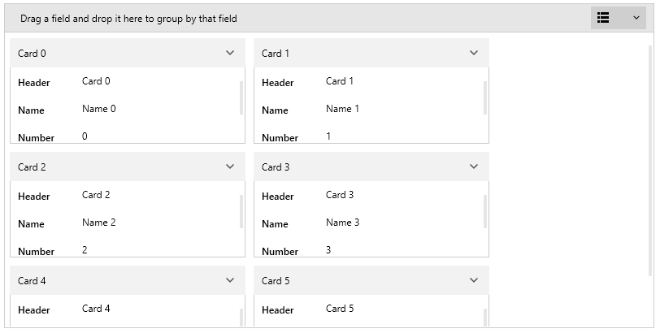

# Getting Started with {{ site.framework_name }} CardView

This tutorial will walk you through the creation of a sample application that contains a __RadCardView__ control.

## Adding Telerik Assemblies Using NuGet

To use `RadCardView` when working with NuGet packages, install the `Telerik.Windows.Controls.Data.for.Wpf.Xaml` package. The [package name may vary]() slightly based on the Telerik dlls set - [Xaml or NoXaml]()

Read more about NuGet installation in the [Installing UI for WPF from NuGet Package]() article.

>tip With the 2025 Q1 release, the Telerik UI for WPF has a new licensing mechanism. You can learn more about it [here]().

## Adding Assembly References Manually

If you are not using NuGet packages, you can add a reference to the following assemblies:

* __Telerik.Licensing.Runtime__
* __Telerik.Windows.Controls__
* __Telerik.Windows.Controls.Data__
* __Telerik.Windows.Controls.Input__
* __Telerik.Windows.Data__

You can find the required assemblies for each control from the suite in the [Controls Dependencies]() help article.

## Defining the RadCardView

To display data in the control, provide a collection of business objects and assign it to the __ItemsSource__ property of RadCardView. 

The following example shows how to setup a basic card model and populate the ItemsSource of the control.

#### __[C#] Example 1: Creating card model__
{{region radcardview-getting-started-0}}
	public class CardInfo
    {
        public string Header { get; set; }
        public string Name { get; set; }
        public int Number { get; set; }
    }
{{endregion}}

#### __[XAML] Example 2: Defining the control in XAML__
{{region radcardview-getting-started-1}}
	<telerik:RadCardView x:Name="cardView"  
						 CardHeaderBinding="{Binding Header}"
                         MinorLength="140"/>
{{endregion}}

#### __[C#] Example 3: Populating the control with data__
{{region radcardview-getting-started-2}}
	public MainWindow()
	{
	    InitializeComponent();          
	    var source = new ObservableCollection<CardInfo>();
	    for (int i = 0; i < 6; i++)
	    {
	        source.Add(new CardInfo() { Header = "Card " + i, Name = "Name " + i, Number = i });
	    }
	    this.cardView.ItemsSource = source;
	}
{{endregion}}

#### Figure 1: RadCardView example

The example shows also how to tell what is the property displaying the card headers (via the __CardHeaderBinding__ property) and the height of the cards (via the __MinorLength__ property). The MinorLength will apply to the height or the width of the cards based on the [CardLayout]() property value.

## Manual Data Field Generation

By default the RadCardView cards will auto-generate [data fields]() for each public property of the card's model class. To interfere with this process, you can use the __AutoGeneratingDataFieldDescriptor__ event of the control, where the data field generation can be canceled or customized. Additionally, you can set the __AutoGenerateDataFieldDescriptor__ property to __False__ and define the data fields manually via the RadCardView's __DataFieldDescriptors__ collection. Read more in the [Data Field Descriptor]() article.

## Data Manipulation

There are several mechanisms to customize the displayed data. You can filter, sort or group it. Additionally, when a card is selected, you can edit its data fields using the built-in UI. Read more about those features in the [Features]() section of the documentation.

## Setting a Theme

The controls from our suite support different themes. You can see how to apply a theme different than the default one in the [Setting a Theme]() help article.

>important Changing the theme using implicit styles will affect all controls that have styles defined in the merged resource dictionaries. This is applicable only for the controls in the scope in which the resources are merged. 

To change the theme, you can follow the steps below:

* Choose between the themes and add reference to the corresponding theme assembly (ex: **Telerik.Windows.Themes.Material.dll**). You can see the different themes applied in the **Theming** examples from our [WPF Controls Examples](https://demos.telerik.com/wpf/) application.

* Merge the ResourceDictionaries with the namespace required for the controls that you are using from the theme assembly. For the __RadCardView__, you will need to merge the following resources:

	* __Telerik.Windows.Controls__
	* __Telerik.Windows.Controls.Data__
	* __Telerik.Windows.Controls.Input__
	* __Telerik.Windows.Data__

__Example 2__ demonstrates how to merge the ResourceDictionaries so that they are applied globally for the entire application.

#### __[XAML] Example 2: Merge the ResourceDictionaries__  
{{region xaml-radcardview-getting-started_3}}
	<Application.Resources>
		<ResourceDictionary>
			<ResourceDictionary.MergedDictionaries>
				<ResourceDictionary Source="/Telerik.Windows.Themes.Material;component/Themes/System.Windows.xaml"/>
				<ResourceDictionary Source="/Telerik.Windows.Themes.Material;component/Themes/Telerik.Windows.Controls.xaml"/>
				<ResourceDictionary Source="/Telerik.Windows.Themes.Material;component/Themes/Telerik.Windows.Controls.Input.xaml"/>
				<ResourceDictionary Source="/Telerik.Windows.Themes.Material;component/Themes/Telerik.Windows.Controls.Data.xaml"/>
			</ResourceDictionary.MergedDictionaries>
		</ResourceDictionary>
	</Application.Resources>
{{endregion}}

>Alternatively, you can use the theme of the control via the [StyleManager](https://docs.telerik.com/devtools/wpf/styling-and-appearance/stylemanager/common-styling-apperance-setting-theme-wpf).

__Figure 4__ shows a __RadCardView__ with the **Material** theme applied.
	
#### __Figure 4: RadCardView with the Material theme__


## Telerik UI for WPF Learning Resources

* [Telerik UI for WPF CardView Component](https://www.telerik.com/products/wpf/cardview.aspx)
* [Getting Started with Telerik UI for WPF Components]()
* [Telerik UI for WPF Installation]()
* [Telerik UI for WPF and WinForms Integration]()
* [Telerik UI for WPF Visual Studio Templates]()
* [Setting a Theme with Telerik UI for WPF]()
* [Telerik UI for WPF Virtual Classroom (Training Courses for Registered Users)](https://learn.telerik.com/learn/course/external/view/elearning/16/telerik-ui-for-wpf) 
* [Telerik UI for WPF License Agreement](https://www.telerik.com/purchase/license-agreement/wpf-dlw-s)


## See Also  
* [Events]()
* [Visual Structure]()
* [Data Binding]()
