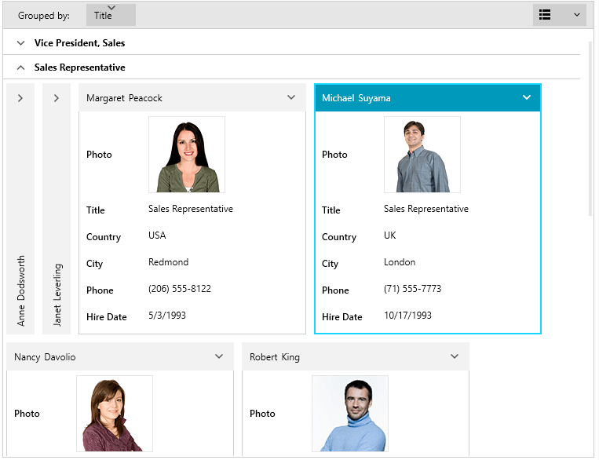

# Overview

__RadCardView__ allows you to display data in a card-like layout where you can sort, group and edit each card.





## Key Features

* __Editing__: The RadCardView cards contain sets of data fields that can be edited while the corresponding card is selected. Read more in the [Editing]() article.

* __Selection__: The control provides a built-in selection support. Clicking on a card in the layout selects it. You can also use the selection API. Read more in the [Selection]() article.

* __Grouping__: The users can interactively organize their data in a way that suits best their needs with a single drag and drop action. Data can be grouped according to several criteria effectively creating a tree of groups with the leaf nodes holding the actual data records. Users can group data by dragging a data field from the drop down menu and dropping it in the group area. Additionally, you can group the data programmatically using the GroupDescriptors collection of the corresponding [collection view](). Read more in the [Grouping]() article.

* __Different card layouts__: The layout of the cards and groups can be altered between row and column based ordering. Read more in the [Card Layout]() article.

* __Sorting__: RadCardView allows you to sort the cards via the [drop down menu]() listing the data fields. Read more in the [Sorting]() article.

* __Filtering__: The control has built-in filtering support. Read more in the [Filtering]() article.

* __Customizeable elements__: The visualization of RadCardView's groups and cards can be easily customized using the control's API. Read more in the [Appearance]() section of the documentation.

* __Localization support__: The text used in the settings areas of the controls is localized. Read more about the Telerik Localization support in the [Localization]() article which lists also the supported languages.

>tip Get started with the control with its [Getting Started]() help article that shows how to use it in a basic scenario.

> Check out the online demos at [demos.telerik.com](https://demos.telerik.com/wpf/).

## See Also
* [Visual Structure]()
* [Data Binding]()