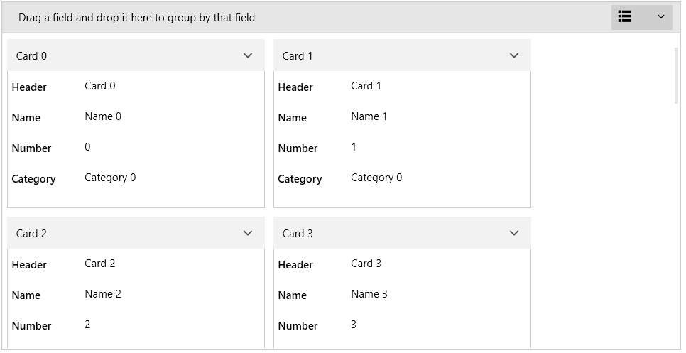
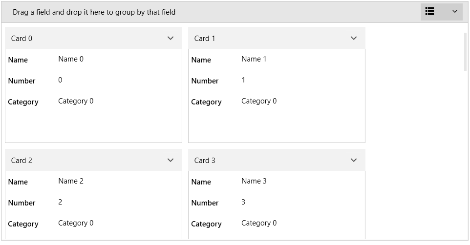
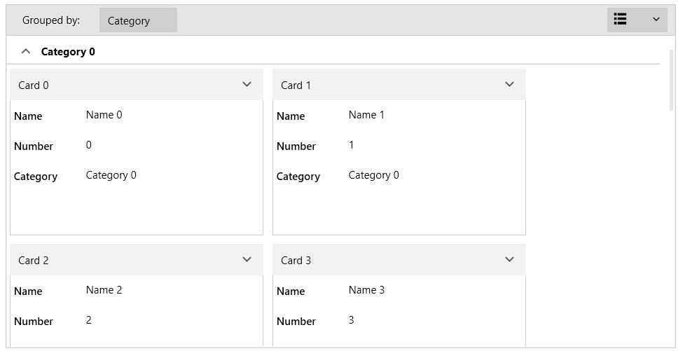

# Data Binding

RadCardView is populated with cards via its ItemsSource property.

This article shows how to prepare and set the ItemsSource, and data bind the cards' properties to the underlying data items.

For each public property in the underlying objects of the ItemsSource a data field is auto-generated in the card.

The control internally works with a QueryableCollectionView which handles the sorting, grouping and filtering operations. This said, if an IEnumerable is set as ItemsSource it will get wrapped into a QueryableCollectionView object.

__Example 1: Defining the model__
<snippet id='radcardview-populating-with-data-data-binding-example_1_defining_the_model-cs' />

__Example 2: Setting the data context__
<snippet id='radcardview-populating-with-data-data-binding-example_2_setting_the_data_context-cs' />

__Example 3: Setting up the view__
<snippet id='radcardview-populating-with-data-data-binding-example_3_setting_up_the_view-xaml' />

#### Figure 1: RadCardView example

The data fields in the cards are automatically generated based on the public properties of the `CardInfo` class from __Example 1__. To change this behavior you can set the __AutoGenerateDataFieldDescriptors__ property of RadCardView to __False__ and then define the descriptors manually in the __DataFieldDescriptors__ collection of the control.

## Manual Data Field Generation

To disable the automatic data field descriptor generation, set the __AutoGenerateDataFieldDescriptors__ property to False. Then add __CardDataFieldDescriptor__ elements in the __DataFieldDescriptors__ collection of RadCardView.

__Example 4: Defining CardDataFieldDescriptors__
<snippet id='radcardview-populating-with-data-data-binding-example_4_defining_carddatafielddescriptors-xaml' />

#### Figure 2: RadCardView example

>tip Read more about the data field descriptor's settings in the [Data Field Descriptor]() article.

## Binding to CollectionView

In order to easily control the sorting, filtering and grouping, you can use `QueryableCollectionView` or `QueryableCollectionViewSource`.
 
__Example 5: Setting up QueryableCollectionViewSource__
<snippet id='radcardview-populating-with-data-data-binding-example_5_setting_up_queryablecollectionviewsource-cs' />

#### Figure 3: RadCardView grouping example

>tip Read more about the collection view descriptors in the [QueryableCollectionView or QueryableCollectionViewSource]() article.

## See Also
* [Getting Started]()
* [Events]()
* [Data Field Descriptor]()
* [Grouping]()