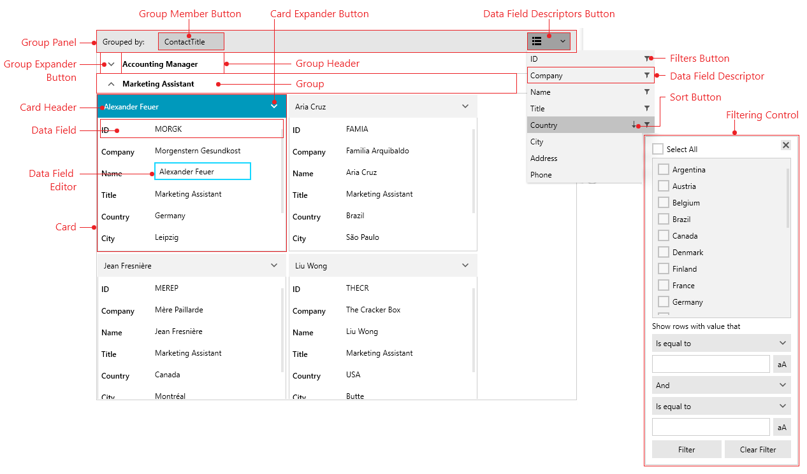

# Visual Structure

This section defines terms and concepts used in the scope of the __RadCardView__ control with which you have to get familiar before you continue to read its documentation. They can also be helpful when contacting our support service in order to describe your issue better.

## See Also  
* [Getting Started]()
