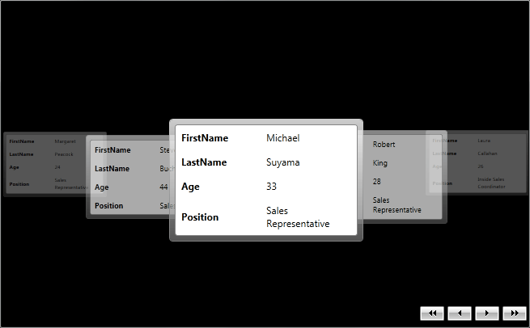

# Getting Started with {{ site.framework_name }} Carousel

This tutorial will walk you through the creation of a simple application containing **RadCarousel** and will show you how to:

## Assembly References

To use __RadCarousel__, add references to the following assemblies:

* __Telerik.Licensing.Runtime__
* __Telerik.Windows.Controls__
* __Telerik.Windows.Controls.Navigation__
* __Telerik.Windows.Data__

You can find the required assemblies for each control from the suite in the [Controls Dependencies]() help article.

>tip With the 2025 Q1 release, the Telerik UI for WPF has a new licensing mechanism. You can learn more about it [here]().

## Adding Telerik Assemblies Using NuGet

To use `__RadCarousel__` when working with NuGet packages, install the `Telerik.Windows.Controls.Navigation.for.Wpf.Xaml` package. The [package name may vary]() slightly based on the Telerik dlls set - [Xaml or NoXaml]()

Read more about NuGet installation in the [Installing UI for WPF from NuGet Package]() article.

## Adding RadCarousel to the Project

__Example 1: Adding RadGridView to application__
```XAML
	<telerik:RadCarousel x:Name="MyCarousel" Background="Black" Height="400" />	
```

## Binding RadCarousel to a Collection of Custom Objects

For the purpose of this tutorial we will create a new **Employee** class with a couple of properties:

__Example 2: The Employee class__

	```C#
	public class Employee
	{
	    public string FirstName
	    {
	        get;
	        set;
	    }
	    public string LastName
	    {
	        get;
	        set;
	    }
	    public int Age
	    {
	        get;
	        set;
	    }
	    public string Position
	    {
	        get;
	        set;
	    }
	}
```
```VB.NET
	Public Class Employee
	    Public Property FirstName() As String
	        Get
	            Return m_FirstName
	        End Get
	        Set
	            m_FirstName = Value
	        End Set
	    End Property
	    Private m_FirstName As String
	    Public Property LastName() As String
	        Get
	            Return m_LastName
	        End Get
	        Set
	            m_LastName = Value
	        End Set
	    End Property
	    Private m_LastName As String
	    Public Property Age() As Integer
	        Get
	            Return m_Age
	        End Get
	        Set
	            m_Age = Value
	        End Set
	    End Property
	    Private m_Age As Integer
	    Public Property Position() As String
	        Get
	            Return m_Position
	        End Get
	        Set
	            m_Position = Value
	        End Set
	    End Property
	    Private m_Position As String
	End Class
```

Furthermore, as some data will be needed, we will create **EmployeeService** class that provides a static **GetEmployees()** method:

__Example 3: The EmployeeService class__

	```C#
	public class EmployeeService
	{
	    public static ObservableCollection<Employee> GetEmployees()
	    {
	        ObservableCollection<Employee> employees = new ObservableCollection<Employee>();
	        Employee employee = new Employee();
	        employee.FirstName = "Margaret";
	        employee.LastName = "Peacock";
	        employee.Position = "Sales Representative";
	        employee.Age = 24;
	        employees.Add(employee);
	        employee = new Employee();
	        employee.FirstName = "Steven";
	        employee.LastName = "Buchanan";
	        employee.Position = "Sales Manager";
	        employee.Age = 44;
	        employees.Add(employee);
	        employee = new Employee();
	        employee.FirstName = "Michael";
	        employee.LastName = "Suyama";
	        employee.Position = "Sales Representative";
	        employee.Age = 33;
	        employees.Add(employee);
	        employee = new Employee();
	        employee.FirstName = "Robert";
	        employee.LastName = "King";
	        employee.Position = "Sales Representative";
	        employee.Age = 28;
	        employees.Add(employee);
	        employee = new Employee();
	        employee.FirstName = "Laura";
	        employee.LastName = "Callahan";
	        employee.Position = "Inside Sales Coordinator";
	        employee.Age = 26;
	        employees.Add(employee);
	        employee = new Employee();
	        employee.FirstName = "Anne";
	        employee.LastName = "Dodsworth";
	        employee.Position = "Sales Representative";
	        employee.Age = 30;
	        employees.Add(employee);
	
	        return employees;
	    }
	}
```
```VB.NET
	Public Class EmployeeService
	    Public Shared Function GetEmployees() As ObservableCollection(Of Employee)
	        Dim employees As New ObservableCollection(Of Employee)()
	        Dim employee As New Employee()
	        employee.FirstName = "Margaret"
	        employee.LastName = "Peacock"
	        employee.Position = "Sales Representative"
	        employee.Age = 24
	        employees.Add(employee)
	        employee = New Employee()
	        employee.FirstName = "Steven"
	        employee.LastName = "Buchanan"
	        employee.Position = "Sales Manager"
	        employee.Age = 44
	        employees.Add(employee)
	        employee = New Employee()
	        employee.FirstName = "Michael"
	        employee.LastName = "Suyama"
	        employee.Position = "Sales Representative"
	        employee.Age = 33
	        employees.Add(employee)
	        employee = New Employee()
	        employee.FirstName = "Robert"
	        employee.LastName = "King"
	        employee.Position = "Sales Representative"
	        employee.Age = 28
	        employees.Add(employee)
	        employee = New Employee()
	        employee.FirstName = "Laura"
	        employee.LastName = "Callahan"
	        employee.Position = "Inside Sales Coordinator"
	        employee.Age = 26
	        employees.Add(employee)
	        employee = New Employee()
	        employee.FirstName = "Anne"
	        employee.LastName = "Dodsworth"
	        employee.Position = "Sales Representative"
	        employee.Age = 30
	        employees.Add(employee)
	        Return employees
	    End Function
	End Class
```

Once all the data is prepared, we may set the RadCarousel's **ItemsSource**:

__Example 4: Setting RadCarousel's ItemsSource__

	```C#
	this.MyCarousel.ItemsSource = EmployeeService.GetEmployees();
```
```VB.NET
	Me.MyCarousel.ItemsSource = EmployeeService.GetEmployees()
```

After running the application, you will see the following result:

#### __Figure 1: RadCarousel displaying a list of employees__



## Display images in RadCarousel

Generally, RadCarousel may be easily used for displaying images and navigating through them. All you need to do is to add those that you want to be visualized in a **List<Image>** for example and set RadCarousel's ItemsSource:

__Example 5: Setting RadCarousel's ItemsSource to a list of images__

	```C#
	List<Image> myImages = new List<Image>();
	Image myImage = new Image();
	myImage.Source = new BitmapImage(new Uri("/Images/nature1.jpg", UriKind.Relative));
	myImage.Height = 200;
	myImage.Width = 200;
	myImages.Add(myImage);
	Image myImage1 = new Image();
	myImage1.Source = new BitmapImage(new Uri("/Images/nature2.jpg", UriKind.Relative));
	myImage1.Height = 200;
	myImage1.Height = 200;
	myImages.Add(myImage1);
	Image myImage2 = new Image();
	myImage2.Source = new BitmapImage(new Uri("/Images/nature15.jpg", UriKind.Relative));
	myImage2.Width = 200;
	myImage.Height = 200;
	myImages.Add(myImage2);
	Image myImage3 = new Image();
	myImage3.Source = new BitmapImage(new Uri("/Images/nature19.jpg", UriKind.Relative));
	myImage3.Height = 200;
	myImage3.Width = 200;
	myImages.Add(myImage3);
	Image myImage4 = new Image();
	myImage4.Source = new BitmapImage(new Uri("/Images/nature26.jpg", UriKind.Relative));
	myImage4.Height = 200;
	myImage4.Width = 200;
	myImages.Add(myImage4);
	this.MyCarousel.ItemsSource = myImages;
```
```VB.NET
	Dim myImages As New List(Of Image)()
	Dim myImage As New Image()
	myImage.Source = New BitmapImage(New Uri("/Images/nature1.jpg", UriKind.Relative))
	myImage.Height = 200
	myImage.Width = 200
	myImages.Add(myImage)
	Dim myImage1 As New Image()
	myImage1.Source = New BitmapImage(New Uri("/Images/nature2.jpg", UriKind.Relative))
	myImage1.Height = 200
	myImage1.Height = 200
	myImages.Add(myImage1)
	Dim myImage2 As New Image()
	myImage2.Source = New BitmapImage(New Uri("/Images/nature15.jpg", UriKind.Relative))
	myImage2.Width = 200
	myImage.Height = 200
	myImages.Add(myImage2)
	Dim myImage3 As New Image()
	myImage3.Source = New BitmapImage(New Uri("/Images/nature19.jpg", UriKind.Relative))
	myImage3.Height = 200
	myImage3.Width = 200
	myImages.Add(myImage3)
	Dim myImage4 As New Image()
	myImage4.Source = New BitmapImage(New Uri("/Images/nature26.jpg", UriKind.Relative))
	myImage4.Height = 200
	myImage4.Width = 200
	myImages.Add(myImage4)
	Me.MyCarousel.ItemsSource = myImages
```

**Figure 2** shows the final result:

#### __Figure 2: RadCarousel displaying a list of images__


## Setting a Theme

The controls from our suite support different themes. You can see how to apply a theme different than the default one in the [Setting a Theme]() help article.

>important Changing the theme using implicit styles will affect all controls that have styles defined in the merged resource dictionaries. This is applicable only for the controls in the scope in which the resources are merged. 

To change the theme, you can follow the steps below:

* Choose between the themes and add reference to the corresponding theme assembly (ex: **Telerik.Windows.Themes.Material.dll**). You can see the different themes applied in the **Theming** examples from our [WPF Controls Examples](https://demos.telerik.com/wpf/) application.

* Merge the ResourceDictionaries with the namespace required for the controls that you are using from the theme assembly. For the __RadCarousel__, you will need to merge the following resources:

	* __Telerik.Windows.Controls__
	* __Telerik.Windows.Controls.Navigation__

__Example 2__ demonstrates how to merge the ResourceDictionaries so that they are applied globally for the entire application.

__Example 2: Merge the ResourceDictionaries__  
```XAML
	<Application.Resources>
		<ResourceDictionary>
			<ResourceDictionary.MergedDictionaries>
				<ResourceDictionary Source="/Telerik.Windows.Themes.Material;component/Themes/System.Windows.xaml"/>
				<ResourceDictionary Source="/Telerik.Windows.Themes.Material;component/Themes/Telerik.Windows.Controls.xaml"/>
				<ResourceDictionary Source="/Telerik.Windows.Themes.Material;component/Themes/Telerik.Windows.Controls.Navigation.xaml"/>
			</ResourceDictionary.MergedDictionaries>
		</ResourceDictionary>
	</Application.Resources>
```

>Alternatively, you can use the theme of the control via the [StyleManager](https://docs.telerik.com/devtools/wpf/styling-and-appearance/stylemanager/common-styling-apperance-setting-theme-wpf)[StyleManager](https://docs.telerik.com/devtools/silverlight/styling-and-appearance/stylemanager/common-styling-apperance-setting-theme).

__Figure 4__ shows a __RadCarousel__ with the **Material** theme applied.
	
#### __Figure 4: RadCarousel with the Material theme__



## Telerik UI for WPF Learning Resources

* [Telerik UI for WPF Carousel Component](https://www.telerik.com/products/wpf/carousel.aspx)
* [Getting Started with Telerik UI for WPF Components]()
* [Telerik UI for WPF Installation]()
* [Telerik UI for WPF and WinForms Integration]()
* [Telerik UI for WPF Visual Studio Templates]()
* [Setting a Theme with Telerik UI for WPF]()
* [Telerik UI for WPF Virtual Classroom (Training Courses for Registered Users)](https://learn.telerik.com/learn/course/external/view/elearning/16/telerik-ui-for-wpf) 
* [Telerik UI for WPF License Agreement](https://www.telerik.com/purchase/license-agreement/wpf-dlw-s)


## See Also

* [Data Binding]()

* [Carousel Properties]()
