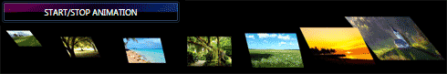
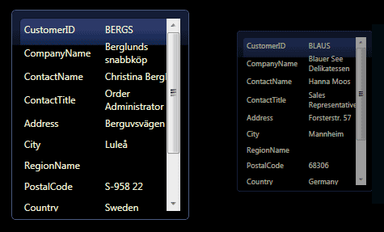
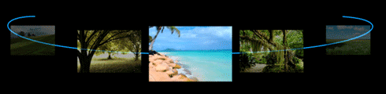

# {{ site.framework_name }} RadCarousel Overview

RadCarousel for WPF is an innovative control for interactive navigation of data, using circular or free-form motion paths. It presents complex data from a whole new perspective and gives a sense of 3D application interface.





## Slick animations 

With RadCarousel any numeric property can be animated, thus creating exciting user experience.
 

## Autogenerated Data Items Presentation 

Data items presentation can be auto generated, thus allowing you to quickly display your business objects inside your application.
 

## Rich item customization 

Rich item customization can be achieved through styles, templates, and animations.      
 

## Scroll support 

When placed in a scrollable container, RadCarousel automatically navigates when you use the scroll bars or the mouse wheel.

## Custom animation paths support 

Any path can be used for item movement. This allows designers to create the best path for the situation at hand in Expression Blend.         
 

## Flexible control points specification mechanism 

The control points are the mechanism to manage the visual appearance of the carousel items. With the help of this mechanism the items’ opacity, scaling and skewing can be easily controlled.    

 

### Performant LINQ-based databinding engine 

RadCarousel is a fully-functional data bound control taking full advantage of the performant LINQ-based Telerik data engine. It provides selection and current item support that enable data binding scenarios from XAML only.

### Reusable RadCarouselPanel 

RadCarouselPanel can both host standalone controls and be used in conjunction with any WPF items control like a ListBox or a ListView to spice up its appearance.

 

### UI virtualization 

To utilize system resources in an optimal way,  __RadCarouselPanel__ will only display UI elements for the currently visible items when used in an items control. 
