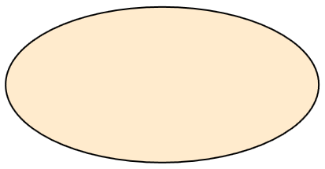
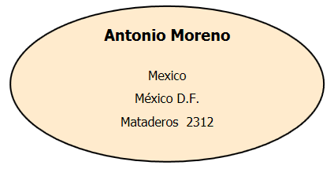
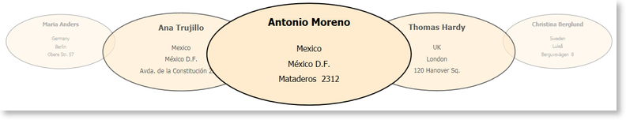

# Global Styles

Global styles allow easy styling of any control and this topic will show you how to redefine the visual appearance of the carousel items using this technique.
Similarly to all __ItemsControls__, the RadCarousel has an item container, called __CarouselItem__ that serves as a wrapper for the data that gets visualized. First we will create a new style for the item container and after that we will create a new style for the data itself.

In order to override the default style of the container item we have to create a style that targets the __CarouselItem__ class. For the sake of this example we shall create a container that is shaped like an ellipse:

>For this example we will be using the __Customers__ table of the Northwind database. 

>Namespace mapping:
xmlns:telerik="http://schemas.telerik.com/2008/xaml/presentation"


```XAML
	  <Style TargetType="{x:Type telerik:CarouselItem}">
	    <Setter Property="Height" Value="200"/>
	    <Setter Property="Width" Value="400"/>
	    <Setter Property="Template">
	      <Setter.Value>
	        <ControlTemplate TargetType="{x:Type telerik:CarouselItem}">
	          <Grid>
	            <Ellipse Fill="BlanchedAlmond" Stroke="Black" StrokeThickness="2"/>
	            <ContentPresenter Margin="60,20,60,20"/>
	          </Grid>
	        </ControlTemplate>
	      </Setter.Value>
	    </Setter>
	  </Style>
```

Now __CarouselItems__ will look like this:



One very important thing to note here is the __ContentPresenter__ that we have included in the new template – it will host the elements that define the visual representation of our data entities.

Now that we have styled the __CarouselItem__ we need to create a new style for the __CarouselDataRecordPresenter__ – the class that will actually display our data.


```XAML
	  <Style TargetType="{x:Type telerik:CarouselDataRecordPresenter}">
	    <Setter Property="Template">
	      <Setter.Value>
	        <ControlTemplate TargetType="{x:Type telerik:CarouselDataRecordPresenter}">
	          <StackPanel HorizontalAlignment="Center" TextElement.FontSize="20" TextElement.FontWeight="Bold">
	            <Label Content="{Binding Path=[ContactName]}"/>
	            <StackPanel Margin="0,20,0,0" TextElement.FontSize="16" TextElement.FontWeight="Normal">
	              <Label HorizontalAlignment="Center" Content="{Binding Path=[Country]}"/>
	              <Label HorizontalAlignment="Center" Content="{Binding Path=[City]}"/>
	              <Label HorizontalAlignment="Center" Content="{Binding Path=[Address]}"/>
	            </StackPanel>
	          </StackPanel>
	        </ControlTemplate>
	      </Setter.Value>
	    </Setter>
	  </Style>
```

Overall this is a very simple style which will display the contact name, the country, the city, and the address of each customer that is listed in the Customers table. The most interesting parts of this style are the binding that are defined for every __Label__ object. Since the data context of every __CarouselDataRecordPresenter__ is a __DataRow__ we use the indexer of each row to bind to a specific column of the Customers table.

Here is the result:   
 

Now the only thing left to do is to run the carousel and see the ellipses in action:
 


