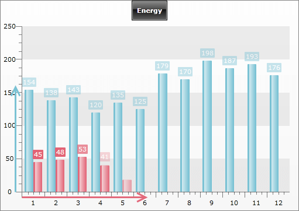

# Animations


## 

When displayed, each chart is nicely animated using default animation settings. __AnimationSettings__ allows you to control how the animation is applied to each series and/or series item:

* __ItemDelay__ - this property specifies the delay for each series item toward the previous one. For example, if you have bar chart, when a bar item animation is started, the next bar item will start its animation with the delay specified by this property.

* __TotalSeriesAnimationDuration__ - specifies how long will take the animation duration for a single series.

* __ItemAnimationDuration__ – specifies how long will take the animation duration of each series item.

* __DefaultSeriesDelay__ - controls when the rendering of the next series should start, compared to the previous one (i.e. the series index is taken into account). For example, if you have three series and __DefaultSeriesDelay__ is set to 10 sec for each of them – the rendering of the 2nd series will begin 10 seconds after the first one is complete, respectively the rendering of the 3rd – 10 seconds after the second is complete.

>If you set values to __ItemDelay__ and __TotalSeriesAnimationDuration__, then __ItemDelay__ is omitted and __TotalSeriesAnimationDuration__ is used.

You have __AnimationSettings__ on several levels:

* __RadChart.AnimationSettings__ - use to control the animation used by default by all data series. These settings are used if there are no settings defined on __ChartArea__ or series definition level.

* __ChartArea.AnimationSettings__ - use to control the animation used for all the data series within a __ChartArea__. These settings are used if there are no settings defined on series definition level.

* __ISeriesDefinition.AnimationSettings__ - use when you want to control the animation of each series definition separately. For example, when you have multi series charts and you want each one to be animated differently.

>As you can see, you can define __AnimationSettings__ on several levels, but the apply priority is from more concrete to more general. This means that the animation settings defined for a single series have the highest priority and will override the settings defined in the __ChartArea__ and the __Chart__.

However, in case you prefer to show the charts without animations, __ChartArea__ provides you with two properties:

* __EnableAnimations__ - indicates whether animation should be applied on the chart or not.

* __EnableStripLinesAnimation__ - indicates whether animation should be applied on the strip lines or not. 

The example below demonstrates how to specify __AnimationSettings__ for __ChartArea__ and __DataSeries__. The chart has two data series represented as bars. Our goals are:

* To make the first bar series look like it is growing: all the bars are shown immediately and then grows for 3 seconds.

* To make the second bar series show its item one after the other, but the total series to be shown again for 3 seconds.

#### __XAML__

```XAML
	<telerik:RadChart>
	    <telerik:RadChart.DefaultView>
	        <telerik:ChartDefaultView>
	            <!--....-->
	            <telerik:ChartDefaultView.ChartArea>
	                <telerik:ChartArea >
	                    <telerik:ChartArea.AnimationSettings>
	                        <telerik:AnimationSettings ItemDelay="00:00:00.0" 
	                                                   ItemAnimationDuration="00:00:03" />
	                    </telerik:ChartArea.AnimationSettings>
	                    <telerik:ChartArea.DataSeries>
	                        <telerik:DataSeries>
	                            <telerik:DataSeries.Definition>
	                                <telerik:BarSeriesDefinition />
	                            </telerik:DataSeries.Definition>
	                            <telerik:DataPoint YValue="154" />
	                            <telerik:DataPoint YValue="138" />
	                            <telerik:DataPoint YValue="143" />
	                            <telerik:DataPoint YValue="120" />
	                            <telerik:DataPoint YValue="135" />
	                            <telerik:DataPoint YValue="125" />
	                            <telerik:DataPoint YValue="179" />
	                            <telerik:DataPoint YValue="170" />
	                            <telerik:DataPoint YValue="198" />
	                            <telerik:DataPoint YValue="187" />
	                            <telerik:DataPoint YValue="193" />
	                            <telerik:DataPoint YValue="176" />
	                        </telerik:DataSeries>
	                        <telerik:DataSeries>
	                            <telerik:DataSeries.Definition>
	                                <telerik:BarSeriesDefinition>
	                                    <telerik:BarSeriesDefinition.AnimationSettings>
	                                        <telerik:AnimationSettings ItemAnimationDuration="00:00:00.5" 
	                                                                   TotalSeriesAnimationDuration="00:00:03.0"/>
	                                    </telerik:BarSeriesDefinition.AnimationSettings>
	                                </telerik:BarSeriesDefinition>
	                            </telerik:DataSeries.Definition>
	                            <telerik:DataPoint YValue="45" />
	                            <telerik:DataPoint YValue="48" />
	                            <telerik:DataPoint YValue="53" />
	                            <telerik:DataPoint YValue="41" />
	                            <telerik:DataPoint YValue="32" />
	                            <telerik:DataPoint YValue="28" />
	                            <telerik:DataPoint YValue="63" />
	                            <telerik:DataPoint YValue="74" />
	                            <telerik:DataPoint YValue="77" />
	                            <telerik:DataPoint YValue="85" />
	                            <telerik:DataPoint YValue="89" />
	                            <telerik:DataPoint YValue="80" />
	                        </telerik:DataSeries>
	                    </telerik:ChartArea.DataSeries>
	                </telerik:ChartArea>
	            </telerik:ChartDefaultView.ChartArea>
	        </telerik:ChartDefaultView>
	    </telerik:RadChart.DefaultView>
	</telerik:RadChart>
```


#### __C#__

```C#
	RadChart radChart= new RadChart();
	//....
	radChart.DefaultView.ChartArea.AnimationSettings = new AnimationSettings();
	radChart.DefaultView.ChartArea.AnimationSettings.ItemDelay = new TimeSpan( 0 );
	radChart.DefaultView.ChartArea.AnimationSettings.ItemAnimationDuration = new TimeSpan( 0, 0, 3 );
	DataSeries barSeries = new DataSeries();
	barSeries.Definition = new BarSeriesDefinition();
	barSeries.Add( new DataPoint(){ YValue = 154 } );
	barSeries.Add( new DataPoint(){ YValue = 138 } );
	barSeries.Add( new DataPoint(){ YValue = 143 } );
	barSeries.Add( new DataPoint(){ YValue = 120 } );
	barSeries.Add( new DataPoint(){ YValue = 135 } );
	barSeries.Add( new DataPoint(){ YValue = 125 } );
	barSeries.Add( new DataPoint(){ YValue = 179 } );
	barSeries.Add( new DataPoint(){ YValue = 170 } );
	barSeries.Add( new DataPoint(){ YValue = 198 } );
	barSeries.Add( new DataPoint(){ YValue = 187 } );
	barSeries.Add( new DataPoint(){ YValue = 193 } );
	barSeries.Add( new DataPoint(){ YValue = 176 } );
	radChart.DefaultView.ChartArea.DataSeries.Add( barSeries );
	barSeries = new DataSeries();
	barSeries.Definition = new BarSeriesDefinition();
	barSeries.Definition.AnimationSettings = new AnimationSettings();
	barSeries.Definition.AnimationSettings.ItemAnimationDuration = new TimeSpan( 0, 0, 0, 0, 500 );
	barSeries.Definition.AnimationSettings.TotalSeriesAnimationDuration = new TimeSpan( 0, 0, 3 );
	barSeries.Add( new DataPoint(){ YValue = 45 } );
	barSeries.Add( new DataPoint(){ YValue = 48 } );
	barSeries.Add( new DataPoint(){ YValue = 53 } );
	barSeries.Add( new DataPoint(){ YValue = 41 } );
	barSeries.Add( new DataPoint(){ YValue = 32 } );
	barSeries.Add( new DataPoint(){ YValue = 28 } );
	barSeries.Add( new DataPoint(){ YValue = 63 } );
	barSeries.Add( new DataPoint(){ YValue = 74 } );
	barSeries.Add( new DataPoint(){ YValue = 77 } );
	barSeries.Add( new DataPoint(){ YValue = 85 } );
	barSeries.Add( new DataPoint(){ YValue = 89 } );
	barSeries.Add( new DataPoint(){ YValue = 80 } );
	radChart.DefaultView.ChartArea.DataSeries.Add( barSeries );
```
    
#### __VB.NET__

```VB.NET
	Dim radChart As New Telerik.Windows.Controls.RadChart()
	radChart.DefaultView.ChartArea.AnimationSettings = New AnimationSettings()
	radChart.DefaultView.ChartArea.AnimationSettings.ItemDelay = New TimeSpan(0)
	radChart.DefaultView.ChartArea.AnimationSettings.ItemAnimationDuration = New TimeSpan(0, 0, 3)
	Dim barSeries As New DataSeries()
	barSeries.Definition = New BarSeriesDefinition()
	barSeries.Add(New DataPoint(154))
	barSeries.Add(New DataPoint(138))
	barSeries.Add(New DataPoint(143))
	barSeries.Add(New DataPoint(120))
	barSeries.Add(New DataPoint(135))
	barSeries.Add(New DataPoint(125))
	barSeries.Add(New DataPoint(179))
	barSeries.Add(New DataPoint(170))
	barSeries.Add(New DataPoint(198))
	barSeries.Add(New DataPoint(187))
	barSeries.Add(New DataPoint(193))
	barSeries.Add(New DataPoint(176))
	radChart.DefaultView.ChartArea.DataSeries.Add(barSeries)
	barSeries = New DataSeries()
	barSeries.Definition = New BarSeriesDefinition()
	barSeries.Definition.AnimationSettings = New AnimationSettings()
	barSeries.Definition.AnimationSettings.ItemAnimationDuration = New TimeSpan(0, 0, 0, 0, 500)
	barSeries.Definition.AnimationSettings.TotalSeriesAnimationDuration = New TimeSpan(0, 0, 3)
	barSeries.Add(New DataPoint(45))
	barSeries.Add(New DataPoint(48))
	barSeries.Add(New DataPoint(53))
	barSeries.Add(New DataPoint(41))
	barSeries.Add(New DataPoint(32))
	barSeries.Add(New DataPoint(28))
	barSeries.Add(New DataPoint(63))
	barSeries.Add(New DataPoint(74))
	barSeries.Add(New DataPoint(77))
	barSeries.Add(New DataPoint(85))
	barSeries.Add(New DataPoint(89))
	barSeries.Add(New DataPoint(80))
	radChart.DefaultView.ChartArea.DataSeries.Add(barSeries)
```
    
__The image below is a snapshot taken in the middle of the animation.__


__AnimationSettings__ are a simple and easy way to control your animations. However, if you need further customizations, you should consider using templates.

To suspend any animations on a chart set __ChartArea.EnableAnimations__ and __ChartArea.EnableStripLinesAnimation__ properties to __False:__

#### __XAML__

```XAML
	<telerik:RadChart>
	    <telerik:RadChart.DefaultView>
	        <telerik:ChartDefaultView>
	            <!--....-->
	            <telerik:ChartDefaultView.ChartArea>
	                <telerik:ChartArea EnableAnimations="False" EnableStripLinesAnimation="False">
	                    <!--....-->
	                </telerik:ChartArea>
	            </telerik:ChartDefaultView.ChartArea>
	        </telerik:ChartDefaultView>
	    </telerik:RadChart.DefaultView>
	</telerik:RadChart>
```


#### __C#__

```C#
	//....
	radChart.DefaultView.ChartArea.EnableAnimations = false;
	radChart.DefaultView.ChartArea.EnableStripLinesAnimation = false;
	//....
```


#### __VB.NET__

```VB.NET
	radChart.DefaultView.ChartArea.EnableAnimations = False
	radChart.DefaultView.ChartArea.EnableStripLinesAnimation = False
```


## See Also[](796308DB-6789-4F88-8C96-7D29A8F49E8B)

 * [Striplines and Gridlines]()

 * [Data Binding Support Overview]()
