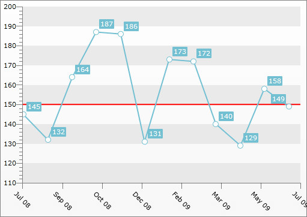

# Custom Gridline


## 

The Custom Gridline allows you to place a vertical or horizontal gridline at a specific place in your __ChartArea__. This allows you to mark a specific value on the __Y-Axis__ and/or the __X-Axis__, which can, for example, serve as a border value. In order to place the Custom GridLine you have to add a __CustomGridLine__ object to the __Annotations__ collection of the __ChartArea__. You also have to set either its __XIntercept__ or __YIntercept__ properties. These properties allow you to specify the value of the X- and Y-Axis, for which the gridline should be placed.

>tipYou can place more than one __CustomGridLine__ in your __ChartArea__.

>The __XIntercept__ and the __YIntercept__ are of type __double__. Therefore, if the respective axis displays __DateTime__ values, you have to pass converted to OLE Automation dates to them. For more information see [DateTime.ToOADate()](http://msdn.microsoft.com/en-us/library/system.datetime.tooadate(VS.95).aspx). 

In order to customize the appearance of the __CustomGridLine__ you can simply set its __Stroke__ (will change its color) and its __StrokeThickness__ (will change the thickness of the line).

>tipIf you have multiple y-axes, you can specify to which the __CustomGridLine__ should be applied by setting the __x:Name__ value of the appropriate __Y-Axis__ to the __YAxisName__ property of the __CustomGridLine__.

Here is an example:


```XAML
	<telerik:RadChart x:Name="radChart">
	    <telerik:RadChart.DefaultView>
	        <telerik:ChartDefaultView>
	            <telerik:ChartDefaultView.ChartArea>
	                <telerik:ChartArea>
	                    <telerik:ChartArea.Annotations>
	                        <telerik:CustomGridLine YIntercept="150"
	                                                Stroke="Red"
	                                                StrokeThickness="2" />
	                    </telerik:ChartArea.Annotations>
	                </telerik:ChartArea>
	            </telerik:ChartDefaultView.ChartArea>
	        </telerik:ChartDefaultView>
	    </telerik:RadChart.DefaultView>
	
	</telerik:RadChart>
```


```C#
	CustomGridLine gridline = new CustomGridLine();
	gridline.YIntercept = 150;
	gridline.Stroke = new SolidColorBrush(Colors.Red);
	gridline.StrokeThickness = 2;
	this.radChart.DefaultView.ChartArea.Annotations.Add(gridline);
```


```VB.NET
	Dim gridline As New CustomGridLine()
	gridline.YIntercept = 150
	gridline.Stroke = New SolidColorBrush(Colors.Red)
	gridline.StrokeThickness = 2
	Me.radChart.DefaultView.ChartArea.Annotations.Add(gridline)
```



Additional customizations can be done via the __ElementStyle__ property. It gets applied to the __Line__ element that visually represents the __CustomGridLine__. Via this style you can set the __StrokeDashArray__ property for example.


```XAML
	<FrameworkElement.Resources>
	    <Style x:Key="CustomGridLineStyle"
	    TargetType="Line">
	        <Setter Property="StrokeDashArray"
	        Value="1,1" />
	    </Style>
	</FrameworkElement.Resources>
	<!--...-->
	<telerik:RadChart>
	    <telerik:RadChart.DefaultView>
	        <telerik:ChartDefaultView>
	            <telerik:ChartDefaultView.ChartArea>
	                <telerik:ChartArea>
	                    <telerik:ChartArea.Annotations>
	                        <telerik:CustomGridLine YIntercept="150"
	                                        Stroke="Red"
	                                        StrokeThickness="2"
	                                        ElementStyle="{StaticResource CustomGridLineStyle}" />
	                    </telerik:ChartArea.Annotations>
	                </telerik:ChartArea>
	            </telerik:ChartDefaultView.ChartArea>
	        </telerik:ChartDefaultView>
	    </telerik:RadChart.DefaultView>
	    <!--...-->
	</telerik:RadChart>
```


>tipThis can be done in code behind too.

