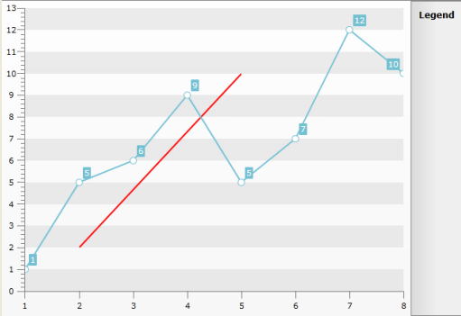
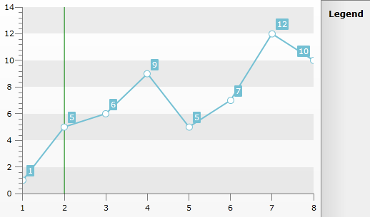

# Custom Line


The __Custom Line__ annotation allows you to place a straight line at a specific place in your __Chart Area__. In order to place the __Custom Line__ you have to add a __CustomLine__ object to the __Annotations__ collection of the __ChartArea__. You also have to use its__Slope and YIntercept__properties.

>tip You can place more than one __CustomLine__ in your __ChartArea__.

In order to define the line you have to set the __Slope__ and/or the __YIntercept__ properties. The function which draws the custom line is __y = mx + b__, where '__m__' is the __Slope__ and '__b__' is __YIntercept__.

The __Slope__ is defined as the ratio of the rise of the line (i.e. how much the line rises vertically) to the run of line (i.e. how much the line runs horizontally). 

The point(s) where the graph of a function intersects with the *y*-axis are called the __Y__

For example, if you want to have a line defined by these two points __(2,2)__, __(5,10)__ you have to solve a system of two linear equations:

* __2 = m*2 + b__

* __10 = m*5 + b__

After solving it you will get the following values __2.66__ for the __Slope__ (m) and __-3.32__ for the __YIntercept__ (b). If you set these to the respective properties of the __CustomLine__, you will see the desired line appear. 

>Note that this line will cross the entire __ChartArea__. If you want only a specific part of it to appear, you have to define the __clipping points__ by setting the __MinX__, __MinY__, __MaxX__, __MaxY__properties of the __CustomLine__. Their values should represent values somewhere on the respective axis.


```XAML
	<telerik:RadChart x:Name="radChart">
	    <telerik:RadChart.DefaultView>
	        <telerik:ChartDefaultView>
	            <telerik:ChartDefaultView.ChartArea>
	                <telerik:ChartArea>
	                    <telerik:ChartArea.Annotations>
	                        <telerik:CustomLine MinX="2"
	                                            MinY="2"
	                                            MaxX="5"
	                                            MaxY="10"
	                                            Slope="2.66"
	                                            YIntercept="-3.32"
	                                            Stroke="Red"
	                                            StrokeThickness="2" />
	                    </telerik:ChartArea.Annotations>
	                </telerik:ChartArea>
	            </telerik:ChartDefaultView.ChartArea>
	        </telerik:ChartDefaultView>
	    </telerik:RadChart.DefaultView>
	</telerik:RadChart>
```


```C#
	CustomLine customLine = new CustomLine();
	customLine.Slope = 2.66;
	customLine.YIntercept = -3.32;
	customLine.MinX = 2;
	customLine.MinY = 2;
	customLine.MaxX = 5;
	customLine.MaxY = 10;
	customLine.Stroke = new SolidColorBrush(Colors.Red);
	customLine.StrokeThickness = 2;
	this.radChart.DefaultView.ChartArea.Annotations.Add(customLine);
```
```VB.NET
	Dim _customLine As New CustomLine()
	_customLine.Slope = 2.66
	_customLine.YIntercept = -3.32
	_customLine.MinX = 2
	_customLine.MinY = 2
	_customLine.MaxX = 5
	_customLine.MaxY = 10
	_customLine.Stroke = New SolidColorBrush(Colors.Red)
	_customLine.StrokeThickness = 2
	Me.radChart.DefaultView.ChartArea.Annotations.Add(_customLine)
```


Here is a snapshot of the final result.


##  How to draw a Custom Line Parallel to one of the Axes

To make your custom line parallel to one of the two Axes you should set the *Slope* to __Infinity__ and specify the *MinY* and *MaxY* properties in order to get it clipped properly. For example the following code snippet will draw a custom line parallel to the YAxis which intercepts the XAxis in X = 2:


```XAML
	<telerik:ChartArea.Annotations>
	    <telerik:CustomLine Stroke="Green" Slope="Infinity" XIntercept="2" MinY="100" MaxY="200" />
	</telerik:ChartArea.Annotations>
```


The result can be seen below:


>When the Custom Line should be parallel to the XAxis, its Slope should be set to __0__
