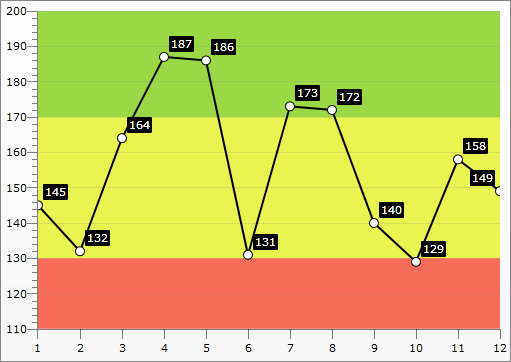
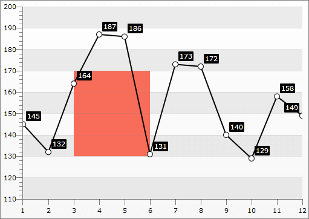
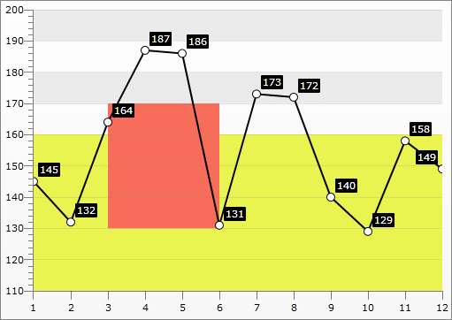
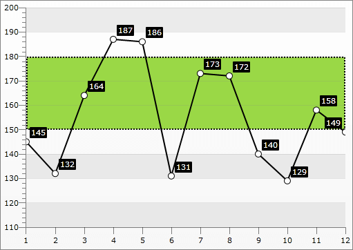

# Marked Zone


## 

The Marked Zone feature allows you to place a rectangle inside the __ChartArea__. This allows you to mark a specific part of it, in order to easily look at all the data that belongs to this area. In order to creat a Marked Zone you have to use the __MarkedZone__ class and add an instance of it to the __Annotations__ collection of the __ChartArea__. You also have to set its __StartY__ and __EndY__ properties for a rectangle that spans along the entire X-Axis, or the __StartX__ and __EndX__ properties for a rectangle that spans along the entire Y-Axis, or set the four properties at once in order to create a rectangle that is limited in both directions.

>tipYou can place more than one __MarkedZone__in your __ChartArea__.

>The __StartX, EndX, StartY__ and __EndY__ are of type __double__. Therefore, if the respective axis displays __DateTime__ values, you have to pass converted to OLE Automation dates to them. For more information see [DateTime.ToOADate()](http://msdn.microsoft.com/en-us/library/system.datetime.tooadate(VS.95).aspx). 

In order to customize the appearance of the __MarkedZone__ you can simply set its __Background__ property, __Stroke__ (will change its color) and its __StrokeThickness__ (will change the thickness of the line).

>tipIf you have multiple y-axes, you can specify to which the __MarkedZone__ should be applied by setting the __x:Name__ value of the appropriate __Y-Axis__ to the __YAxisName__ property of the __MarkedZone__.

The following code snippet demonstrates a RadChart with LineSeries that will be used as base for adding MarkedZones over:

```C#
	DataSeries series1 = new DataSeries()
	 {
	   new DataPoint(145),
	   new DataPoint(132),
	   new DataPoint(164),
	   new DataPoint(187),
	   new DataPoint(186),
	   new DataPoint(131),
	   new DataPoint(173),
	   new DataPoint(172),
	   new DataPoint(140),
	   new DataPoint(129),
	   new DataPoint(158),
	   new DataPoint(149)
	 };
	series1.Definition = new LineSeriesDefinition();
	series1.Definition.Appearance.Fill = new SolidColorBrush(Colors.Black);
	series1.Definition.Appearance.Stroke = new SolidColorBrush(Colors.Black);
	series1.Definition.Appearance.PointMark.Stroke = new SolidColorBrush(Colors.Black);
	this.radChart.DefaultView.ChartArea.DataSeries.Add(series1);
```
```VB.NET
	InitializeComponent()
	Dim series1 As New DataSeries() With
	{ New DataPoint(145),
	New DataPoint(132),
	New DataPoint(164),
	New DataPoint(187),
	New DataPoint(186), 
	New DataPoint(131), 
	New DataPoint(173),
	New DataPoint(172),
	New DataPoint(140), 
	New DataPoint(129), 
	New DataPoint(158), 
	New DataPoint(149)
	}
	series1.Definition = New LineSeriesDefinition()
	series1.Definition.Appearance.Fill = New SolidColorBrush(Colors.Black)
	series1.Definition.Appearance.Stroke = New SolidColorBrush(Colors.Black)
	series1.Definition.Appearance.PointMark.Stroke = New SolidColorBrush(Colors.Black)
	RadChart1.DefaultView.ChartArea.DataSeries.Add(series1)
```

```XAML
	<telerik:RadChart x:Name="radChart">
	    <telerik:RadChart.DefaultView>
	        <telerik:ChartDefaultView>
	            <telerik:ChartDefaultView.ChartArea>
	                <telerik:ChartArea>
	                    <telerik:ChartArea.Annotations>
	                        <telerik:MarkedZone Tag="RedZone"
	                                            Background="#FFF86D5A"
	                                            StartY="110"
	                                            EndY="130" />
	                        <telerik:MarkedZone x:Name="YellowZone"
	                                            Background="#FFEAF451"
	                                            StartY="130"
	                                            EndY="170" />
	                        <telerik:MarkedZone Tag="GreenZone"
	                                            Background="#FF9AD846"
	                                            StartY="170"
	                                            EndY="200" />
	                    </telerik:ChartArea.Annotations>
	                </telerik:ChartArea>
	            </telerik:ChartDefaultView.ChartArea>
	        </telerik:ChartDefaultView>
	    </telerik:RadChart.DefaultView>
	</telerik:RadChart>
```

```C#
	MarkedZone redZone = new MarkedZone();
	redZone.StartY = 110;
	redZone.EndY = 130;
	redZone.Background = new SolidColorBrush( Color.FromArgb( 255, 248, 109, 90 ) );
	MarkedZone yellowZone = new MarkedZone();
	yellowZone .StartY = 130;
	yellowZone .EndY = 170;
	yellowZone .Background = new SolidColorBrush( Color.FromArgb( 255, 234, 244, 81 ) );
	MarkedZone greenZone = new MarkedZone();
	greenZone.StartY = 170;
	greenZone.EndY = 200;
	greenZone.Background = new SolidColorBrush( Color.FromArgb( 255, 154, 216, 70 ) );
	this.radChart.DefaultView.ChartArea.Annotations.Add(redZone);
	this.radChart.DefaultView.ChartArea.Annotations.Add(yellowZone);
	this.radChart.DefaultView.ChartArea.Annotations.Add(greenZone);
```
```VB.NET
	Dim redZone As New MarkedZone()
	redZone.StartY = 110
	redZone.EndY = 130
	redZone.Background = New SolidColorBrush(Color.FromArgb(255, 248, 109, 90))
	Dim yellowZone As New MarkedZone()
	yellowZone.StartY = 130
	yellowZone.EndY = 170
	yellowZone.Background = New SolidColorBrush(Color.FromArgb(255, 234, 244, 81))
	Dim greenZone As New MarkedZone()
	greenZone .StartY = 170
	greenZone .EndY = 200
	greenZone .Background = New SolidColorBrush(Color.FromArgb(255, 154, 216, 70))
	Me.radChart.DefaultView.ChartArea.Annotations.Add(redZone)
	Me.radChart.DefaultView.ChartArea.Annotations.Add(yellowZone)
	Me.radChart.DefaultView.ChartArea.Annotations.Add(greenZone)
```



Here is an example of a marked zone that is limited in both directions.

#### __XAML__

```XAML
	<telerik:RadChart>
	    <telerik:RadChart.DefaultView>
	        <telerik:ChartDefaultView>
	            <telerik:ChartDefaultView.ChartArea>
	                <telerik:ChartArea>
	                    <telerik:ChartArea.Annotations>
	                        <telerik:MarkedZone Tag="LimitedZone"
	                                            Background="#FFF86D5A"
	                                            StartY="130"
	                                            EndY="170"
	                                            StartX="3"
	                                            EndX="6" />
	                    </telerik:ChartArea.Annotations>
	                </telerik:ChartArea>
	            </telerik:ChartDefaultView.ChartArea>
	        </telerik:ChartDefaultView>
	    </telerik:RadChart.DefaultView>
	</telerik:RadChart>
```


>tipThis can be done in code behind too!



The Marked Zones can overlap each other. In such case their __Z-Index__ will be used to determine which will appear above. Here is an example.

#### __XAML__

```XAML
	<telerik:RadChart>
	    <telerik:RadChart.DefaultView>
	        <telerik:ChartDefaultView>
	            <telerik:ChartDefaultView.ChartArea>
	                <telerik:ChartArea>
	                    <telerik:ChartArea.Annotations>
	                        <telerik:MarkedZone Tag="YellowZone"
	                                            Background="#FFEAF451"
	                                            StartY="110"
	                                            EndY="160" />
	                        <telerik:MarkedZone x:Name="LimitedZone"
	                                            Background="#FFF86D5A"
	                                            StartY="130"
	                                            EndY="170"
	                                            StartX="3"
	                                            EndX="6" />
	                    </telerik:ChartArea.Annotations>
	                </telerik:ChartArea>
	            </telerik:ChartDefaultView.ChartArea>
	        </telerik:ChartDefaultView>
	    </telerik:RadChart.DefaultView>
	  </telerik:RadChart>
```


>tipThis can be done in code behind too!



Additional customizations can be done via the __ElementStyle__ property. It gets applied to the __Rectangle__ element that visually represents the __MarkedZone__. Via this style you can set the __StrokeDashArray__ property for example.

#### __XAML__

```XAML
	<FrameworkElement.Resources>
	    <Style x:Key="MarkedZoneStyle"
	    TargetType="Rectangle">
	        <Setter Property="StrokeDashArray"
	        Value="1,1" />
	    </Style>
	</FrameworkElement.Resources>
	
	<telerik:RadChart>
	    <telerik:RadChart.DefaultView>
	        <telerik:ChartDefaultView>
	            <telerik:ChartDefaultView.ChartArea>
	                <telerik:ChartArea>
	                    <telerik:ChartArea.Annotations>
	                        <telerik:MarkedZone Tag="GreenZone"
	                                    Background="#FF9AD846"
	                                    StartY="150"
	                                    EndY="180"
	                                    Stroke="Black"
	                                    StrokeThickness="2"
	                                    ElementStyle="{StaticResource MarkedZoneStyle}" />
	                    </telerik:ChartArea.Annotations>
	                </telerik:ChartArea>
	            </telerik:ChartDefaultView.ChartArea>
	        </telerik:ChartDefaultView>
	    </telerik:RadChart.DefaultView>
	</telerik:RadChart>
```


>tipThis can be done in code behind too!

