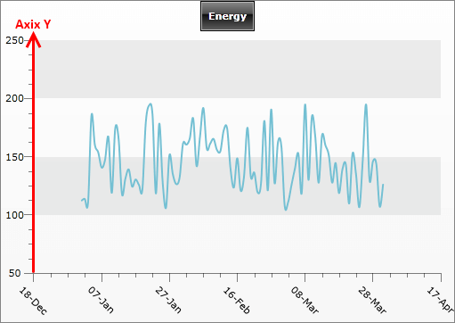
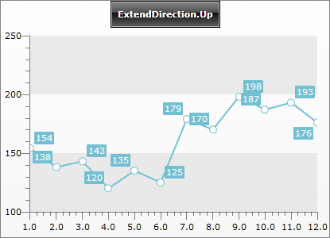
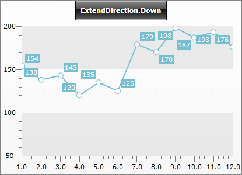
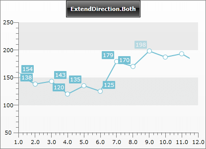
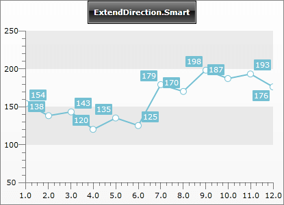
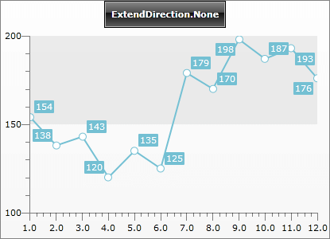

# Y-Axis

## 

This topic covers only the properties that are specific to the __Y-axis__. If you want to learn more about the properties that are common to both X and Y axes take a look at the [Axes Overview]() topic.

Besides the common properties, __Y-axis__ has some specific properties, explained in the list below:

* __MinorTickPointMultiplier__- specifies the number of minor ticks per major tick, i.e the number of the minor ticks between two major ticks. 

* __MinorTicksVisibility__- specifies whether the minor tick marks on the axis should be visible. 

* __MinorGridLinesVisibility__- specifies whether the minor axis grid lines should be visible. See [Striplines and Gridlines](). 

* __ExtendDirection__- specifies the direction in which the axis range should be extended.

__AxisY.ExtendDirection__ is of type __AxisExtendDirection__ and has the following options:

* __Up__ - when selected, the upper end of the axis will be extended. 

* __Down__ - when selected, the lower end of the axis will be extended. 

* __Both__ - when selected, the upper and the lower end of the axis will be extended. 

* __Smart__ - when selected, the upper and the lower end of the axis will be extended unless 0 is set to __MinValue__ or __MaxValue__. In this case the axis will not be extended in the respective direction. 

* __None__ - when selected, the axis will not be extended.

In the example below you can see how changing the __ExtensionDirection__ properties reflects the charts. Also, notice the result when __MinorTickPointMultiplier__ is set to 5.

#### __XAML__

{{region xaml-radchart-features-axes-Y-axis_0}}
	<telerik:RadChart x:Name="radChart">
	    <telerik:RadChart.DefaultView>
	        <telerik:ChartDefaultView>
	            <telerik:ChartDefaultView.ChartArea>
	                <telerik:ChartArea>
	                    <telerik:ChartArea.AxisY>
	                        <telerik:AxisY Title="Ampere [A]"
	                                       DefaultLabelFormat="0"
	                                       ExtendDirection="Down"
	                                       MinorTickPointMultiplier="5"
	                                       MinorTicksVisibility="Visible" />
	                    </telerik:ChartArea.AxisY>
	                </telerik:ChartArea>
	            </telerik:ChartDefaultView.ChartArea>
	        </telerik:ChartDefaultView>
	    </telerik:RadChart.DefaultView>
	</telerik:RadChart>
{{endregion}}

#### __C#__

{{region cs-radchart-features-axes-Y-axis_1}}
	Telerik.Windows.Controls.RadChart radChart = new Telerik.Windows.Controls.RadChart();
	//....
	radChart.DefaultView.ChartArea.AxisY.MinorTicksVisibility = Visibility.Visible;
	radChart.DefaultView.ChartArea.AxisY.MinorTickPointMultiplier = 5;
	radChart.DefaultView.ChartArea.AxisY.ExtendDirection = AxisExtendDirection.Down;
	radChart.DefaultView.ChartArea.AxisY.DefaultLabelFormat = "0";
	radChart.DefaultView.ChartArea.AxisY.Title="Ampere [A]";
	//....
{{endregion}}

#### __VB.NET__

{{region vb-radchart-features-axes-Y-axis_2}}
	Dim radChart As New Telerik.Windows.Controls.RadChart()
	'....'
	radChart.DefaultView.ChartArea.AxisY.MinorTicksVisibility = Visibility.Visible
	radChart.DefaultView.ChartArea.AxisY.MinorTickPointMultiplier = 5
	radChart.DefaultView.ChartArea.AxisY.ExtendDirection = AxisExtendDirection.Down
	radChart.DefaultView.ChartArea.AxisY.DefaultLabelFormat = "0"
	radChart.DefaultView.ChartArea.AxisY.Title = "Ampere [A]"
	'....'
{{endregion}}

And here is a snapshot of the result. You can see how the Y-axis ticks are placed - there are four minor ticks between each 2 major ones. Moreover the visualization of the chart varies depending on the value specified for the __ExtendDirection__.

## See Also

 * [Axes Overview]()

 * [X-Axis]()

 * [Striplines and Gridlines]()

 * [Styling the Axes Overview]()
