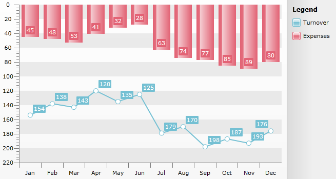
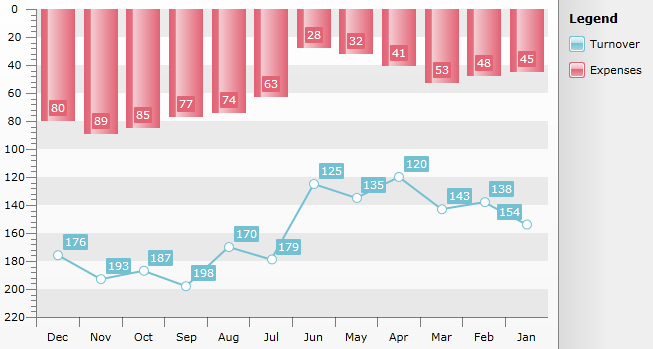

# Inverse Axis


## 

Since __Q2 2011__ Inverse Axis feature was released. It allows the axes values of RadChart to be inverted.

>The __IsInverse__ property can be set independently of the Axis range - it works both with automatic range and custom one(*AutoRange* = false).

The following sample code will show you how this can be achieved:

#### __C#__

```C#
	           
	this.radChart.DefaultView.ChartArea.AxisY.IsInverse = true;
	//Line Chart
	DataSeries lineSeries = new DataSeries();
	lineSeries.LegendLabel = "Turnover";
	lineSeries.Definition = new LineSeriesDefinition();
	lineSeries.Add(new DataPoint() { YValue = 154, XCategory = "Jan" });
	lineSeries.Add(new DataPoint() { YValue = 138, XCategory = "Feb" });
	lineSeries.Add(new DataPoint() { YValue = 143, XCategory = "Mar" });
	lineSeries.Add(new DataPoint() { YValue = 120, XCategory = "Apr" });
	lineSeries.Add(new DataPoint() { YValue = 135, XCategory = "May" });
	lineSeries.Add(new DataPoint() { YValue = 125, XCategory = "Jun" });
	lineSeries.Add(new DataPoint() { YValue = 179, XCategory = "Jul" });
	lineSeries.Add(new DataPoint() { YValue = 170, XCategory = "Aug" });
	lineSeries.Add(new DataPoint() { YValue = 198, XCategory = "Sep" });
	lineSeries.Add(new DataPoint() { YValue = 187, XCategory = "Oct" });
	lineSeries.Add(new DataPoint() { YValue = 193, XCategory = "Nov" });
	lineSeries.Add(new DataPoint() { YValue = 176, XCategory = "Dec" });
	this.radChart.DefaultView.ChartArea.DataSeries.Add(lineSeries);
	//Bar Chart
	DataSeries barSeries = new DataSeries();
	barSeries.LegendLabel = "Expenses";
	barSeries.Definition = new BarSeriesDefinition();
	barSeries.Add(new DataPoint() { YValue = 45, XCategory = "Jan" });
	barSeries.Add(new DataPoint() { YValue = 48, XCategory = "Feb" });
	barSeries.Add(new DataPoint() { YValue = 53, XCategory = "Mar" });
	barSeries.Add(new DataPoint() { YValue = 41, XCategory = "Apr" });
	barSeries.Add(new DataPoint() { YValue = 32, XCategory = "May" });
	barSeries.Add(new DataPoint() { YValue = 28, XCategory = "Jun" });
	barSeries.Add(new DataPoint() { YValue = 63, XCategory = "Jul" });
	barSeries.Add(new DataPoint() { YValue = 74, XCategory = "Aug" });
	barSeries.Add(new DataPoint() { YValue = 77, XCategory = "Sep" });
	barSeries.Add(new DataPoint() { YValue = 85, XCategory = "Oct" });
	barSeries.Add(new DataPoint() { YValue = 89, XCategory = "Nov" });
	barSeries.Add(new DataPoint() { YValue = 80, XCategory = "Dec" });
	this.radChart.DefaultView.ChartArea.DataSeries.Add(barSeries);
```

#### __VB.NET__

```VB.NET
	InitializeComponent()
	Dim lineSeries As New DataSeries()
	    lineSeries.LegendLabel = "Turnover"
	    lineSeries.Definition = New LineSeriesDefinition()
	    Dim dataPoint As New DataPoint()
	    dataPoint.YValue = 154
	    dataPoint.XCategory = "Jan"
	    lineSeries.Add(dataPoint)
	    dataPoint = New DataPoint()
	    dataPoint.YValue = 138
	    dataPoint.XCategory = "Feb"
	    lineSeries.Add(dataPoint)
	    dataPoint = New DataPoint()
	    dataPoint.YValue = 143
	    dataPoint.XCategory = "Mar"
	    lineSeries.Add(dataPoint)
	    dataPoint = New DataPoint()
	    dataPoint.YValue = 120
	    dataPoint.XCategory = "Apr"
	    lineSeries.Add(dataPoint)
	    dataPoint = New DataPoint()
	    dataPoint.YValue = 135
	    dataPoint.XCategory = "May"
	    lineSeries.Add(dataPoint)
	    dataPoint = New DataPoint()
	    dataPoint.YValue = 125
	    dataPoint.XCategory = "Jun"
	    lineSeries.Add(dataPoint)
	    dataPoint = New DataPoint()
	    dataPoint.YValue = 179
	    dataPoint.XCategory = "Jul"
	    lineSeries.Add(dataPoint)
	    dataPoint = New DataPoint()
	    dataPoint.YValue = 170
	    dataPoint.XCategory = "Aug"
	    lineSeries.Add(dataPoint)
	    dataPoint = New DataPoint()
	    dataPoint.YValue = 198
	    dataPoint.XCategory = "Sep"
	    lineSeries.Add(dataPoint)
	    dataPoint = New DataPoint()
	    dataPoint.YValue = 187
	    dataPoint.XCategory = "Sep"
	    lineSeries.Add(dataPoint)
	    dataPoint = New DataPoint()
	    dataPoint.YValue = 193
	    dataPoint.XCategory = "Nov"
	    lineSeries.Add(dataPoint)
	    dataPoint = New DataPoint()
	    dataPoint.YValue = 176
	    dataPoint.XCategory = "Dec"
	    lineSeries.Add(dataPoint)
	    telerikChart.DefaultView.ChartArea.DataSeries.Add(lineSeries)
	    'Bar Chart '
	    Dim barSeries As New DataSeries()
	    barSeries.LegendLabel = "Expenses"
	    barSeries.Definition = New BarSeriesDefinition()
	    dataPoint = New DataPoint()
	    dataPoint.YValue = 45
	    dataPoint.XCategory = "Jan"
	    barSeries.Add(dataPoint)
	    dataPoint = New DataPoint()
	    dataPoint.YValue = 48
	    dataPoint.XCategory = "Feb"
	    barSeries.Add(dataPoint)
	    dataPoint = New DataPoint()
	    dataPoint.YValue = 53
	    dataPoint.XCategory = "Mar"
	    barSeries.Add(dataPoint)
	    dataPoint = New DataPoint()
	    dataPoint.YValue = 41
	    dataPoint.XCategory = "Apr"
	    barSeries.Add(dataPoint)
	    dataPoint = New DataPoint()
	    dataPoint.YValue = 32
	    dataPoint.XCategory = "May"
	    barSeries.Add(dataPoint)
	    dataPoint = New DataPoint()
	    dataPoint.YValue = 28
	    dataPoint.XCategory = "Jun"
	    barSeries.Add(dataPoint)
	    dataPoint = New DataPoint()
	    dataPoint.YValue = 63
	    dataPoint.XCategory = "Jul"
	    barSeries.Add(dataPoint)
	    dataPoint = New DataPoint()
	    dataPoint.YValue = 74
	    dataPoint.XCategory = "Aug"
	    barSeries.Add(dataPoint)
	    dataPoint = New DataPoint()
	    dataPoint.YValue = 77
	    dataPoint.XCategory = "Sep"
	    barSeries.Add(dataPoint)
	    dataPoint = New DataPoint()
	    dataPoint.YValue = 85
	    dataPoint.XCategory = "Oct"
	    barSeries.Add(dataPoint)
	    dataPoint = New DataPoint()
	    dataPoint.YValue = 89
	    dataPoint.XCategory = "Nov"
	    barSeries.Add(dataPoint)
	    dataPoint = New DataPoint()
	    dataPoint.YValue = 80
	    dataPoint.XCategory = "Dec"
	    barSeries.Add(dataPoint)
	    telerikChart.DefaultView.ChartArea.DataSeries.Add(barSeries)
	```


Note the __IsInverse__ property of the YAxis which is __false__ by default. Turned on it will reverse the axis. The picture shows it in action:


For a sample with databound Chart - take a look at our Inverse Axis [demo](https://demos.telerik.com/silverlight/#Chart/InverseAxis).

Optionally you may inverse the XAxis too - it will display the categories from Dec to Jan:

#### __C#__

```C#
	this.radChart.DefaultView.ChartArea.AxisX.IsInverse = true;
```


#### __VB.NET__

```VB.NET
	telerikChart.DefaultView.ChartArea.AxisX.IsInverse = true
	```




