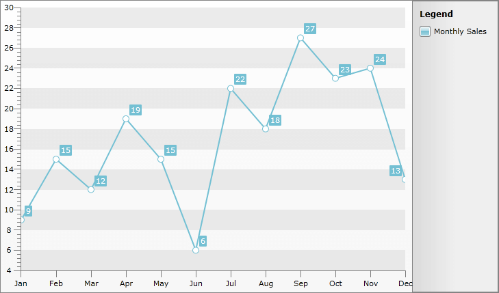

# Labels

## 

The axes of the RadChart display a label for each of the major ticks

You can specify custom Axis Items Labels by either specifying a [XCategory]() or by manually setting TickPoint's labels. 

XCategory is used when the data is not sequential, i.e. values on the X Axis have no meaning, for examle when the chart presents information for different companies (whose names are placed on the X axis) or other entities. In case X value is present in the data, and something else should be placed on the X axis, you need to go through the __RadChart.DefaultView.ChartArea.AxisX.TickPoints__ collection and set __Label__ for each TickPoint. Since the XCategory is already described in another help article - [Categorical Charts]() this topic will demonstrate the second approach:

#### __C#__

{{region radchart-features-axes-labels_0}}
	DataSeries lineSeries = new DataSeries();
    lineSeries.LegendLabel = "Monthly Sales";
    lineSeries.Definition = new LineSeriesDefinition();
    Random r = new Random();
    for (int i = 0; i < 12; i++)
    {
        lineSeries.Add(new DataPoint() { YValue = i + r.Next(0,20) });
    }

    radChart.DefaultView.ChartArea.DataSeries.Add(lineSeries);

    string[] months = new string[] { "Jan", "Feb", "Mar", "Apr", "May", "Jun" ,"Jul", "Aug", "Sep", "Oct", "Nov", "Dec", };

    for (int i = 0; i < months.Length; i++)
    {
       radChart.DefaultView.ChartArea.AxisX.TickPoints[i].Label = months[i];
    }
	{{endregion}}

#### __VB.NET__

{{region radchart-features-axes-labels_1}}
	Dim lineSeries As New DataSeries()
	lineSeries.LegendLabel = "Monthly Sales"
	lineSeries.Definition = New LineSeriesDefinition()
	Dim r As New Random()
	For i As Integer = 0 To 11
	 lineSeries.Add(New DataPoint() With { _
	  .YValue = i + r.[Next](0, 20) _
	 })
	Next
	radChart.DefaultView.ChartArea.DataSeries.Add(lineSeries)
	Dim months As String() = New String() {"Jan", "Feb", "Mar", "Apr", "May", "Jun", _
	 "Jul", "Aug", "Sep", "Oct", "Nov", "Dec"}
	For i As Integer = 0 To months.Length - 1
	 radChart.DefaultView.ChartArea.AxisX.TickPoints(i).Label = months(i)
	Next
	{{endregion}}

The result is:

